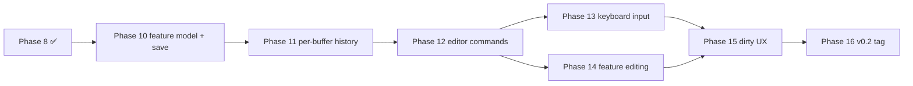

# SeqForge Editor Plan (v0.2) — revised after Stage 2.5 refactor

## Context

PLAN.md locked v0.1 as a read-only viewer. Phases 0–8 of that plan are complete; Phase 9 (v0.1.0 tag + verification) remains but does not block editor work. v0.2 is where SeqForge becomes an editor: bases can be inserted, deleted, replaced, and the document saved back to disk.

The original EDITOR_PLAN.md was written before Stages 2.5a–e landed. Those stages refactored the entire state model — splitting `Document` into `Buffer + Annotations`, introducing `BufferStore`, `Workspace`, `Cache<K,V>`, `PersistedSession`, the `with_buffer_mut` locking helper, and splitting the command module into subfiles. Every section below has been updated to reflect what actually exists in the codebase rather than what was assumed when the plan was first drafted.

**v0.2 scope (locked):** single-document editor. Insert/delete/replace bases at cursor or over a selection. Undo/redo. Save and Save As. Add/remove/rename features. Cut/Copy/Paste. Reverse-complement of a selection. Dirty-state UX. **Out of scope for v0.2:** multi-document tabs (separate buffers; multi-view of same buffer already works), feature drawing in graphical views (no graphical views yet), primer design, Gibson/Golden Gate, agent-driven editing beyond the typed-command layer.

---

## What the 2.5 refactor changed (and why it matters for the editor)

### The old model (at time of original EDITOR_PLAN)

```
ViewerState {
    open_doc: Option<Document>,   ← one doc, owned here
    selection, scroll_to,
    search_hits, cut_sites, ...
}
```

Mutations would operate on `state.open_doc.as_mut()`. History would live on `ViewerState`. Save would read back from `Document`.

### The actual model (post 2.5)

```
AppState {
    workspace: Workspace {
        views: HashMap<ViewId, View>,       ← per-render state
        active_view: Option<ViewId>,
        buffers: BufferStore {              ← Buffer + Annotations, Arc-shared
            buffers: HashMap<BufferId, Arc<RwLock<Buffer>>>,
            annotations: HashMap<BufferId, Annotations>,
            ...
        },
        seq_views: HashMap<ViewId, SequenceView>, ← render caches
    },
    ...
}
```

Consequences for the editor — all positive:

1. **`with_buffer_mut` already exists.** `Workspace::with_active_buffer_mut(|view, &mut buf, &mut ann| {...})` acquires the write lock, gives the closure all three mutable handles, and releases it at the end. Mutation functions never touch `RwLock` directly.

2. **`Buffer::version` + `Cache<K,V>` make cache invalidation free.** Every per-view render cache (feature stacking, cut-label stacking) already keys on `(buffer_id, buffer.version, ...)` via the `Cache` helper. Bumping `buf.version += 1` inside any mutation is all that's needed — caches recompute on the next paint automatically.

3. **History belongs on `Buffer`, not on any view.** Multiple views of the same buffer must share one undo stack — closing the second view must not erase the undo history the first view still uses. The original plan's "history on ViewerState" would break this. History lives as a parallel slot in `BufferStore` alongside `annotations`.

4. **Editor commands go in `command/edit.rs`.** The command module is already split into `{mod, file, nav, layout}.rs`, each under 250 lines. Adding `edit.rs` for mutation commands is the natural next file.

5. **Save reads from `Buffer + Annotations`, not `Document`.** `Document` continues to exist as a load intermediary (returned by `BioOps::load`, converted into a `Buffer + Annotations` pair by `BufferStore::open_path`). The save path is the reverse: assemble a `Document`-shaped value from `Buffer + Annotations` just long enough to pass to the writer, or add writer functions that accept them directly. Either approach avoids re-coupling the model.

---

## Resolved design decisions

### 1. Mutation primitives — `Vec<u8>` + `splice`/`drain`

`Buffer.text` stays `Vec<u8>` (rope is Tier 3b, after the editor is stable). Insertions via `text.splice(p..p, bases.iter().copied())`; deletions via `text.drain(start..end)`. Fast enough for plasmid sizes. Rope revisited only if a profiler points here.

### 2. Feature shift policy — Benchling convention

When `apply_insert(buf, ann, pos, bases)` is applied (length `n`), for each `Feature` in `ann.features`:
- `feat.range.end <= pos` → untouched (left of edit).
- `feat.range.start >= pos` → shift both endpoints by `+n` (right of edit).
- `feat.range.start < pos < feat.range.end` → extend (`end += n`); feature covers the inserted bases.

When `apply_delete(buf, ann, start, end)` (region length `n = end - start`):
- Feature fully left (`feat.end <= start`) → untouched.
- Feature fully right (`feat.start >= end`) → shift by `-n`.
- Feature fully inside (`start <= feat.start && feat.end <= end`) → **remove**.
- Feature straddles deletion start (`feat.start < start < feat.end <= end`) → clamp: `feat.end = start`.
- Feature straddles deletion end (`start <= feat.start < end && feat.end > end`) → `feat.start = start`, `feat.end -= n`.
- Feature spans deletion (`feat.start < start && feat.end > end`) → contract: `feat.end -= n`.

`apply_replace(buf, ann, start, end, bases)` is a single operation (not two) so feature shift fires once. Length delta `δ = bases.len() - (end - start)`. Same Delete case-analysis on the removed region, then fully-right features shift by `δ`.

All three functions are in `seqforge-core::mutations`. Each bumps `buf.version += 1` and sets `buf.dirty = true`. Ten tests (one per shift-policy bullet) against synthetic 100-bp sequences.

### 3. Undo/redo — per-buffer snapshot stack

Snapshots of `(Buffer, Annotations)` pairs, not a reverse-op log. Snapshot-based undo sidesteps the complexity of recording feature-shift deltas alongside byte deltas.

```rust
// in seqforge-core::history
pub struct History {
    past: VecDeque<Snapshot>,   // capped at 50
    future: Vec<Snapshot>,      // cleared on any non-undo mutation
    last_edit_kind: Option<EditKind>,
    last_edit_at: std::time::Instant,
}

pub struct Snapshot {
    pub text: Vec<u8>,
    pub annotations: Annotations,
}

pub enum EditKind { Insert, Delete, Other }
```

At ~15 kb plasmids and 50-snapshot cap, comfortably under 1 MB resident.

Coalescing: consecutive `Insert` edits within 500 ms collapse into the same snapshot (no new push per keystroke). Any other edit kind, or any Insert after the 500 ms window, forces a new snapshot.

**Placement:** `BufferStore` grows a parallel `histories: HashMap<BufferId, History>` slot alongside `annotations`. The same accessors pattern (`history_mut(bid)`) follows what `annotations_mut` already does. This gives every buffer its own undo stack, shared across all views into that buffer, and garbage-collected when the buffer is dropped.

`Workspace` exposes convenience methods `with_history_mut(view_id, f)` and a `record_snapshot(view_id, edit_kind)` helper. The mutation entry point is always:

```rust
workspace.with_active_buffer_mut(|view, buf, ann| {
    // push snapshot before the mutation
    history.record(buf, ann, edit_kind);
    apply_insert(buf, ann, pos, bases);
    // update cursor
    view.selection = Some(Selection::cursor(pos + bases.len()));
})
```

### 4. Editor commands — `ViewerRequest` additions + `command/edit.rs`

The socket/CLI surface is `ViewerRequest` (clap-derived, serde-serialized). Editor operations that need to be reachable from the embedded terminal or external agents go here:

```rust
// additions to seqforge-core::commands::ViewerRequest
Insert { pos: usize, bases: String },
Delete { start: usize, end: usize },
Replace { start: usize, end: usize, bases: String },
ReverseComplement { start: usize, end: usize },
Cut { start: usize, end: usize },
Copy { start: usize, end: usize },
Paste { pos: usize },
AddFeature { start: usize, end: usize, kind: String, label: String, strand: String },
RemoveFeature { index: usize },
RenameFeature { index: usize, label: String },
Save,
SaveAs { path: PathBuf },
Undo,
Redo,
```

GUI-only editor actions (open SaveAs file dialog, dirty-close modal) stay as `AppCommand` variants — they never need a socket wire format.

The `apply` dispatcher in `command/mod.rs` already has the `Viewer(req) → other → dispatch_active(...)` pass-through arm. Editor `ViewerRequest` variants do NOT go through `dispatch_active` (which only read-locks the buffer). Instead they're matched in the `Viewer(req)` arm and routed to the new `command/edit.rs`:

```rust
// command/mod.rs, inside the Viewer(req) match arm
ViewerRequest::Insert { pos, bases } => edit::apply_insert(state, pos, bases),
ViewerRequest::Delete { start, end } => edit::apply_delete(state, start, end),
// … etc.
ViewerRequest::Undo => edit::apply_undo(state),
ViewerRequest::Save => edit::apply_save(state),
```

`command/edit.rs` calls `workspace.with_active_buffer_mut` (or the history-recording wrapper) and emits `SideEffect`-style results via `AppCommand` for things like save-to-disk (see §5 below) and clipboard (see §6).

### 5. Save — `seqforge-bio::save` + `SideEffect` via `AppCommand`

Add to `seqforge-bio`:

```rust
pub fn save(buf: &Buffer, ann: &Annotations, path: &Path) -> Result<(), BioError>;
```

Dispatches on extension to `genbank::write` or `fasta::write`. No `Document` round-trip needed — write functions consume `Buffer + Annotations` directly.

`genbank::write` assembles a `gb_io::seq::Seq` from `Buffer + Annotations` (using `Feature.raw_kind` as the gb-io kind string, preserving `Option`-valued qualifiers including provenance). FASTA write is hand-rolled (header from `buf.name`, 80-column wrap).

**Qualifier round-trip (Feature model change).** Currently `Feature.qualifiers: BTreeMap<String, String>` silently drops flag-style qualifiers (`/pseudo`, `/partial`, etc.) that have no value. For lossless round-trip:
- Add `Feature.raw_kind: String` — the verbatim GenBank feature type string (e.g. `"CDS"`, `"misc_feature"`, `"rep_origin"`).
- Change `Feature.qualifiers: BTreeMap<String, Option<String>>` — `None` value encodes a flag qualifier.
- `FeatureKind` becomes a classifier function `fn classify(raw_kind: &str) -> FeatureKind`; the enum variant is derived on the fly for display/coloring.
- `genbank.rs::map_feature` updated to capture `raw_kind` and preserve `None`-valued qualifiers.

This is a `seqforge-core::document.rs` change. `viewer.rs` calls `feature_color(feature)` — the call site changes from `feature.kind` to `classify(&feature.raw_kind)`.

**Save side-effect flow:**

`edit::apply_save` and `edit::apply_save_as` emit `AppCommand::SaveDocument { path }` (a new variant) rather than calling `seqforge-bio::save` directly. The `apply` dispatcher processes it in the next submodule (or directly in `file.rs`), calls `seqforge-bio::save`, clears `buf.dirty`, and emits a toast. This keeps the IO off the command arm that originated from a socket connection (which may be on a different thread in the future).

Add `BioError::Write(String)` variant.

### 6. Keyboard input — always editable, Benchling style

No modal "enter edit mode" toggle. When `SequenceView` has focus and `view.selection` is a cursor, typed IUPAC characters push `ViewerRequest::Insert`. With a range selection, typing replaces: `ViewerRequest::Replace { start, end, bases: one_char }`.

Backspace/Delete: cursor `Delete { start: p-1, end: p }` / `Delete { start: p, end: p+1 }`; range: `Delete { start, end }`.

Modifier shortcuts:
- `Cmd/Ctrl+Z` → `ViewerRequest::Undo`. `Cmd/Ctrl+Shift+Z` (or `Y`) → `ViewerRequest::Redo`.
- `Cmd/Ctrl+X/C/V` → `Cut/Copy/Paste`.
- `Cmd/Ctrl+S` → `ViewerRequest::Save`. `Cmd/Ctrl+Shift+S` → open SaveAs dialog → `AppCommand::OpenSaveAs`.

Key reading happens in `viewer.rs` via `ui.input(|i| i.events.iter()...)` after `response = ui.allocate_painter(...)`. Only processes when `response.has_focus()` (call `response.request_focus()` on click). Viewer commands are pushed into `pending_commands` — they go through the normal `apply` path and never mutate state directly inside the render function.

Non-IUPAC characters silently ignored. Paste with whitespace: strip it, accept valid IUPAC remainder; if any non-IUPAC remains after stripping, show a toast and discard.

### 7. Clipboard — arboard + in-memory fallback

`state.clipboard: Option<Vec<u8>>` lives on `AppState` as an in-memory fallback for headless/test paths. For GUI, `arboard 3.x` is added to `seqforge-app/Cargo.toml` only (not `seqforge-core`). `edit::apply_cut` and `edit::apply_copy` write to both; `edit::apply_paste` reads arboard first, falls back to `state.clipboard`.

### 8. Dirty state + save UX

- `Buffer.dirty: bool` — set true by `apply_insert/delete/replace`; cleared by the save handler in `command/file.rs`. Already initialized false on load.
- Title bar shows `*name` when the active buffer is dirty (`ctx.send_viewport_cmd(ViewportCommand::Title(...))` checked once per frame when dirty changes).
- `File → Close` on a dirty buffer → modal: `Save / Discard / Cancel`. Implemented as `Overlay::DirtyCloseConfirm { view_id }` following the existing `OverlayStack` pattern.
- App quit on any dirty buffer → same modal, intercept via `eframe::App::on_close_event`.
- `File → Save As…` uses `egui-file-dialog::save_file()`, suggested filename = `buf.name + ".gb"`.
- `Cmd/Ctrl+S` accelerator registered at the app menu level (fires regardless of focus) — not just viewer-focus-scoped.

### 9. Feature provenance + forward-positioning types

**Feature.provenance.** Add `Feature.provenance: Option<Provenance>`:

```rust
pub struct Provenance {
    pub source_doc: String,
    pub source_range: Range<usize>,
    pub operation: String,   // e.g. "GoldenGate(BsaI)"
}
```

Round-trip via `/seqforge_provenance="<json>"` qualifier (stored as `Option<String>` under that key in the qualifiers map). Unlocks lineage tracing for future cloning workflows.

**Fragment.** Declare in `seqforge-core::document` now to prevent `Buffer`-only assumptions from baking into dispatch/IPC before cloning workflows land:

```rust
pub enum Overhang { Blunt, FivePrime(Vec<u8>), ThreePrime(Vec<u8>) }
pub struct Fragment {
    pub sequence: Vec<u8>,
    pub five_prime_overhang: Overhang,
    pub three_prime_overhang: Overhang,
    pub features: Vec<Feature>,
}
impl Fragment {
    pub fn from_buffer(buf: &Buffer, ann: &Annotations) -> Self { /* blunt both ends */ }
}
```

Nothing in v0.2 produces or consumes `Fragment`. The declaration alone prevents downstream assumptions.

**WorkflowCommand placeholder.** Add `pub enum WorkflowCommand {}` to `seqforge-core::commands`. Cloning operations (`Digest`, `GoldenGate`, `Ligate`) are not viewer mutations and not file-only — they get their own command axis to avoid cramming into either existing enum.

### 10. Multi-doc — deferred to v0.3

v0.2 is still single-buffer-at-a-time from the *editor* perspective (open one plasmid, edit it, save it). Multi-view of the same buffer already works from Stage 2.5c. Opening a second *file* already works too — two buffers in `BufferStore`, two views. What's deferred: cross-buffer operations (copy a feature from one to another via UI), shared undo across buffers, and the cloning panel that produces new buffers from existing ones. None of that requires shape changes to `Workspace`.

---

## Repository layout (changes only)

```
seqforge/
└── crates/
    ├── seqforge-core/
    │   ├── src/document.rs      # +Feature.raw_kind, +qualifiers Option<String>,
    │   │                        # +Feature.provenance, +Provenance,
    │   │                        # +Fragment + Overhang, +FeatureKind as classify()
    │   ├── src/mutations.rs (NEW) # apply_insert, apply_delete, apply_replace
    │   ├── src/history.rs   (NEW) # Snapshot, History, EditKind
    │   └── src/commands.rs      # +editor ViewerRequest variants;
    │                            # +WorkflowCommand placeholder
    ├── seqforge-bio/
    │   ├── src/lib.rs           # +save(buf, ann, path)
    │   ├── src/genbank.rs       # +write(); map_feature updated for raw_kind + Option qualifiers
    │   └── src/fasta.rs         # +write()
    └── seqforge-app/
        ├── src/command/edit.rs (NEW) # apply_insert/delete/replace/undo/redo/
        │                            # cut/copy/paste/add_feature/remove_feature/
        │                            # rename_feature/save/save_as
        ├── src/command/mod.rs   # +AppCommand::SaveDocument, +AppCommand::OpenSaveAs;
        │                        # +editor variants in Viewer(req) arm → edit.rs
        ├── src/command/file.rs  # +apply_save_document (IO); +dirty-close modal flow
        ├── src/viewer.rs        # +keyboard input; +request_focus on click; +cursor blink
        ├── src/overlay.rs       # +Overlay::DirtyCloseConfirm { view_id }
        ├── src/workspace.rs     # +with_history_mut; +record_snapshot helper;
        │                        # BufferStore +histories: HashMap<BufferId, History>
        ├── src/app.rs           # +clipboard: Option<Vec<u8>>; +dirty title bar;
        │                        # +on_close_event dirty check
        └── Cargo.toml           # +arboard = "3"
```

---

## How the 2.5 model makes each phase cleaner

| Original plan assumption | What's actually there | Improvement |
|---|---|---|
| Mutations call `doc.sequence.splice(...)` directly | `workspace.with_active_buffer_mut(\|view, buf, ann\| {...})` acquires/releases write lock | No manual lock management in mutation code |
| History lives on `ViewerState` | History lives in `BufferStore` alongside `annotations` | Shared correctly across views; GC'd with buffer |
| Cache invalidation is ad-hoc per field | `buf.version += 1` → all `Cache<K,V>` caches recompute automatically next frame | Zero extra invalidation code |
| `dispatch` signature changes needed | `with_buffer_mut` closure already passes `(&mut View, &mut Buffer, &mut Annotations)` | Dispatch function signature already correct |
| Editor commands add to a new `ViewerCommand` enum | Add to existing `ViewerRequest`; route to new `command/edit.rs` | No new type; socket/CLI surface unchanged |
| Save takes `&Document` | `save(buf, ann, path)` — no `Document` reconstruction needed | Cleaner bio/core boundary |

---

## Implementation phases

Each phase independently testable. Don't start N+1 until N's "done" check passes.

---

### Phase 10 — Feature model + save round-trip *(2 days)*

**Goal:** `Feature` round-trips through disk without data loss; mutation primitives in place; forward-positioning types declared.

- [ ] `Feature.raw_kind: String` — add the field; change `qualifiers: BTreeMap<String, Option<String>>`.
- [ ] `FeatureKind` becomes `fn classify(raw_kind: &str) -> FeatureKind`; drop the `kind` field from `Feature`. Update `viewer.rs::feature_color` call site from `f.kind` to `classify(&f.raw_kind)`.
- [ ] `genbank.rs::map_feature`: preserve `raw_kind = f.kind.to_string()`; keep `None`-valued qualifiers (flag-style).
- [ ] `Feature.provenance: Option<Provenance>`; GenBank round-trip via `/seqforge_provenance="<json>"`.
- [ ] Declare `Fragment`, `Overhang`, `Fragment::from_buffer` in `seqforge-core::document`.
- [ ] Declare `pub enum WorkflowCommand {}` in `seqforge-core::commands`.
- [ ] `seqforge-core::mutations::{apply_insert, apply_delete, apply_replace}` taking `(&mut Buffer, &mut Annotations)`. Each applies the feature shift policy from §2, bumps `buf.version`, sets `buf.dirty = true`.
- [ ] `seqforge-bio::save(buf, ann, path)` → `genbank::write` / `fasta::write`. Add `BioError::Write(String)`.
- [ ] `genbank::write`: build `gb_io::seq::Seq` from `Buffer + Annotations` (raw_kind, Option qualifiers, provenance).
- [ ] `fasta::write`: hand-rolled, header from `buf.name`, 80-column wrap.
- [ ] Tests: 10 mutation cases (one per shift-policy bullet); 3 round-trip tests against existing fixtures; 1 provenance round-trip; 1 `Fragment::from_buffer` smoke test.

**Done when:** `cargo test -p seqforge-core mutations` + `cargo test -p seqforge-bio roundtrip` green. No UI changes.

---

### Phase 11 — Per-buffer history *(1 day)*

**Goal:** Snapshot-based undo/redo with typing coalescence, shared correctly across views.

- [ ] `seqforge-core::history::{Snapshot, History, EditKind}` per §3.
- [ ] `BufferStore.histories: HashMap<BufferId, History>` + `history_mut(bid)` accessor.
- [ ] `Workspace::record_snapshot(view_id, edit_kind)` convenience method — resolves the buffer id, snapshots `(text.clone(), annotations.clone())` into the history before any mutation.
- [ ] `Workspace::with_active_buffer_mut` gains a companion `with_history_mut` that combines snapshot + mutation in one call: `workspace.edit(view_id, edit_kind, |view, buf, ann| {...})`.
- [ ] No command wiring yet — Phase 12 does that.
- [ ] Tests: 5 consecutive Inserts → 1 snapshot; Insert/Delete mix → 2 snapshots; undo restores bytes + features; redo restores; non-undo command after undo clears future.

**Done when:** History is unit-tested end-to-end against synthetic buffers.

---

### Phase 12 — Editor commands in dispatcher *(2 days)*

**Goal:** Every editor action expressible as a `ViewerRequest`, routed identically from menu/keyboard/terminal/socket.

- [ ] Add v0.2 `ViewerRequest` variants from §4.
- [ ] `command/edit.rs` with one `apply_*` function per variant. Each calls `workspace.edit(...)` (Phase 11 helper). `Save`/`SaveAs` push `AppCommand::SaveDocument { path }` / `AppCommand::OpenSaveAs`. `Undo`/`Redo` are pure history ops. Cut/Copy/Paste use `state.clipboard`; app layer also mirrors to arboard.
- [ ] Route editor `ViewerRequest` variants in `command/mod.rs` `Viewer(req)` arm to `edit::*` instead of `dispatch_active`.
- [ ] `AppCommand::SaveDocument { path }` handled in `command/file.rs`: calls `seqforge-bio::save`, clears `buf.dirty`, shows toast on success/failure.
- [ ] `AppCommand::OpenSaveAs` handled in `command/file.rs`: pushes `Overlay::FileDialog` in save mode; on pick, pushes `AppCommand::SaveDocument { path }`.
- [ ] Menu: `Edit → Undo/Redo/Cut/Copy/Paste/Delete`, `Edit → Reverse Complement Selection`, `File → Save/Save As…`. Enable/disable via `is_enabled` using `view.selection`, history state, `buf.dirty`.
- [ ] CLI surface: verify `seqforge insert --pos 10 ATG` over socket against a running GUI.

**Done when:** All v0.2 `ViewerRequest` variants work from the `:command` terminal. Unit tests for each `apply_*` arm.

---

### Phase 13 — Keyboard input in the viewer *(1 day)*

**Goal:** Type into the sequence; Benchling-style always-editable.

- [ ] `SequenceView::show` calls `response.request_focus()` on click.
- [ ] When `response.has_focus()`, consume `ui.input(|i| i.events.iter()...)` for `Event::Text` (filter IUPAC), `Event::Key { Backspace | Delete }`, and modifier shortcuts from §6.
- [ ] Each consumed event pushes a `ViewerRequest` into `pending_commands` (via the existing `AppCommand::Viewer(req)` path).
- [ ] Cursor blink: toggle a `cursor_visible: bool` in `SequenceView` via `ctx.request_repaint_after(Duration::from_millis(500))` when `has_focus()`.

**Done when:** Typing `ATGC` inserts at cursor; Backspace deletes; `Cmd+Z` undoes; modifier shortcuts work; clicking the terminal stops viewer from absorbing keys.

---

### Phase 14 — Feature editing *(1 day)*

**Goal:** Add, remove, rename features over a selection.

- [ ] `Tools → New Feature from Selection…` dialog (label, kind dropdown, strand). Emits `ViewerRequest::AddFeature`.
- [ ] Right-click on annotation bar: context menu `Rename…` / `Remove`. Emits `RenameFeature` / `RemoveFeature`.
- [ ] `AddFeature` validates `start < end <= buf.len()`. Sets `raw_kind` to the GenBank vocabulary string for the chosen kind.
- [ ] Per-view render caches that depend on `annotations.features` invalidate automatically via `buf.version` bump in `apply_insert` — but `AddFeature` / `RemoveFeature` don't touch the sequence. These need to bump `buf.version` too (or the feature-stacking cache needs to also key on `annotations.features.len()`). Decision: bump `buf.version` on any annotation mutation for simplicity.

**Done when:** Create a CDS over a selection, rename it, delete it; reload the file and the change is on disk.

---

### Phase 15 — Dirty state + save UX *(½ day)*

**Goal:** Editor feels safe.

- [ ] Title bar `*name` when the active buffer is dirty.
- [ ] `Overlay::DirtyCloseConfirm { view_id }` modal (`Save / Discard / Cancel`); wired to `AppCommand::CloseTab` and `on_close_event`.
- [ ] `Cmd/Ctrl+S` accelerator registered at the menu level (fires regardless of focus).
- [ ] Toast on save success/failure (egui-notify, pull forward from Phase 8 polish if not already landed).

**Done when:** Can't accidentally lose work by closing the window.

---

### Phase 16 — v0.2 verification + release *(½ day)*

- [ ] Manual walk: open pUC19, type bases, delete a region, RC a selection, add a feature, undo through everything, save, reload, diff against expected.
- [ ] Round-trip all `tests/fixtures/` programmatically: `load → modify → undo back → save → reload → assert sequence + feature equality`.
- [ ] CI green on Linux + macOS + Windows builds.
- [ ] Tag `v0.2.0`.

---

## Dependency graph



Phase 9 (v0.1.0 tag) runs in parallel and does not block this plan.

---

## Verification (v0.2 done = all of these pass)

1. Click into the viewer, type `ATGC` — bases appear at the cursor, title bar shows `*name`.
2. Select a range, hit Backspace — region deleted; features straddling the boundary clamp correctly.
3. `Cmd+Z` undoes the deletion; `Cmd+Shift+Z` redoes. Five consecutive keystroke inserts undo as one snapshot.
4. `Tools → New Feature from Selection…` adds a feature; right-click → Rename; right-click → Remove.
5. `Cmd+S` saves; file on disk is a valid GenBank that reloads to a buffer equal to the in-memory one (sequence + features, ignoring whitespace).
6. Close the window with unsaved changes → modal blocks; `Cancel` returns with state intact.
7. From the embedded terminal: `:insert 100 ATGC`, `:delete 50 75`, `:rc 200 250`, `:undo`, `:save` all work and update the viewer.
8. From an external shell: `seqforge insert --pos 100 ATGC` against the running GUI via session socket.
9. Round-trip the 3 test fixtures: load → modify → undo back → save → reload → assert equal to original.
10. Open pUC19 in two split panes. Edit in one pane; undo in the other. Both panes see the same buffer state after each operation.

---

## Conventions (additions to PLAN.md)

- **Mutations:** call `workspace.edit(view_id, edit_kind, |view, buf, ann| {...})`. Never call `apply_insert` / `apply_delete` / `apply_replace` outside `command/edit.rs`.
- **History:** always go through `workspace.edit(...)`. Direct `apply_*` calls bypass undo.
- **Dirty flag:** set inside `apply_*`; cleared only by the save handler in `command/file.rs`.
- **Version bump:** any function that mutates `buf.text` OR `ann.features` must call `buf.version += 1`. This is the cache invalidation contract for all `Cache<K,V>` entries keyed on version.
- **No GUI deps in `seqforge-core`:** arboard, egui-notify, eframe stay in `seqforge-app`. `seqforge-core::history` and `seqforge-core::mutations` have zero GUI deps.
- **CLI surface:** every new `ViewerRequest` variant must have doc comments that read as CLI help text (`/// Insert bases at a position`).
- **Feature kind:** always set `raw_kind` to the GenBank vocabulary string when creating features; use `classify(&raw_kind)` for display/coloring. Never store a bare `FeatureKind` variant as the authoritative kind.
