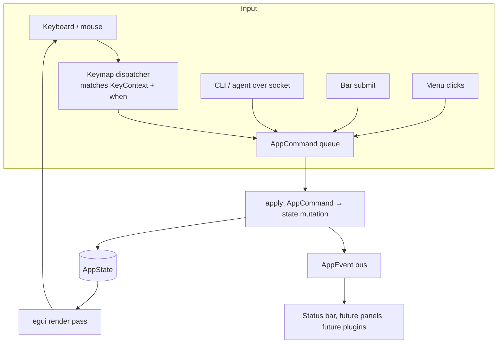

# SeqForge MVP Plan

## Context

Build a Rust-based GUI sequence viewer/editor with an embedded terminal, targeted at molecular cloning workflows (restriction digest, PCR, Golden Gate, etc.). The defining architectural goal is a **single typed command layer** so that every operation is invokable from both the GUI menu and the embedded terminal — keeping execution flow uniform and minimizing code duplication as features land.

PlasCAD (`David-OConnor/plascad`, MIT, Rust + egui) already covers ~80% of this concept as a viewer/editor, but lacks an embedded terminal and a unified command-dispatch layer. After review, the chosen path is to **build fresh**, reusing the same upstream Rust bio crates PlasCAD depends on, and referencing PlasCAD's source for proven patterns. This gives full control over the command-dispatch architecture from day one and avoids inheriting design decisions that don't fit the terminal-first vision.

**MVP scope (locked):** read-only viewer + embedded terminal + file browser. No editing/saving in v1. Restriction-site detection and sequence search are the only sequence ops. Dual-strand text viewer (no graphical linear/circular views yet).

---

## Architecture

### GUI toolkit

**egui (via `eframe`) + `egui_dock`** for VSCode-style panel layout. Rationale: monospace text rendering is the optimal case for immediate-mode + galley caching; embedded terminal works via `egui_term`; "BYO state" pairs naturally with a `Command` enum dispatcher.

**Alternative on the table:** `iced` + `iced_term` v0.8.0 (March 2026, actively maintained by Harzu). Defer unless egui's state model becomes painful.

### Layout (egui_dock)

```
┌──────────┬─────────────────────────┐
│ File     │   Sequence Viewer       │
│ Browser  │   (dual-strand text +   │
│          │    annotations + sites) │
│          ├─────────────────────────┤
│          │   Embedded Terminal     │
└──────────┴─────────────────────────┘
```

### Command dispatch (the core pattern)

Commands fall into two distinct categories that determine how `seqforge-cli` executes them:

**File commands** — operate on sequence files on disk. No running GUI required. These are the primary standalone CLI use case: digest, annotate, align, cloning workflows. Always execute locally in the CLI process.

**Viewer commands** — mutate the state of a running GUI instance (scroll to position, open a file in the viewer, highlight a range, run a search and show results). Meaningless without a GUI; fail with a clear message if none is running.

```rust
// seqforge-core — no GUI dep, runs anywhere
enum FileCommand {
    Info { input: PathBuf },
    Digest { input: PathBuf, enzymes: Vec<String>, output: PathBuf },
    Annotate { input: PathBuf, output: PathBuf },
}

// seqforge-core — requires a running GUI instance; JSON-RPC wire encoding
#[serde(tag = "method", rename_all = "snake_case")]
enum ViewerRequest {
    Open { path: PathBuf },
    Close,
    GoTo { position: usize },
    Find { pattern: String, mismatches: u8 },
    Enzymes { enzymes: Vec<String> },
}

#[serde(tag = "kind", rename_all = "snake_case")]
enum ViewerResponse {
    Ok,
    Navigated { position: usize },
    SearchResults { count: usize, hits: Vec<SearchHit> },
    CutSites { count: usize, sites: Vec<CutSite> },
}

fn dispatch_file(cmd: FileCommand) -> Result<(), DispatchError>;
fn dispatch<B: BioOps>(state: &mut ViewerState, bio: &B, req: ViewerRequest)
    -> Result<ViewerResponse, DispatchError>;
```

Both menu clicks and terminal input parse to the appropriate `Command` type and call the right dispatch function. Terminal uses a thin parser (`clap` derive) so commands have help text and validation for free. **Reference: Helix's `helix-term/src/commands.rs` for the typed-action shape.**

### CLI as a first-class standalone tool

`seqforge-cli` is a complete tool independent of the GUI — modelled after `git`, not a GUI remote control. File commands work identically whether the GUI is open or not:

```bash
seqforge digest plasmid.gb --enzymes EcoRI BamHI -o fragments.gb
seqforge annotate input.gb --add-feature "CDS:100-500:+:lacZ" -o output.gb
seqforge align query.fa reference.gb -o alignment.gb
seqforge golden-gate parts/*.gb --enzyme BsaI -o assembly.gb
```

Viewer commands additionally try the GUI socket (see below) and error gracefully if no instance is running.

### GUI session IPC (viewer commands only)

Both human users and agents invoke viewer commands via `seqforge <subcommand>` in the embedded terminal. The CLI detects `SEQFORGE_SOCKET` and routes them to the GUI:

- On launch, SeqForge opens a Unix domain socket at a temp path and sets `SEQFORGE_SOCKET=/tmp/seqforge-$PID.sock` in the PTY environment.
- `seqforge-cli`, when executing a `ViewerCommand` and `SEQFORGE_SOCKET` is set, serializes the command and sends it over the socket. The GUI receives it and calls `dispatch_viewer`.
- If the socket is absent and the command is a `ViewerCommand`, the CLI exits with a clear error; `FileCommand`s are unaffected.
- `seqforge --help` gives any agent the full command schema with no extra documentation.

This is ~50 lines (socket listener in the app, socket-client in the CLI) and lands in Phase 6.

### Sandboxing (post-MVP hook, not in scope for v0.1)

The socket is a natural containment boundary — all viewer mutations flow through typed `ViewerCommand` values. The hooks to enable sandboxing are small and do not require changing the dispatch layer:

1. **PTY spawn** accepts a configurable wrapper command (macOS sandbox profile, Linux `bwrap`). Add the config field and stub; leave wrapper empty for now.
2. **Socket listener** validates incoming commands against a session policy before calling dispatch. Add the policy field, default to `AllowAll`.

Defer until the basic app is stable and sequence editing works smoothly.

### State model

**Two-layer split** — keeps GUI types out of `seqforge-core` so dispatch and socket IPC have no egui deps:

```rust
// seqforge-core — pure data, no GUI types
struct ViewerState {
    open_doc: Option<Document>,
    selection: Option<Selection>,      // cursor or range
    selected_feature: Option<usize>,
    scroll_to: Option<usize>,          // one-shot; consumed by viewer each frame
    search_hits: Vec<SearchHit>,
    cut_sites: Vec<CutSite>,
    active_enzymes: Vec<String>,
}

// seqforge-app — GUI shell
struct AppState {
    viewer: ViewerState,               // passed to dispatch()
    dock_state: DockState<Tab>,        // egui_dock — GUI only
    browser: BrowserState,
    pending_commands: Vec<PendingCommand>, // (AppCommand, Option<oneshot_tx>); consumed each frame
    overlays: OverlayStack,
    focus: FocusState,
    events: EventSink,
    // …
}
```

- `Document` is the doc model (sequence, features, computed cut-sites cache) — independent of egui types.
- Persist `AppState` (minus transient fields) via `eframe::App::save`/`load` with serde.
- For MVP, `open_doc` is `Option<Document>` (one file at a time). Multi-doc (`Vec<Document>`) deferred to post-MVP.
- **Reference: Rerun's `re_viewer` crate** for store-vs-UI-state separation in egui.

Keyboard focus, command dispatch, and the event bus are fully covered in [Focus & Command Architecture](#focus--command-architecture) below — that section is the binding reference for adding hotkeys, panes, overlays, and agent actions.

---

## Bio core (dependencies)

| Need | Crate | Status |
|---|---|---|
| GenBank parse/write | `gb-io` 0.9 | Active, used by PlasCAD |
| Restriction enzymes (recognition, cut offsets, Type IIs, presets) | `seqforge-restriction` (in-workspace) | **Replaced `na_seq` (see RESTRICTION_PLAN.md). `na_seq` dependency dropped.** |
| FASTA + DNA primitives (complement, translation, GC%, MW) | hand-rolled in `seqforge-bio` | IUPAC complement table + parsers live in `seqforge-bio` |
| Pattern matching (IUPAC, mismatches), alphabets, alignment (later) | `bio` (rust-bio) 2.3 | Active |
| SnapGene `.dna` (deferred to post-MVP) | None — port from `tg-oss/packages/bio-parsers/src/snapgeneToJson.js` when needed | n/a |

**Targeted ports from `examples/tg-oss` (only as features land beyond MVP):**

- Digest fragment enumeration + overhang classification — `packages/sequence-utils/src/getDigestFragmentsForRestrictionEnzymes.js` (~150 LOC)
- Golden Gate part assembly (post-MVP) — `packages/sequence-utils/src/getPossiblePartsFromSequenceAndEnzymes.js`

**Already ported:**

- Annotation row-stacking — `stackElements` from `examples/seqviz/src/elementsToRows.ts` (~30 LOC Rust). Landed in Phase 4.

Skip porting: complement, translation (hand-rolled in `seqforge-bio`), restriction-site finding (now covered by the in-workspace `seqforge-restriction` crate, which replaced `na_seq` — see RESTRICTION_PLAN.md). Digest fragment enumeration is `seqforge-restriction` Tier 2.

---

## Embedded terminal

- `egui_term` 0.1.0 (Apr 2025) — wraps `alacritty_terminal` and `portable-pty`. Renders into an egui `Ui`.
- Terminal widget owns its PTY + grid state.
- **Single command path:** `seqforge-cli` is the sole way to issue viewer commands from the terminal — `seqforge goto 100`, `seqforge find ATGC`, etc. The CLI detects `SEQFORGE_SOCKET` and routes over the socket. No keystroke intercept; TUI tools (vim, nvim, less) work normally.
- **Agent / script path:** same `seqforge <subcommand>` CLI calls. `dispatch_file` runs in-process; viewer commands go over the session socket and return structured JSON-RPC responses an agent can parse.
- For commands that need rich output (e.g., a digest fragment table), `ViewerResponse` carries the data; the app layer can open a result tab from the response kind.

---

## File browser

- Left pane: `egui_extras::TableBuilder` rows backed by `walkdir` for the project tree.
- File-open via `egui-file-dialog` (modal) and drag-and-drop via `egui::Context::input` drop events.
- Double-click on `.gb` / `.fasta` / `.fa` opens a viewer tab.

---

## Sequence viewer (dual-strand text)

Monospace rendering using `egui::Painter` + `Galley` (via `LayoutJob` for per-base ATGC coloring).

**Layout per block (standard convention: cut labels → ruler → strands → annotations):**

```
[cut label row 0: EcoRI  BamHI ]   ← stacked above ruler; omitted when no sites
[cut label row 1: HindIII      ]
[position ruler: 1    10   20 …]
[top strand 5'→3': A T G C …  ]   ← ATGC colored; cut staple passes through
[bottom strand 3'→5': T A C G …]  ← complement, dimmed; staple ends here
[annotation row 0              ]   ← stacked below strands
[annotation row 1              ]
…
[gap]
```

**Key design decisions made during implementation:**

- **Dynamic line width:** computed each frame from available pane width (`floor((width - margins) / char_width)`), not a fixed 60 bp. Blocks reflow on pane resize.
- **char_width source:** measured from an actual laid-out galley (`layout_no_wrap("A" × 64).width / 64`) rather than `glyph_width()`, which can differ due to subpixel rounding. This ensures annotation bar edges align exactly with character cell boundaries.
- **Annotation stacking:** port of seqviz `stackElements` — sort by start, greedily pack into the first non-overlapping row. `O(n log n)`, computed once per document load.
- **Feature selectability:** clicking an annotation bar sets `selection = (feature.range.start, feature.range.end)` and highlights the bar with a white border. Dragging on the strand initiates a sequence-range selection. Both expose `(start, end)` on `AppState` for command context.
- **Annotations render below strands** (standard convention: SnapGene, Benchling, Geneious).

**Performance:**

- Each line rendered as a single `LayoutJob` galley (not per-character `painter.text` calls). Galley cache in egui makes repeat frames cheap.
- Painter clip-rect culling: blocks outside the visible scroll viewport are skipped before any layout work.

**Selection:** click+drag to select a range, exposes `(start, end)` to the dispatcher for context-aware terminal commands.

---

## Repository layout

```
seqforge/
├── Cargo.toml             # workspace
├── crates/
│   ├── seqforge-core/     # Document, ViewerState, ViewerRequest/Response, BioOps, dispatch — no GUI deps
│   ├── seqforge-bio/      # thin wrappers over na_seq + gb-io + bio; ported workflows; impl BioOps
│   ├── seqforge-cli/      # standalone tool: FileCommand runs locally always; ViewerRequest sent via JSON-RPC socket when SEQFORGE_SOCKET set
│   └── seqforge-app/      # eframe binary: egui + egui_dock + egui_term wiring; AppBio impl
└── examples/              # existing reference repos (seqviz, tg-oss) — read-only
```

The split keeps GUI out of `core` so the same dispatcher can later back a headless CLI, test harness, or WASM WebView worker.

---

## Critical files to read before coding

- `examples/tg-oss/packages/sequence-utils/src/cutSequenceByRestrictionEnzyme.js` — restriction site logic reference
- `examples/tg-oss/packages/sequence-utils/src/getDigestFragmentsForRestrictionEnzymes.js` — fragment enumeration (port target post-MVP)
- `examples/seqviz/src/elementsToRows.ts` — annotation row-stacking algorithm (already ported)
- `examples/seqviz/src/digest.ts` — concise reference for cut-site dedup + circular handling
- PlasCAD `src/` (clone separately, MIT) — egui + bio crate wiring patterns
- Helix `helix-term/src/commands.rs` — typed-command dispatcher shape
- Rerun `re_viewer` (open source) — store/UI-state separation

---

## Verification (MVP done = all of these pass)

1. `cargo run` opens the app with the three-pane dock layout.
2. File browser shows `examples/` and lets you double-click a `.gb` file (use any GenBank file; if none in repo, drop one in).
3. Viewer pane renders top + bottom strands with index ruler, fills pane width dynamically, shows annotations stacked below with correct colors; clicking an annotation selects its range.
4. Embedded terminal accepts: `seqforge find ATGCGT`, `seqforge enzymes EcoRI BamHI`, `seqforge goto 1234`, `seqforge --help` — each invokes `dispatch` and updates the viewer.
5. Same operations work from the menu (`Edit → Find...`, `Tools → Restriction Sites...`, `Navigate → Go to position...`).
6. `seqforge goto 100` (no `:` prefix, plain shell command) in the embedded terminal also works — CLI detects `SEQFORGE_SOCKET` and routes to `dispatch_viewer`. `seqforge digest plasmid.gb --enzymes EcoRI -o out.gb` works in any terminal, GUI open or not.
7. App quits cleanly; on relaunch, recent files and dock layout are restored (`eframe` persistence).
8. Open at least one large plasmid (~10 kb) and one small fragment (~500 bp) without rendering hitches.
9. Smoke test on macOS (primary). Linux/Windows builds via CI; manual test deferred.

---

## Out of scope for MVP (explicit non-goals)

- Linear/circular graphical viewers (tg-oss/seqviz LinearView/CircularView)
- Editing, undo/redo, save
- SnapGene `.dna` support
- Cloning workflows (digest fragments, PCR, Golden Gate, Gibson)
- Primer design / Tm calc
- Alignment views
- WASM build
- Agent sandboxing / PTY namespace isolation (hooks designed in, implementation deferred)

---

## Implementation Phases

Each phase is independently testable. Don't start phase N+1 until phase N's "done" check passes.

### Phase 0 — Workspace skeleton ✅ DONE

**Goal:** Cargo workspace compiles, CI green, zero functionality.

- [x] `cargo new --bin seqforge-app` inside a workspace `Cargo.toml`
- [x] Add empty `seqforge-core`, `seqforge-bio`, `seqforge-cli` library crates
- [x] Add `eframe = "0.31"`, `egui_dock`, `egui_extras`, `egui-file-dialog` to `seqforge-app`
- [x] Add `gb-io = "0.9"`, `na_seq = "0.3"`, `bio = "2.3"` to `seqforge-bio`
- [x] Add `clap = { version = "4", features = ["derive"] }` to `seqforge-cli`
- [x] `rustfmt.toml` + `clippy.toml` (deny warnings in CI)
- [x] GitHub Actions: `cargo check`, `cargo test`, `cargo clippy -- -D warnings`, `cargo fmt --check`

**Done when:** `cargo run -p seqforge-app` opens an empty eframe window with "Hello" text and CI passes. ✅

---

### Phase 1 — Bio core: parse + model ✅ DONE

**Goal:** Load a GenBank file from disk into a GUI-free `Document` struct, exercise it via a headless CLI.

- [x] Define `Document { name, sequence: Vec<u8>, topology: Linear|Circular, features: Vec<Feature>, source_path }` in `seqforge-core`
- [x] `Feature { range: Range<usize>, kind: FeatureKind, label: String, strand: Strand, qualifiers: BTreeMap<String,String> }`
- [x] `seqforge-bio::load(path) -> Result<Document>` — dispatches on extension to `gb-io` (GenBank) or hand-rolled FASTA parser
- [x] `seqforge-bio::reverse_complement(&[u8]) -> Vec<u8>` + `complement(&[u8]) -> Vec<u8>` — IUPAC lookup table
- [x] Snapshot tests: round-trip 3 reference files (small linear, circular plasmid, multi-feature)

**Notes:**

- `na_seq` uses its own `Nucleotide` enum, not `&[u8]`. `reverse_complement` and `complement` are implemented directly with an IUPAC byte table.
- `gb_io::reader::GbParserError` is the public path (not `gb_io::errors::`).

**Done when:** `cargo run -p seqforge-cli -- info path/to/plasmid.gb` prints name, length, topology, feature count. ✅

---

### Phase 2 — egui dock shell ✅ DONE

**Goal:** Three-pane layout renders, no real content.

- [x] `egui_dock` skeleton with three tabs: `FileBrowser`, `Viewer`, `Terminal`
- [x] `AppState` struct held by the eframe `App` impl; tabs render placeholder text
- [x] Persist `DockState` via `eframe::App::save` → serde blob in eframe storage
- [x] Menu bar stub: `File`, `Edit`, `View`, `Tools`, `Navigate`, `Help` (items disabled)

**Notes:**

- `egui_dock` requires `features = ["serde"]` in `Cargo.toml` for `DockState: Serialize`.
- `TabViewer` holds a `'a` lifetime reference to mutable sub-state (browser) so tabs can mutate app state during rendering.
- Layout: FileBrowser 20% left; Viewer top-right 70%; Terminal bottom-right 30%.

**Done when:** three labelled empty panes; drag-rearrange works; layout survives restart. ✅

---

### Phase 3 — File browser pane ✅ DONE

**Goal:** Open a directory, click a `.gb` file, emit an `OpenFile` intent (no handler yet).

- [x] `BrowserState { root, expanded: HashSet<PathBuf>, selected: Option<PathBuf> }`
- [x] Render via recursive `walkdir` tree (depth=1 per node, sorted by name)
- [x] `egui-file-dialog` for "Open Folder…" modal (`dialog.pick_directory()` + `dialog.update(ctx)`)
- [x] Drag-and-drop folder onto window sets root (`ctx.input(|i| i.raw.dropped_files)`)
- [x] Double-click on `.gb` / `.gbk` / `.fasta` / `.fa` / `.fna` logs `OpenFile(path)` to stdout

**Notes:**

- `egui-file-dialog 0.9` API: `dialog.state()` returns `DialogState` enum; there is no `is_open()` method.
- `BrowserState` is `#[serde(skip)]` on `file_dialog` since `FileDialog` is not serializable.

**Done when:** folder tree visible, expandable, double-click logs the path. ✅

---

### Phase 4 — Viewer widget (dual-strand text) ✅ DONE

**Goal:** Render an open `Document` as dual-strand text with ruler, stacked annotations, and sequence selection.

- [x] `SequenceView` widget using `egui::Painter` + `LayoutJob` galleys
- [x] Top strand 5'→3' with ATGC base coloring; index ruler every 10 bp above
- [x] Bottom strand: complement (not reverse complement), dimmed, 3'→5' label
- [x] Dynamic line width — fills available pane width, reflows on resize
- [x] `char_width` derived from actual galley measurement (not `glyph_width`) to keep annotation bars aligned with character cells
- [x] Annotation stacking: port of seqviz `stackElements` — greedy interval packing, `O(n log n)`
- [x] Annotations render **below** both strands (standard convention)
- [x] Click annotation bar → selects feature range; drag on strand → sequence range selection; both expose `(start, end)` on `AppState`
- [x] Clip-rect culling: only visible blocks are processed each frame
- [x] `SequenceView::reset()` clears selection + selected feature on new doc load

**Implementation notes:**

- `cached_seq_len` guard: complement + stacking are computed once when `seq.len()` changes, cached in `SequenceView`. Not recomputed per frame.
- `pending_open: Option<PathBuf>` side-channel in `AppState`: `TabViewer` sets it during `DockArea` rendering; `update()` consumes it afterward. Phase 5 generalizes this to `pending_requests: Vec<PendingReq>`.
- Feature labels: rendered on any segment (including continuations) where `bar.width() >= label.chars().count() * char_width`. Omitted on narrow segments, consistent with SnapGene/Benchling behavior.

**Key files:**

- `crates/seqforge-app/src/viewer.rs` — `SequenceView`, `stack_features`, `annot_bar_rect`, `build_strand_galley`
- `crates/seqforge-bio/src/dna.rs` — added `complement()`

**Done when:** open `examples/…some.gb`, see paired strands + ruler + stacked annotations below, can scroll and select both features and sequence ranges. ✅

---

### Phase 5 — Command dispatch ✅ DONE

**Goal:** `FileCommand` and `ViewerCommand` enums with their dispatch functions wired to menu and file browser. The architectural keystone.

**Architecture note:** `dispatch_viewer` takes `&mut ViewerState` (pure data, in `seqforge-core`) not `&mut AppState`. `AppState` in `seqforge-app` holds `ViewerState` and passes a `&mut` reference. This keeps `seqforge-core` free of egui deps and makes Phase 6 socket IPC straightforward (the socket thread only needs `ViewerState`).

- [x] Extract `ViewerState` from `SequenceView` / `AppState` into `seqforge-core`; add clap dep to seqforge-core
- [x] Define `ViewerRequest` enum (`Open`, `Close`, `GoTo`, `Find`, `Enzymes`) + `ViewerResponse` enum; both derive clap + serde; wire encoding is `{"method":"..."}` JSON-RPC 2.0
- [x] Define `FileCommand` enum; stub variants: `Info`, `Digest`, `Annotate`
- [x] `BioOps` trait in `seqforge-core` — `load`, `find_matches`, `find_cut_sites`; `AppBio` in `seqforge-app` implements it; breaks core/bio dep cycle
- [x] `dispatch<B: BioOps>(state, bio, req) -> Result<ViewerResponse, DispatchError>` — single dispatch function; no `SideEffect` indirection
- [x] `dispatch_file(cmd: FileCommand) -> Result<(), DispatchError>` in `seqforge-core`
- [x] `AppState`: `viewer: ViewerState` + `seq_view: SequenceView` + `pending_requests: Vec<PendingReq>` (request + optional oneshot response channel)
- [x] `SequenceView` reads from `&mut ViewerState` rather than holding document data itself
- [x] Wire `File → Open…` and `File → Close` menu items; `Edit → Find…`, `Navigate → Go to…`, `Tools → Restriction Sites…` stubs
- [x] File-browser double-click emits `ViewerRequest::Open` through dispatch
- [x] `Selection { anchor, focus }` — cursor when equal, range when not; single click places cursor, drag builds range, annotation/hit/site click sets range

**Notes:**

- `Selection` replaces raw `Option<(usize, usize)>` — cursor = zero-length selection (seqviz/SnapGene pattern)
- `BioOps` trait bridges the core/bio crate boundary: dispatch calls `bio.load` / `bio.find_matches` / `bio.find_cut_sites` directly — no `SideEffect` round-trip through the app layer
- `GoTo` dispatch validates `position` in `[1, seq_len]`; out-of-range returns `DispatchError::OutOfRange { position, seq_len }`
- `scroll_to: Option<usize>` on `ViewerState` is a one-shot field: set by `GoTo`/`Find` dispatch, consumed by the viewer to center in viewport

**Done when:** opening files works via menu *and* file-browser double-click, both go through `dispatch_viewer`. Both dispatch functions are unit-tested. ✅

---

### Phase 6 — Embedded terminal + session IPC ✅ DONE

**Goal:** Terminal pane runs a real shell; `:viewer-commands` route to `dispatch_viewer`; plain shell commands and `seqforge file-commands` run normally; `seqforge viewer-commands` route to `dispatch_viewer` via session socket.

**Terminal:**

- [x] `egui_term 0.1.0` widget in the Terminal tab, spawning `$SHELL`
- [x] No keystroke intercept — viewer commands issued via `seqforge <subcommand>` CLI directly in the shell; TUI tools (nvim, vim, less, htop) work unaffected
- [x] Embedded terminal history isolated to `~/.local/share/seqforge/terminal_history` via `HISTFILE` set before PTY spawn

**Session socket (viewer commands from CLI/agents):**

- [x] On app start, open Unix socket at `/tmp/seqforge-{pid}.sock`; set `SEQFORGE_SOCKET` in env before PTY spawn (child shell inherits it)
- [x] Socket listener thread receives newline-delimited JSON-RPC 2.0 requests, parses into `ViewerRequest` via serde tagged enum, dispatches, returns a JSON-RPC response on the same connection; pushes `(ViewerRequest, oneshot_tx)` to `socket_rx` mpsc channel; main `update()` drains it into `pending_requests` each frame
- [x] `seqforge-cli`: viewer subcommands (`open`, `close`, `goto`, `find`, `enzymes`) read `SEQFORGE_SOCKET` and send JSON over socket; error if unset
- [x] File subcommands (`info`, `digest`, `annotate`) always run in-process; `FileCommand` never touches socket

**Sandboxing stubs (design only — implement post-MVP):**

- [x] PTY spawn: comment stub in `TerminalPane::new` — `sandbox_wrapper: Option<Vec<String>>` hook location documented
- [x] Socket listener: comment stub in `handle_connection` — `CommandPolicy` validation hook location documented

**Implementation notes:**

- `TerminalPane` and `socket_rx` live in `AppState` as `#[serde(skip)]` fields — avoids split-borrow issues and keeps initialization in `SeqForgeApp::new`
- `TerminalView::new(ui, ...)` assigned to a local before `ui.add(...)` to satisfy borrow checker (both borrow `ui`)
- `std::env::set_var`/`remove_var` are `unsafe` in Rust 2024 edition; wrapped with safety comments

**CLI PATH scoping (added post-Phase 6):**

- `seqforge` CLI is embedded-terminal-only by default (VS Code "Install command in PATH" pattern)
- `sibling_seqforge_dir()` in `terminal.rs` finds the `seqforge` binary next to the running app binary and prepends it to the PTY's PATH — `cargo build` (not `cargo install`) is sufficient for embedded terminal use
- `cli_install.rs` in `seqforge-app`: `install_cli_to_path()` symlinks the bundled CLI to `/usr/local/bin/seqforge` or `~/.local/bin/seqforge`; `is_installed()` checks for an existing symlink
- `Tools → Install 'seqforge' CLI to PATH` menu item (or `Reinstall…` if already linked); result shown in a centered modal window via `cli_status: Option<String>` in `AppState`
- `seqforge-app --install-cli` flag for headless/scripted installs (prints result and exits)
- `README.md` written with install instructions, `seqforge <subcommand>` CLI usage, opt-in PATH install, supported formats, and dev workflow

**Tests (18 total across workspace):**

- `socket::tests` — JSON command round-trip via `UnixStream::pair()`; `FileCommand` serialization check
- `seqforge_cli::tests` — viewer cmd fails cleanly without `SEQFORGE_SOCKET`
- `seqforge_core::commands::tests` — dispatch coverage for GoTo bounds, Find, Enzymes, error cases

**Done when:** `seqforge open path/to/file.gb`, `seqforge find ATGCGT`, `seqforge goto 1234` work from the terminal via socket. `seqforge digest plasmid.gb --enzymes EcoRI -o out.gb` works whether or not the GUI is open. ✅

---

### Phase 7 — Restriction sites + search ✅ DONE

**Goal:** The two real sequence operations for MVP.

> **Superseded (post-MVP):** the `na_seq`-based cut-site backend described
> below was replaced by the in-workspace `seqforge-restriction` crate
> (REBASE-derived table, Type IIs support, presets). The `seqforge-bio`
> public API (`find_cut_sites`, `resolve_query`) is unchanged — the swap was
> invisible to callers. See **RESTRICTION_PLAN.md** for the new design. The
> checkboxes below record the original Phase 7 implementation.

- [x] Use `na_seq`'s restriction enzyme module (`re_lib::load_re_library` + `find_re_matches`) to find cut sites
- [x] `find_iupac_matches` — own O(n·m) IUPAC scanner with Hamming-distance mismatch allowance; circular extension handled by appending first `pat_len-1` bases before scanning
- [x] Both forward + reverse-complement search; palindromic patterns deduplicated
- [x] `SearchHit { start, end, strand }` and `CutSite { enzyme, recognition_start, recognition_end, cut_pos, bottom_cut_pos }` types in `seqforge-core`
- [x] `bottom_cut_pos` for palindromic enzymes derived from palindrome symmetry: `recognition_end - cut_after - 1`; equals `cut_pos` for blunt cutters
- [x] `ViewerState` gains `search_hits`, `cut_sites`, `active_enzymes` (all `#[serde(skip)]`, cleared on new doc load)
- [x] `BioOps` trait bridges core/bio boundary — `dispatch` calls `bio.find_matches` / `bio.find_cut_sites` directly and populates `ViewerState`; no `SideEffect` indirection
- [x] Render search hits as amber (forward) / cyan (reverse) semi-transparent highlights behind strand text; clicking a hit selects its range
- [x] Render cut sites as **staple shapes** through the strand rows — vertical top line from stacked label through top strand, horizontal bridge to `bottom_cut_pos`, vertical bottom line through bottom strand; blunt cutters use a single straight line
- [x] Cut site labels stacked above the ruler using the same greedy interval algorithm as feature stacking; `block_h` grows by `n_label_rows × CUT_LABEL_ROW_H` (14 px/row)
- [x] Cut label stacking cached in `SequenceView` (`cached_cut_site_key`, `cached_char_width`); invalidation key is a sorted `Vec<usize>` of cut positions — catches same-count enzyme swaps that a bare count check would miss
- [x] Clicking a cut site label selects the recognition site range; staple line area remains clickable for cursor placement (not enzyme selection)
- [x] Empty `seqforge find` clears hits; empty `seqforge enzymes` clears cut sites; both require an open document

**Implementation notes:**

- `na_seq::restriction_enzyme::find_re_matches` only searches forward — correct for palindromic enzymes (all entries in na_seq's library); circular handled by extending input sequence
- na_seq's `find_re_matches` skips the last `re_seq_len + 1` positions (off-by-one in upstream code); circular extension compensates
- `find_iupac_matches` and `find_cut_sites` live in `seqforge-bio/src/search.rs`
- `stack_features` and `stack_cut_labels` are thin wrappers over a shared `greedy_stack(ranges: &[(usize, usize)]) -> (Vec<usize>, usize)`; algorithm lives in one place
- Label width approximated by `LABEL_CHAR_W` const (`(FONT_SIZE - 3.0) * 0.55`) — used by both `stack_cut_labels` and Pass 1 click-rect computation
- `open_doc(state) -> Result<&Document, DispatchError>` helper replaces the `require_document` + `.unwrap()` two-step that appeared in three dispatch arms
- `Close` dispatch calls `clear_results()` — fixes stale `search_hits`/`cut_sites` that persisted after document close
- `Find` dispatch sets `selection` to the first hit's range alongside `scroll_to`, so the viewer lands on the first result with it visually selected
- Cut site x positions are inter-base: `seq_x0 + col * char_width` places lines between character cells, matching the cursor line convention

**Tests (14 in `seqforge-bio::search`, 4 new in `seqforge-core::commands`):**

- `exact_forward_hit`, `palindrome_not_double_counted`, `reverse_complement_hit`, `iupac_n_wildcard`, `mismatch_allowance`, `circular_wrap_around`
- `find_ecori_cut_sites`, `unknown_enzyme_returns_empty`, `enzyme_name_case_insensitive`, `multiple_enzymes`
- `find_returns_search_side_effect`, `enzymes_returns_show_enzymes_side_effect`, `find_without_doc_returns_error`, `enzymes_empty_clears_cut_sites`

**Done when:** `seqforge enzymes EcoRI BamHI` shows staple-shaped cut sites with stacked labels above the ruler at known positions; `seqforge find ATGCNNNNGCAT` highlights IUPAC matches on both strands; clicking a search hit or enzyme label selects the corresponding range. ✅

---

### Phase 8 — Persistence + polish ✅ DONE

**Goal:** App feels finished for MVP scope.

- [x] Recent files list persisted in eframe storage; `File → Recent` submenu (max 10, deduped)
- [x] Dock layout persistence (already in Phase 2 — verified)
- [x] Keyboard shortcuts: `Cmd/Ctrl+O`, `Cmd/Ctrl+F`, `Cmd/Ctrl+G`, `Cmd/Ctrl+W`
- [x] Shift+click range selection: extends `selection.focus` while holding `selection.anchor` fixed
- [x] Status bar at bottom: cursor position, selection length, doc length, topology
- [x] Error toasts via `egui-notify` for failed file loads / bad commands
- [x] `Edit → Find…` and `Navigate → Go to Position…` wired to inline viewer bar

**Find / GoTo UX — inline bar (not floating dialogs):**

Both Find and GoTo use an inline bar rendered at the top of the Viewer tab pane, not floating `Window` dialogs. This follows the VSCode / SnapGene convention: the document stays live and interactive while search or navigation is active.

```
┌─────────────────────────────────────────────────┐
│ Find: [ATGCNNNN______] Mismatches: [0] [Find] [Clear] [✕] │  ← inline bar
├─────────────────────────────────────────────────┤
│  sequence viewer content …                      │
└─────────────────────────────────────────────────┘
```

Find / GoTo bars are `Overlay::FindBar` / `Overlay::GoToBar` variants on the shared `OverlayStack`; submission produces an `AppCommand::SubmitFind` / `AppCommand::SubmitGoTo` that `apply()` translates into a `ViewerRequest`. Escape pops the overlay; clicking the bar's text field is the only way it captures input. See [Focus & Command Architecture](#focus--command-architecture) for the overlay model and "How to add X" for adding a new overlay.

**Key files:**

- `crates/seqforge-app/src/overlay.rs` — `Overlay`, `OverlayStack`, `FindBar`, `GoToBar` (absorbs the old `bar.rs`)
- `crates/seqforge-app/src/keymap.rs` — `⌘F` / `⌘G` bindings with `when_context = ["Pane:Viewer"]`
- `crates/seqforge-app/src/command.rs` — `AppCommand::{OpenFind, OpenGoTo, SubmitFind, SubmitGoTo, DismissOverlay}` and `apply()`

**Done when:** the MVP verification checklist (top of this plan) all passes. ✅

---

### Phase 9 — Verification + release prep

- [ ] Walk the MVP verification checklist on macOS
- [ ] `README.md` screenshots (README prose written in Phase 6; add screenshots here)
- [ ] Socket hardening: prefer `$XDG_RUNTIME_DIR/seqforge-{pid}.sock` over `/tmp`; `chmod 0600` immediately after `bind`; update `SEQFORGE_SOCKET` propagation to PTY; set env vars **before** spawning the socket thread (fixes Rust-2024 `set_var`-after-thread-spawn UB)
- [ ] Write `docs/socket-protocol.md` — one-page JSON-RPC 2.0 wire format reference (method names, params shape, response variants, standard error codes); state the threat model (single-user workstation; per-user runtime dir is the boundary; no auth token)
- [ ] Apply the [Pre-editor Refactor Punch List](#pre-editor-refactor-punch-list) below
- [ ] Tag `v0.1.0`

CI is not in scope for v0.1.

---

### Phase 9.5 — Sequence Minimap Sidebar Panel ✅ DONE

**Goal:** Compact, read-only sequence overview panel below the file browser. Topology-aware: circular sequences render as a plasmid ring with feature arcs; linear sequences render as a proportional horizontal bar with feature rectangles. Click-to-navigate via the existing `GoTo` path. Non-focusable; never mutates state directly.

**Features landed (`fb7d2d6`):**

- [x] `MiniMap` widget in `crates/seqforge-app/src/minimap.rs` — retained state, geometry cache, painter
- [x] **Topology dispatch:** `buf.is_circular()` → circular ring (`paint_circular`) or linear bar (`paint_linear`); adding a new topology is `+1 branch`
- [x] **Circular ring:** backbone ring via `painter.circle_stroke`; feature arcs as polyline approximations (~1 segment per 3°); LOD filter drops arcs < 2.5° span
- [x] **Linear bar:** backbone rect; feature bars using greedy stacking (reuses `viewer::greedy_stack`); LOD filter drops bars < 2 px wide; feature colors reuse `viewer::feature_color`
- [x] **Geometry cache:** keyed by `(BufferId, buffer.version, quantised_panel_size)` — identical invalidation contract to `SequenceView::feature_cache`; rebuild is free once the editor lands and starts bumping `version`
- [x] **Click-to-navigate:** angular hit-test (circular) or proportional x hit-test (linear) → `AppCommand::Viewer(GoTo{position})`
- [x] **Cursor indicator:** 2 px white tick radially through backbone (circular) or 1.5 px white vline on spine (linear)
- [x] **Selection highlight:** blue semi-transparent arc (circular) or rect (linear) over the selected range
- [x] **Selected feature highlight:** white stroke border over the selected feature's arc/bar
- [x] **Strand arrowheads:** small filled triangles at arc/bar termini for `Strand::Forward` / `Strand::Reverse` features
- [x] **Viewport indicator:** `View::visible_range` written each frame by `SequenceView::show`; minimap renders a white semi-transparent arc (circular) or rect (linear) showing the currently visible portion of the sequence
- [x] **Header label:** construct name (truncated with `…`) + bp count + topology tag rendered above the panel
- [x] **Dynamic sizing:** panel fills available pane space; circular is `min(w, h)` square; linear uses full width; panel size is part of the cache key (quantised to 0.5 px steps)
- [x] **Resizable split:** drag handle between browser tree and minimap adjusts `browser_fraction`; persisted in `MiniMap` across tab switches; clamped to `[0.15, 0.85]`
- [x] **Centering:** circular ring horizontally and vertically centered in the available panel area
- [x] Background inherits egui theme (no explicit fill = transparent over egui's default)

**Key files:**

- `crates/seqforge-app/src/minimap.rs` — new; `MiniMap`, geometry builders, painters, arrowhead helpers
- `crates/seqforge-app/src/tabs.rs` — `TabViewer::minimap` field; `Tab::FileBrowser` arm wired with drag handle and `minimap.show()`
- `crates/seqforge-app/src/viewer.rs` — `visible_range` computed and written to `view.visible_range` at end of scroll closure; `greedy_stack` + `feature_color` + `StackLayout` made `pub(crate)`
- `crates/seqforge-core/src/model.rs` — `View::visible_range: Option<(usize, usize)>` added (`#[serde(skip)]`)
- `crates/seqforge-app/src/app.rs` — `AppState::minimap: MiniMap` + destructuring in `update()`

**Done when:** open `pUC19.gbk` → ring with colored arcs + arrowheads + white viewport arc; scroll text viewer → arc moves; click ring → viewer navigates. Open linear `.fasta` → bar with feature rects + viewport rect. ✅

---

## Dependency-of-phases graph

```
0 → 1 → 2 → 3 → 5 → 6
               ↓    ↑
               4 ───┘
                    ↓
                    7 → 8 → 9 → 9.5
```

Phase 4 (viewer) and Phase 5 (dispatch) can be developed in parallel after Phase 3. Phase 6 needs both. Phase 7 needs viewer + dispatch.

---

## Conventions summary (apply across all phases)

- **Errors:** `thiserror` in libs, `anyhow` at app boundary. No `unwrap()` in non-test code.
- **State:** `AppState` is the single source of truth; widgets receive `&mut` references, never own data.
- **Commands:** every user-visible action goes through `dispatch`. No menu handler does work directly.
- **Bio types:** `Vec<u8>` for sequences (ASCII bytes), not `String`. Half-open `Range<usize>` for ranges. *(See the [Pre-editor Refactor Punch List](#pre-editor-refactor-punch-list) — `Vec<u8>` is slated for replacement by a rope before editing lands.)*
- **Files:** sequence files via `seqforge-bio::load`; never have GUI code touch `gb-io` or `na_seq` directly.
- **Tests:** every pure function in `seqforge-bio` and `seqforge-core` gets unit tests; widgets get manual smoke tests documented in the phase's "done when" line.
- **Fixtures:** check in 3 small reference files under `crates/seqforge-bio/tests/fixtures/` (small linear, plasmid, multi-feature). Avoid >100 kb test files.

---

## Reference repos (clone separately, do not vendor)

| Repo | Used for |
|---|---|
| `David-OConnor/plascad` | egui + bio crate wiring, sequence rendering reference |
| `helix-editor/helix` | typed Command enum + dispatcher pattern |
| `rerun-io/rerun` | egui store/UI-state separation, dock viewport |
| `Harzu/egui_term` | terminal widget integration examples |
| `dlesl/gb-io` | GenBank parsing examples in `examples/` |
| `rust-bio/rust-bio` | pattern matching, alphabets |
| `zed-industries/zed` | rope + anchors + transactional edits + action/keymap model (reference for the editor transition) |

---

# Focus & Command Architecture

> Status: **active** — landed across six staged PRs (commits `42efc2f`, `3361170`, `62d83a2`, `4d73110`, `3bac5a2`, `6d69580`). This section is the durable architecture reference; the staged history is preserved in git.

This is the binding reference for SeqForge's keyboard-focus, command-dispatch, and event architecture. If you're adding a feature — a new hotkey, a new pane, a new modal, a new agent action — start at [How to add X](#how-to-add-x). The earlier subsections explain *why* the architecture looks the way it does so you can judge edge cases instead of guessing.

## Target architecture

Three layers, strictly separated:



**Frame lifecycle, in order, every frame:**

1. **Drain external inputs.** Socket requests, OS events. Convert each to one or more `AppCommand` values, append to `pending_commands`.
2. **Dispatch keys.** Single call to `keymap::dispatch(&focus, &state, ctx) -> Vec<AppCommand>`. Each binding's `when` predicate is checked against the current `KeyContext` stack and `AppState`; only matching bindings call `consume_key`. Results appended to `pending_commands`.
3. **Render.** Menus, dock area, panes, overlays. Click handlers and widget submits enqueue more `AppCommand`s. **Render never mutates `AppState` directly.** *(See the [Pre-editor Refactor Punch List](#pre-editor-refactor-punch-list) — the viewer widget currently violates this for click/drag selection and needs to be routed through `AppCommand`.)*
4. **Apply commands.** Drain `pending_commands`, call `apply(cmd, &mut state, &bio)` for each. `apply` is the single place where state mutates and `AppEvent`s are emitted.

This ordering is load-bearing. Mixing render-time mutation with command application is what produces the "ghost frame" bugs (a click fires this frame but the visual reflects last frame's state).

### Focus state

```rust
// crates/seqforge-app/src/focus.rs

/// Which pane "owns" the keyboard when no overlay is active.
/// Set by clicks and by explicit `AppCommand::FocusPane`. Sticky across frames.
#[derive(Copy, Clone, Eq, PartialEq, Debug, Serialize, Deserialize)]
pub enum FocusScope { Viewer, Terminal, Browser }

/// Stack of context tags. Top of stack is the innermost active context.
/// Keymap `when` predicates match against this stack.
///
/// Example stack while Find bar is open over the Viewer:
///   ["Workspace", "Pane:Viewer", "Overlay:FindBar", "TextInput"]
pub struct KeyContext { stack: Vec<&'static str> }

pub struct FocusState {
    pub scope: FocusScope,
    pub context: KeyContext,
}
```

Rules:
- **Pane click** → `AppCommand::FocusPane(scope)` → updates `scope`, rebuilds context base.
- **Overlay open** → push `"Overlay:<Name>"` and (if it captures text) `"TextInput"`.
- **Overlay close** → pop the overlay tags. `scope` is unchanged; the pane that owned input regains it automatically.
- **Widgets never read `scope` directly.** They read `is_focused: bool` derived from state by the dispatcher and passed down. Source of truth stays single.

### Commands

```rust
// crates/seqforge-app/src/command.rs

/// Every user-visible or agent-visible action. Closed enum (for now — see "Out of scope" below).
///
/// `Viewer(ViewerRequest)` wraps the existing seqforge-core request type so the
/// socket / CLI surface remains unchanged. GUI-only commands live alongside.
#[derive(Debug, Clone)]
pub enum AppCommand {
    // File / document
    PromptOpenFile,
    OpenFile(PathBuf),
    ClearRecent,
    CloseDoc,

    // Overlays
    OpenFind,
    OpenGoTo,
    DismissOverlay,
    SubmitFind { pattern: String, mismatches: u8 },
    SubmitGoTo { position: usize },
    DismissCliStatus,

    // Focus / layout
    FocusPane(FocusScope),
    ResetLayout,

    // Tools
    InstallCli,

    // Wrapped viewer request (from menu, hotkey, bar, socket, or agent)
    Viewer(ViewerRequest),
}

/// The single place where state mutates. Emits zero or more AppEvents.
pub fn apply<B: BioOps>(
    cmd: AppCommand,
    state: &mut AppState,
    bio: &B,
) -> Result<Option<ViewerResponse>, DispatchError>;

/// Is this command currently allowed? Used to grey menu items, gate keymap,
/// and reject agent requests with a clear error.
pub fn is_enabled(cmd: &AppCommand, state: &AppState) -> bool;
```

`is_enabled` replaces every ad-hoc `if open_doc.is_some()` check at hotkey + menu + bar call sites.

### Events

```rust
// crates/seqforge-app/src/event.rs

/// Broadcast after `apply()` finishes for any state change downstream surfaces
/// might care about.
#[derive(Debug, Clone)]
pub enum AppEvent {
    DocOpened { name: String, len: usize },
    DocClosed,
    SelectionChanged { selection: Option<Selection> },
    SearchCompleted { hits: usize },
    FocusChanged(FocusScope),
    OverlayPushed(&'static str),
    OverlayPopped(&'static str),
}

pub struct EventSink { /* stdlib mpsc — emit + consume both on UI thread */ }
```

Subscribers in scope today: the status bar reads `AppState` directly each frame, but the event bus is the path forward for the metadata panel, the future agent activity log, and any plugin surface. The socket-facing event stream is explicitly future work.

### Keymap

```rust
// crates/seqforge-app/src/keymap.rs

pub struct Binding {
    pub chord: (Modifiers, Key),
    /// Required context tags. All must be present on the KeyContext stack.
    pub when_context: &'static [&'static str],
    /// Additional state predicate (e.g. requires open doc).
    pub when_state: fn(&AppState) -> bool,
    pub command: fn() -> AppCommand,
}

pub const KEYMAP: &[Binding] = &[
    Binding { chord: (CMD, Key::O), when_context: &["Workspace"],   when_state: |_| true,    command: || AppCommand::PromptOpenFile },
    Binding { chord: (CMD, Key::F), when_context: &["Pane:Viewer"], when_state: has_open_doc, command: || AppCommand::OpenFind },
    Binding { chord: (NONE, Key::Escape), when_context: &["Overlay"], when_state: |_| true, command: || AppCommand::DismissOverlay },
    // …
];

pub fn dispatch(focus: &FocusState, state: &AppState, ctx: &egui::Context) -> Vec<AppCommand>;
```

Why a const table and not a registry: the binding set is closed for the MVP (plugin registration is future work). A const table compiles, the exhaustive-match in `apply` catches missing branches, and the entire keymap fits on one screen for review.

### Overlays

```rust
// crates/seqforge-app/src/overlay.rs

/// All transient UI that captures input. Stacked; top renders on top and
/// receives Esc first.
pub enum Overlay {
    FindBar(FindBar),
    GoToBar(GoToBar),
    FileDialog(Box<FileDialog>),
    CliStatus(String),
    // Future: CommandPalette, ConfirmDialog, AgentPrompt, …
}

pub struct OverlayStack(Vec<Overlay>);

impl OverlayStack {
    pub fn push_unique(&mut self, o: Overlay) -> Option<&'static str>;
    pub fn pop(&mut self) -> Option<&'static str>;
    pub fn pop_kind(&mut self, tag: &'static str) -> Option<&'static str>;
    pub fn context_tags(&self) -> impl Iterator<Item = &'static str>;
}
```

The stack is the reason metadata panels, modals, and bars compose cleanly: open a confirm dialog over an open Find bar; Esc pops the dialog, the bar remains, keyboard returns to the bar's text field. Today this would require bespoke logic.

## Module layout

```
crates/seqforge-app/src/
├── main.rs
├── app.rs              // SeqForgeApp, AppState; frame lifecycle only
├── focus.rs            // FocusScope, KeyContext, FocusState
├── command.rs          // AppCommand, apply(), is_enabled(), PendingCommand
├── event.rs            // AppEvent, EventSink, EventLog
├── keymap.rs           // Binding, KEYMAP, dispatch()
├── overlay.rs          // Overlay enum, OverlayStack, FindBar, GoToBar
├── tabs.rs             // Tab, TabViewer; pane click → AppCommand::FocusPane
├── viewer.rs           // SequenceView (sequence rendering + interaction)
├── terminal.rs         // TerminalPane; reads `is_focused` from FocusState
├── browser.rs          // BrowserState
├── socket.rs           // JSON-RPC listener; produces AppCommand::Viewer(...)
└── cli_install.rs
```

## How to add X

### A new hotkey
1. Add an `AppCommand` variant if no existing command fits.
2. Handle it in `apply`. Add to `is_enabled` if availability is conditional.
3. Append a `Binding` to `KEYMAP` with the right `when_context` and `when_state`.

Do **not** add `ctx.input_mut().consume_key(...)` anywhere else.

### A new menu item
Same as a hotkey, minus the `KEYMAP` entry. Menu code calls `pending_commands.push((AppCommand::X, None))` and uses `is_enabled` to grey itself.

### A new overlay (modal, dialog, popup bar)
1. Add an `Overlay::X(...)` variant in `overlay.rs` and a matching `Overlay::TAG_X: &'static str` constant; extend the `Overlay::tag()` match.
2. Add a typed accessor on `OverlayStack` (`x_mut(&mut self) -> Option<&mut X>`) if callers need to read the inner state.
3. Choose a render site:
   - **Inline-in-pane** (Find/GoTo style): render inside `overlay::show_inline_bar` (or a sibling fn) called from the relevant `tabs.rs` arm.
   - **Top-level window/dialog**: render directly in `app.rs::update()` after fetching state via the typed accessor, the same way `cli_status()` and `file_dialog_mut()` do.
4. Push from `command::apply` via `state.overlays.push_unique(Overlay::X(...))`; on push emit `AppEvent::OverlayPushed(tag)`. Dismiss via `pop_kind(Overlay::TAG_X)` or generic `DismissOverlay` (top-of-stack).
5. `OverlayStack::context_tags` already emits the tag and the generic `"Overlay"` — no change needed there.
6. If the overlay should be Escape-dismissable from any widget focus, no work needed: the keymap's existing Escape binding handles it via `TAG_ACTIVE`.

### A new pane (e.g. live metadata panel)
1. Add a `Tab::X` variant; render in `tabs.rs::TabViewer`.
2. Decide: focusable (gets a `FocusScope`) or non-focusable (read-only / click-into-field-only)?
   - **Focusable** (claims keyboard exclusively when active): add to `FocusScope`, handle click → `FocusPane`.
   - **Non-focusable** (default for panels): no `FocusScope` change. Individual fields can `request_focus` for inline edits, push `"TextInput"` while editing.
3. Subscribe to `AppEvent` if the panel needs to react to state changes (preferred over per-frame state polling for derived data).

### A new agent action
Agents do not exist as a first-class concept yet; they appear via the existing socket. To make a viewer-side operation reachable by an agent today:

1. Add a `ViewerRequest` variant in `seqforge-core` (existing pattern).
2. Handle in `seqforge-core::dispatch`.

To make a *GUI-side* operation reachable (open the Find bar, focus a pane, scroll the metadata panel) before plugin work lands:

1. Add an `AppCommand` variant.
2. Surface it via a new `ViewerRequest::Gui` wrapper or a small extension to the JSON-RPC method set.

### A new keymap context
1. Identify the scope: pane (`Pane:X`), overlay (`Overlay:X`), or modal mode (`Mode:Y`).
2. Push the tag in the right place: `FocusState::set_scope` for panes, `OverlayStack` for overlays.
3. Reference the tag in `when_context` on relevant `Binding`s.

## Glossary

| Term | Meaning |
|---|---|
| `AppCommand` | A typed, queueable action. Single channel for all user-, agent-, and code-initiated mutations. |
| `apply` | The one function that mutates `AppState` and emits `AppEvent`s. Pure w.r.t. inputs; deterministic. |
| `AppEvent` | A broadcast notification of something that happened. Subscribers react to changes without polling state. |
| `FocusScope` | Which pane "owns" the keyboard when no overlay is active. Set by click. |
| `KeyContext` | Stack of `&'static str` tags describing the current input situation. Keymap `when` clauses match against it. |
| `Overlay` | A transient UI surface (bar, dialog, modal). Stacked; top owns input first. |
| `Binding` | A row in the keymap table: chord + context predicate + state predicate + command. |
| `is_enabled` | Predicate that says whether a command is currently runnable. Used by menus, keymap gating, and agent rejection. |

## Out of scope (deferred to future plan)

Documented so the design stays open without expanding the current architecture.

**Plugin ABI (future):**
- `AppCommand::Custom(String, serde_json::Value)` opens the closed enum.
- `AppEvent` becomes subscribable over the JSON-RPC socket (server-sent events or a poll method).
- Plugins register `KEYMAP` bindings at runtime via a separate registry that the dispatcher checks after the const table.
- `KeyContext` plugin tags use a `"plugin:<id>:<tag>"` namespace.

**In-process plugin runtime (future):**
- WASM via `wasmtime` + `wit-bindgen`, or dynamic libraries. Only justified when ≥2 concrete plugins exist that cannot ship over the socket.

**Declarative panel API:** plugins describe panels as a tree of `{label, value, action}` nodes; host renders in egui. The internal metadata panel will be built on top of this same API once it exists.

The current architecture is chosen so all three slot in **without** changing existing call sites.

---

# Pre-editor Refactor Punch List

The MVP architecture is well-shaped for the editor transition — single `apply` site, typed commands, event bus, overlay stack, core/app split. But the **data model** (`Vec<u8>` sequences, absolute-offset features and selections, no version counter, no undo log) will be the bottleneck once edits start landing.

This section is the gate between read-only MVP and the editor transition. **Apply these refactors before planning the editor path** so the editor work changes one layer at a time instead of all of them at once.

## Current Status (auto-updated as commits land)

Legend: ✅ done · 🟡 partial · ⏳ next · 📋 queued

| Stage | Status | Commits |
|---|---|---|
| Tier 1 #2 — `set_var` ordering | ✅ | `cadd087` |
| Tier 1 #3 — Selection events from clicks | ✅ | `395eb2d` |
| **Tier 1 #1 — Socket hardening (`$XDG_RUNTIME_DIR` + chmod 0600)** | ✅ | (uncommitted) |
| **Tier 1 #4 — Stale socket cleanup (SocketGuard Drop)** | ✅ | (uncommitted) |
| **Tier 1 #5 — Windows build (`#[cfg(unix)]` gating)** | ✅ | (uncommitted) |
| Tier 2 #6 — `is_circular()` audit | ✅ | no replacements needed; already clean |
| **Tier 2 #9 — `screen_to_seq` end-of-doc cursor** | ✅ | (uncommitted) |
| **Tier 2 #10 — `Find` empty pattern clears selection** | ✅ | (uncommitted) |
| Tier 2 #7, #8 — viewer.rs structural refactors | 📋 | deferred (collides with editor rendering) |
| **Stage 2.5a — Model split (Buffer / View / Workspace)** | ✅ | `3a6fd38`, `a0332bf`, `f40bd4d` |
| **Stage 2.5b — Multi-tab within a pane** | ✅ | `5316cae` |
| **Stage 2.5c — Multi-pane split-view via egui_dock** | ✅ | `19c2a77` |
| **Stage 2.5c follow-up — Flatten to `Tab::View(ViewId)`** | ✅ | `19c2a77` |
| **Focus / overlay UX polish** | ✅ | `19c2a77` |
| **Stage 2.5e — PersistedSession + Cache helper + command split** | ✅ | `3e5deb9` |
| **Stage 2.5d — `ViewKind` plumbing + socket protocol view-targeting + docs** | ✅ | (uncommitted) |
| Tier 3a — Buffer version counter (cache invalidation key) | 🟡 | landed as side effect of 2.5a; bump-on-edit waits for 3d |
| Tier 3b — Rope-backed Buffer | 📋 | — |
| Tier 3c — Anchors | 📋 | — |
| Tier 3d — Transactional edits + undo | 📋 | — |
| Tier 4 — Nice-to-haves | 📋 | — |

**At a glance:**
- All structural prerequisites for editor work are landed. The dock owns layout during a session; the workspace is a flat `views: HashMap<ViewId, View>` + `BufferStore`; persistence is path-keyed via `PersistedSession`.
- `Buffer::version` exists and the viewer's per-view caches key on it via the generic `Cache<K, V>` helper; once `Buffer` actually mutates (Tier 3d), invalidation Just Works.
- Command pipeline split into `command/{mod, file, nav, layout}.rs` — each file ≤253 LOC, room to grow as edit/multi-cursor/plugin variants land.
- Socket protocol accepts optional `view: ViewId` targeting; `docs/socket-protocol.md` documents the wire format, errors, and threat model; `docs/architecture.md` captures the background-task contract.
- 66 tests pass; clippy clean; full build green; macOS smoke-tested through Stage 2.5d.

---

## Tier 1 — Bug fixes and security hardening

These are real defects in the current code, independent of editor work. Land them as standalone PRs.

1. ✅ **Socket hardening.** `socket_path()` now prefers `$XDG_RUNTIME_DIR/seqforge-<pid>.sock` (per-user, mode-0700 directory) before falling back to `/tmp/seqforge-<pid>.sock`. After `bind`, the socket file is explicitly `chmod 0600`'d so only the owning user can connect. Threat model documented in `docs/socket-protocol.md` (Stage 2.5d).
2. ✅ **Fix `set_var`-after-thread-spawn ordering** (`cadd087`). All `unsafe { set_var(...) }` calls moved to `terminal::install_pty_env`, which `SeqForgeApp::new` invokes **before** `start_socket_listener` spawns the listener thread.
3. ✅ **Selection events from clicks** (`395eb2d`). `AppCommand::SetSelection` / `SelectFeature` route clicks through `command::apply` so `AppEvent::SelectionChanged` fires from a single path.
4. ✅ **Stale socket file cleanup.** `socket::SocketGuard` is a `Drop` wrapper held in `AppState`. Window close (normal exit) drops it and unlinks the file; the listener thread's existing on-error cleanup covers abnormal exit. Per-pid socket paths prevent collisions when both cleanups miss.
5. ✅ **Windows build.** `mod socket;` and every consumer in `app.rs` are `#[cfg(unix)]`-gated. The `seqforge-cli` viewer-IPC half (`dispatch_viewer_cmd`) is `#[cfg(unix)]` too, with a `#[cfg(not(unix))]` stub that returns a clear error. File commands (`info` / `digest` / `annotate`) work everywhere. Adopting `interprocess` for cross-platform sockets is deferred until Windows becomes a real target.

## Tier 2 — Code consolidation (cleanup pass)

Small, low-risk refactors that pay back as the editor lands.

6. ✅ **`Buffer::is_circular()` helper.** Audit complete — no `matches!(_, Topology::Circular)` predicate sites remained to replace. The only `Topology::Circular` references in the workspace are construction/parsing of the variant (genbank parser, raw constructors), which is correct.
7. 📋 **`InteractiveLayer` enum for viewer hit-testing.** Three parallel hit-test passes (annot / search / cut, `viewer.rs:255-312`) are structurally identical. One enum + one generic collector trims ~50 lines and keeps z-order explicit. Becomes essential when the linear/circular graphical views land (they'll share interaction logic). **Deferred** — collides with editor rendering changes (cursor / paste indicator); easier to land after Tier 3d.
8. 📋 **`BlockLayout` value type.** Block geometry (`block_h`, `n_blocks`, `block_y`, `seq_x0`, `line_width`) is recomputed in three places in `viewer.rs` (pass 1, pass 2, `screen_to_seq`). Compute once into a `BlockLayout`, pass everywhere. Eliminates a class of off-by-one bugs and is a pre-req for #7. **Deferred alongside #7.**
9. ✅ **`screen_to_seq` end-of-doc cursor.** Changed `p >= seq_len` to `p > seq_len`. The valid cursor range is now the closed `0..=seq_len`, with the upper bound being the "insert-at-end" position. Editor table stakes; lands here so Tier 3d edits have the affordance immediately.
10. ✅ **`Find` clears `selection` on empty pattern.** Empty `pattern` previously cleared `search_hits` only, leaving a stale selection (typically pointing at the first hit). Now also clears `selection` for consistency with the rest of the "drop derived data" surface (`Open` / `Close`). Test extended to assert both cleared.

## Tier 2.5 — Model object split + Workspace/Pane/View hierarchy

This is **the** architectural change that gates everything else. Each downstream tier (version counter, rope, anchors, transactions, undo) becomes a local PR inside a single type instead of a sweep across the codebase. Tabs and split-view become incremental rather than a rewrite. Linear/circular graphical views (post-MVP) land as `+1 enum variant`.

**Why now:** the current `AppState::viewer: ViewerState { open_doc, selection, scroll_to, search_hits, … }` shape conflates **buffer data** (bytes, features), **per-view UI state** (selection, scroll, search results), and **app-wide state** (which doc is active) into one struct. Multi-tab, multi-view, split-view, and shared buffer ownership are all blocked by this. Doing them piecemeal means three painful retrofits; doing them in one model-object split is one structural PR with no behavior change.

### 2.5.0 Locked-down decisions

These choices are cheap to commit to today and expensive to reverse later. Lock them in:

1. **Pane is the dock-tab unit.** `egui_dock::Tab::Pane(PaneId)` replaces `Tab::Viewer`. Free horizontal/vertical splits + tab drag-rearrange from egui_dock. The file browser and terminal stay as their own dock-tab kinds — they aren't split-able panes, they're sidebar/utility panes.
2. **Same buffer may appear in multiple panes (and in multiple views within one pane).** `Buffer` is owned via `Arc<RwLock<Buffer>>` and stored in a `BufferStore` keyed by `BufferId`. View state is independent per-view.
3. **`View` is the unit of selection + scroll + search results.** Not `Tab`, not `Pane`, not `Buffer`. A view references a buffer via `Arc<RwLock<Buffer>>` and holds everything that's specific to *this rendering* of *this buffer*.
4. **Active pane + active view = the "current" target for `AppCommand`s.** Most commands operate on `workspace.active_view_mut()`. Optional `pane`/`view` params on socket protocol for explicit targeting; default is active. Documented in `docs/socket-protocol.md`.
5. **`FocusScope::Pane(PaneId)`** replaces `FocusScope::Viewer`. KeyContext gets `Pane:<ViewKind>` tags so keymaps can target view kinds (`Pane:TextView`, `Pane:LinearView` later) without naming specific panes.
6. **Find bar is app-level, operates on active view, contents reflect `active_view.find_query`.** Tab switch swaps the bar contents. (Per-pane find bars are a v0.3+ concern.)
7. **`ViewKind` enum exists from day one with `TextView` as the only variant.** Adding linear/circular views post-MVP becomes a new variant + a new render impl, no dispatch refactor.
8. **Background-task contract:** background work read-locks `Buffer` or takes a cheap `BufferSnapshot` (rope clone). Writes happen **only** inside `apply()` on the UI thread, under a brief write lock. Background results post back as `AppCommand::TaskResult(...)`. Documented as an architectural invariant from day one even though no background tasks exist yet.
9. **Complement cache moves to `Buffer`** (pure function of the sequence, view-independent). All other per-view caches stay on `View` because they depend on view width / params (feature stacking, cut label stacking, etc.).
10. **Cache invalidation keys on `buffer.version()`.** Per-view caches store `cached_version: u64` and recompute when it diverges. Sets up Tier 3a directly.

### 2.5.1 Target type structure

```rust
// ── seqforge-core ────────────────────────────────────────────────────────────

pub type BufferId = u64;

/// The editable data. Shareable via Arc<RwLock<Buffer>>.
/// In Tier 2.5 this is essentially today's Document fields minus identity.
/// Tier 3 turns `text` into a rope, adds anchors + history + transactions.
pub struct Buffer {
    pub text: Vec<u8>,              // → Rope in Tier 3b
    pub complement: Vec<u8>,        // cached; recomputed on edit
    pub topology: Topology,
    pub version: u64,               // Tier 3a wires this in for cache invalidation
    // Tier 3c adds: anchors: AnchorMap
    // Tier 3d adds: history: History
}

/// Features and any view-independent derived data. Lives alongside a Buffer.
pub struct Annotations {
    pub features: Vec<Feature>,     // Tier 3c: ranges become anchors
}

/// Per-render state. Each open view in the UI gets one of these.
/// Selection, scroll, search results, find query state.
pub struct View {
    pub id: ViewId,
    pub buffer_id: BufferId,
    pub kind: ViewKind,
    pub selection: Option<Selection>,
    pub selected_feature: Option<usize>,
    pub scroll_to: Option<usize>,           // one-shot
    pub scroll_pos: Option<f32>,            // remembered on tab switch
    pub search_hits: Vec<SearchHit>,
    pub cut_sites: Vec<CutSite>,
    pub active_enzymes: Vec<String>,
    pub find_query: Option<FindQuery>,
}

pub type ViewId = u64;

#[derive(Clone, Copy, Debug, PartialEq, Eq, Serialize, Deserialize)]
pub enum ViewKind {
    TextView,
    // Future: LinearView, CircularView, FeatureTableView, …
}

// ── seqforge-app ─────────────────────────────────────────────────────────────

pub type PaneId = u64;

/// A pane in the dock area. Holds a tab strip of Views; one is active.
pub struct Pane {
    pub id: PaneId,
    pub views: Vec<View>,
    pub active: usize,              // index into `views`
    pub seq_view: SequenceView,     // rendering cache; tied to active view
                                    // (moved to View in 2.5.5 if cache-thrash on switch is felt)
}

/// Buffer-handle store, keyed by id. Dedupes when the same file opens twice.
pub struct BufferStore {
    buffers: HashMap<BufferId, Arc<RwLock<Buffer>>>,
    annotations: HashMap<BufferId, Annotations>,
    by_path: HashMap<PathBuf, BufferId>,
    next_id: BufferId,
}

pub struct Workspace {
    pub panes: HashMap<PaneId, Pane>,
    pub pane_order: Vec<PaneId>,    // for tab-cycle hotkeys
    pub active_pane: Option<PaneId>,
    pub buffers: BufferStore,
    next_view_id: ViewId,
    next_pane_id: PaneId,
}

impl Workspace {
    pub fn active_view(&self) -> Option<&View>;
    pub fn active_view_mut(&mut self) -> Option<&mut View>;
    pub fn active_pane(&self) -> Option<&Pane>;
    pub fn active_pane_mut(&mut self) -> Option<&mut Pane>;
    pub fn buffer(&self, id: BufferId) -> Option<Arc<RwLock<Buffer>>>;
    pub fn open_path(&mut self, path: &Path, bio: &dyn BioOps) -> Result<ViewId, …>;
    pub fn close_view(&mut self, pane: PaneId, view: ViewId);
    pub fn switch_to(&mut self, pane: PaneId, view: ViewId);
}

pub struct AppState {
    pub workspace: Workspace,       // replaces `viewer: ViewerState`
    pub dock_state: DockState<DockTab>,
    pub browser: BrowserState,
    pub recent_files: Vec<PathBuf>,
    pub overlays: OverlayStack,
    pub focus: FocusState,
    // events, terminal, socket_rx, toasts as today
}

pub enum DockTab {
    Pane(PaneId),                   // replaces `Viewer`
    FileBrowser,
    Terminal,
}
```

### 2.5.2 Dispatch reshape

`seqforge_core::dispatch` operates on a single view + its buffer:

```rust
pub fn dispatch<B: BioOps>(
    view: &mut View,
    buffer: &mut Buffer,            // write-locked by the caller (apply)
    annotations: &mut Annotations,
    bio: &B,
    req: ViewerRequest,
) -> Result<ViewerResponse, DispatchError>;
```

Active-view resolution happens once in `apply()`:

```rust
// command::apply (seqforge-app)
fn dispatch_to_active<B: BioOps>(state: &mut AppState, bio: &B, req: ViewerRequest)
    -> Result<ViewerResponse, DispatchError>
{
    let view = state.workspace.active_view_mut().ok_or(DispatchError::NoView)?;
    let buf_arc = state.workspace.buffers.get(view.buffer_id)?;
    let mut buf = buf_arc.write().unwrap();
    let ann = state.workspace.buffers.annotations_mut(view.buffer_id)?;
    dispatch(view, &mut buf, ann, bio, req)
}
```

`Open` is the special case — it goes through `Workspace::open_path` (which creates a buffer if new, finds the active pane, opens a new view in it) and does not flow through the per-view dispatch path.

### 2.5.3 Events become id-tagged

Every event that's view- or pane-specific carries the ids:

```rust
pub enum AppEvent {
    DocOpened { pane: PaneId, view: ViewId, buffer: BufferId, name: String, len: usize },
    DocClosed { pane: PaneId, view: ViewId, buffer: BufferId },
    SelectionChanged { pane: PaneId, view: ViewId, selection: Option<Selection> },
    SearchCompleted { pane: PaneId, view: ViewId, hits: usize },
    BufferEdited { buffer: BufferId, version: u64 },   // Tier 3d
    FocusChanged(FocusScope),
    PaneActivated(PaneId),
    TabSwitched { pane: PaneId, view: ViewId },
    OverlayPushed(&'static str),
    OverlayPopped(&'static str),
}
```

Status bar reads from active view; future panels can filter on `pane`/`view`/`buffer` ids.

### 2.5.4 New `AppCommand` variants

```rust
pub enum AppCommand {
    // existing variants…
    SwitchTab { pane: PaneId, view: ViewId },
    CloseTab { pane: PaneId, view: ViewId },
    NextTab,                        // active pane, next view
    PrevTab,
    SplitPane { direction: SplitDirection },    // post-MVP-friendly stub
    FocusPane(PaneId),              // FocusPane(FocusScope) → FocusPane(PaneId)
    // Tier 3d:
    // Undo, Redo,
}
```

### 2.5.5 Tab strip widget

Each `Pane` renders a tab strip at the top of its dock area before delegating to `SequenceView`. Clicks emit `SwitchTab`. Middle-click / × button emits `CloseTab`. Drag-reorder within a pane is a stretch goal; cross-pane drag (move a tab to another pane) is post-MVP.

### 2.5.6 Socket protocol additions

Add optional `pane` and `view` params to viewer methods (default: active). Document in `docs/socket-protocol.md` from day one so the schema is forward-compatible. Example wire:

```json
{"jsonrpc":"2.0","id":1,"method":"goto","params":{"position":100,"view":17}}
```

Agents can target any open view; humans get the default-to-active behavior via the embedded terminal.

### 2.5.7 Staged rollout (four PRs)

Each stage compiles and runs; `main` stays shippable.

- ✅ **Stage 2.5a — Types + single-pane/single-view migration** (`3a6fd38`, `a0332bf`, `f40bd4d`).
  Landed in three sub-commits:
  1. Introduced `Buffer`, `Annotations`, `View`, `ViewKind`, `Pane`, `BufferStore`, `Workspace` types — unused, with 14 new tests.
  2. Migrated `AppState::viewer: ViewerState` → `AppState::workspace: Workspace`. `dispatch` reshaped to `(view, buffer, annotations, bio, req)`. `Open` / `Close` moved out of dispatch into `Workspace::open_path` / `close_active_view`. Six closure helpers (`with_buffer{,_mut}`, `with_active_buffer{,_mut}`, `view{,_mut}`) hide lock acquisition and disjoint-borrow ceremony. Viewer caches re-key on `(buffer_id, buffer.version)`. New `DispatchError` variants: `NoActiveView`, `ViewNotFound(ViewId)`, `PoisonedLock`.
  3. Cleanup — deleted legacy `ViewerState` and `DispatchError::NoDocument` alias.

- ✅ **Stage 2.5b — Multi-tab support within a pane** (`5316cae`).
  `SwitchTab { pane, view }`, `CloseTab { pane, view }`, `NextTab`, `PrevTab` commands. Tab strip widget (`tabs.rs::render_tab_strip`) above the viewer area: selectable labels + × close buttons. `Cmd+W` closes active tab; closing the last view of a buffer also drops the buffer (emits `DocClosed`). `Cmd+Shift+]` / `[` cycle tabs. Open-of-already-open dedupes via `find_open_view_for` — switches to the existing tab instead of duplicating. New events: `TabSwitched`, `TabClosed`. `AppState::workspace` marked `#[serde(skip)]` because `BufferStore` holds `Arc<RwLock<Buffer>>` that can't round-trip; `recent_files` restores the working set across restarts.

- ✅ **Stage 2.5c — Multi-pane support (split-view via egui_dock).**
  Landed in two passes. The first introduced a `Pane` workspace concept paired with `Tab::Pane(PaneId)` in the dock; the follow-up flattened it (see next bullet). Net features:
  - `Cmd+\` splits the dock leaf hosting the active view; the split clones the active view's buffer into a new `View` in the new leaf so users get side-by-side comparison in one keystroke (Zed convention).
  - View menu offers Split Right / Split Below.
  - `Cmd+1`..`Cmd+9` focuses the Nth view tab in dock traversal order.
  - egui_dock provides drag-to-rearrange and drag-to-split-edge natively.
  - Closing the last view in a leaf no longer leaves an empty hole — a `Tab::Welcome` placeholder fills the central area whenever no `Tab::View(_)` exists.

- ✅ **Stage 2.5c follow-up — Flatten to `Tab::View(ViewId)`.**
  After 2.5c landed, the dock-level `Pane` tab and the in-pane custom tab strip were doing the same job (two tab strips per leaf). The follow-up dissolves `Pane` as a first-class workspace concept and addresses every viewer tab by `ViewId` directly. Concretely:
  - `Pane` / `PaneId` / `pane_order` / `active_pane` removed from `Workspace`. `Workspace::views: HashMap<ViewId, View>` is now the flat source of truth for view identity.
  - `SequenceView` render cache moved from `Pane` onto a `Workspace::seq_views: HashMap<ViewId, SequenceView>` keyed by view. Each view has an independent cache.
  - `Tab::Pane(PaneId)` → `Tab::View(ViewId)`. `FocusScope::Pane(PaneId)` → `FocusScope::View(ViewId)`. Events lose their `pane:` field.
  - egui_dock now owns *all* layout: which view is in which leaf, the tab order, the per-leaf active tab, drag-rearrange, split-via-drag. We render exactly one tab strip per leaf (the dock's native one).
  - End-of-frame reconciler: `dock_state.find_active_focused()` syncs into `workspace.active_view` via a `SwitchTab` command so dock-internal tab clicks flow through the single-applier path.
  - Dock × button routes through `TabViewer::on_close` → `AppCommand::CloseTab`, identical to ⌘W.
  - `apply_open_file::place_view_tab` targets the active view's leaf first, falls back to any leaf with View/Welcome, then last-resort focused leaf — new opens never land in Browser/Terminal.
  - **Persistence sanitizer**: on startup `dock_state` is loaded from disk but `workspace` is `#[serde(skip)]`, so persisted `Tab::View(_)` ids reference views that don't exist. `app.rs::sanitize_dock_after_restore` strips orphan view tabs and re-establishes the Welcome invariant before the first frame.

- ✅ **Focus / overlay UX polish** (bundled with the flatten).
  - **Find/GoTo bar anchored to the active view**: `show_inline_bar` is gated by `workspace.active_view == Some(this_view_id)` so the bar visually appears in the pane that will receive the search, regardless of which pane is rendering. `OpenFind`/`OpenGoTo` also pull focus into the active viewer before pushing the overlay.
  - **Focused-pane outline**: a 2px accent stroke is painted around the focused view's content rect each frame. Unambiguous in split-view layouts.
  - **Last-focused preservation**: `AppState::focus_before_overlay` snapshots `focus.scope` on empty→non-empty overlay push, restored on the corresponding pop. Wired through every overlay command. Dialog-accept (OpenFile) clears the snapshot so the new view's focus isn't overridden on completion.

- ✅ **Stage 2.5e — PersistedSession (path-keyed) + `Cache<K, V>` helper + command split.**
  Architectural deep-clean prompted by the NodeIndex-shift panic and the dual-source-of-truth bug class that produced it. Aligns the persistence model with Zed / VSCode: layout is owned by egui_dock during a session, but the save/load boundary speaks paths, not ids.

  **Persistence model (final shape for the project).** `AppState` is no longer `Serialize` — runtime state is purely transient. Persistence is a separate `PersistedSession` blob:
  ```rust
  // In-session: never persisted.
  struct Workspace {
      buffers: BufferStore,
      views: HashMap<ViewId, View>,        // ViewIds are session-scoped
      active_view: Option<ViewId>,
      seq_views: HashMap<ViewId, SequenceView>,
  }
  DockState<Tab>  // egui_dock owns layout during the session

  // The only thing that round-trips to disk.
  struct PersistedSession {
      recent_files: Vec<PathBuf>,
      layout: Option<LayoutSnapshot>,         // path-keyed tree of splits + leaves
      file_state: HashMap<PathBuf, FileState>, // selection + scroll per file
  }

  enum LayoutSnapshot {
      Leaf(LeafSnapshot),
      HSplit { ratio: f32, a: Box<_>, b: Box<_> },
      VSplit { ratio: f32, a: Box<_>, b: Box<_> },
  }
  enum LeafSnapshot {
      Browser, Terminal,
      Viewer { paths: Vec<PathBuf>, active: usize },
  }
  ```
  **Save flow** (in `eframe::App::save`): walk `dock_state` → emit `LayoutSnapshot` (resolving `Tab::View(vid)` → buffer's `source_path`); snapshot per-view state into `file_state`. **Load flow** (in `SeqForgeApp::new`): build `dock_state` skeleton from snapshot (placeholder leaves), replay `OpenFile` for each persisted path targeting the correct leaf, restore `selection`/`scroll_pos` from `file_state`. **Orphan view tabs are now impossible by construction** — `ViewId` and `BufferId` are never persisted.

  **Side effects of the persistence move:**
  - `sanitize_dock_after_restore` deleted (the bug it fixed is gone by construction).
  - The end-of-frame reconciler's defensive `views.contains_key` guard retained as belt-and-braces.
  - `apply_close_view` now stashes per-file state into `pending_file_state` so close + reopen restores selection/scroll inside a single session, not just across restarts.

  **`Cache<K, V>` helper** (`cache.rs`). Generic single-entry version-keyed cache; `get_or_compute(key, || ...)` runs the producer iff the key differs. Refactored `SequenceView`'s ad-hoc caches (`cached_feat_row`, `cached_cut_label_row`, etc.) into two `Cache` instances — feature stacking keyed by `(BufferId, version)`, cut-label stacking keyed by `(sorted_cut_positions, quantized_char_width)`. Pattern for every derived-data cache that lands in Tier 3+/4.

  **Command pipeline split** (`command/` directory). `command.rs` (was 643 lines, growing as edits land) replaced by four cohesive modules:
  - `command/mod.rs` (253 LOC) — `AppCommand` enum, `SplitDirection`, public `apply` dispatcher + `is_enabled`, shared helpers (`active_selection`, `emit_selection_diff`, `dispatch_active`, `snapshot/restore_focus_for_overlay`, `view_tab_order`, `count_view_tabs`).
  - `command/file.rs` (188 LOC) — Open / Close / recents / CLI install.
  - `command/nav.rs` (112 LOC) — Find / GoTo / Selection / Feature highlight.
  - `command/layout.rs` (218 LOC) — Split / Focus / tab cycling / dock-tree invariants (`ensure_welcome_invariant`, `place_view_tab`, `dock_activate_view`).

  Shared helpers are `pub(super)` on `mod.rs`; submodules import via `use super::...`. Adding a new command domain (e.g. `command/edit.rs` for Tier 3d) is now a localized change.

- ✅ **Stage 2.5d — `ViewKind` plumbing + socket protocol view-targeting + docs.**
  Closes out the structural Tier 2.5 work; remaining items are editor-track (Tier 3).
  - **`ViewKind` consumers wired in.** `view.kind` matched in `tabs.rs::Tab::View(_)` render path; `SequenceView::show` is the `TextView` arm. Adding `LinearView` / `CircularView` is now `+1 enum variant + +1 widget module + +1 match arm` — no dispatch refactor.
  - **`FocusState::rebuild_context` pushes `ViewKind::context_tag()`** (`Pane:TextView`) onto the keymap context stack when focus is on a viewer pane. Bindings can target a view kind without naming a pane id. `Pane:Viewer` stays as the generic workspace-level tag for cmd-chord scoping; the kind tag layers on top.
  - **Socket protocol view targeting.** `ViewerRequest::{GoTo, Find, Enzymes}` gain an optional `view: Option<ViewId>` field, serialized with `#[serde(skip_serializing_if = "Option::is_none")]` so default behaviour (omitted) operates on active view and the wire format stays clean for the common case. `ViewerRequest::target_view()` extracts the explicit id; `dispatch_active` routes via `with_buffer(vid, ...)` when set, `with_active_buffer(...)` when not. `ViewNotFound` if the view was closed mid-conversation.
  - **`seqforge` CLI gains `--view <ID>`** on `goto` / `find` / `enzymes`. Backwards compatible (flag is optional).
  - **`docs/socket-protocol.md`** written: transport, wire format, methods, view-targeting semantics, error codes (parse / invalid-request / method / params / dispatch — including ViewNotFound), 5-second dispatch timeout, threat model (local control plane, no auth, DoS surface noted).
  - **`docs/architecture.md`** written: background-task contract (write locks only on UI thread, background tasks read-lock or use future `BufferSnapshot`, results post back as `AppCommand::TaskResult`, cancellation via tokens); ViewKind dispatch checklist; Cache pattern checklist; Workspace/Layout/Persistence boundary summary.
  - **`ViewId: FromStr`** added in `seqforge-core::model` so clap can auto-parse `--view 5`.
  - **`BioOps::load` widening** is deferred — the adapter (`workspace.rs::pure_complement`) is small (~5 LOC of duplicated work per Open) and the rewrite touches three crates. Will land alongside Tier 3b (rope-backed Buffer) when both `Buffer` and `Annotations` need to flow through `BioOps` anyway.
  - ~~Session restore~~ — done as part of 2.5e via `LayoutSnapshot` + `file_state`.

Each stage is independently mergeable. Stage 2.5a was the load-bearing structural change; b/c/e each added a user-visible capability; 2.5d adds the remaining agent-protocol polish and locks in the async contract before Tier 4.

---

## Tier 3 — Editor-transition prerequisites (the big rocks)

With Tier 2.5 in place, each item below is a **local PR inside `Buffer`** (or `Annotations` for 3c features). Order matters: each builds on the previous one. Do them as four separate PRs, in this order, **before** writing any edit-feature code.

### 3a. 🟡 Buffer version counter — wired into cache, awaits edits to bump

The cache-invalidation half of 3a landed as a side effect of Stage 2.5a:

- `Buffer::version: u64` exists.
- `SequenceView` caches re-key on `(cached_buffer_id, cached_version)` instead of the old `cached_seq_len`. Mismatch on either ⇒ teardown.
- The complement cache moved onto `Buffer` itself (no separate viewer-side cache to invalidate).

What's left for 3a: nothing today, because no code mutates `Buffer::version` yet. The first edit operation (Tier 3d) will bump it, and the caching infrastructure picks up automatically. Audit + close-out when 3d lands.

### 3b. Rope-backed Buffer

Replace `Buffer::text: Vec<u8>` with a rope. `ropey` is the obvious pick (~2k LOC, no deps, byte-indexed). Behind the scenes:

- `Buffer::text: Rope` with `len()`, `slice(range)`, `byte_at(i)` accessors.
- `seqforge-bio` operations that scan the sequence iterate chunks instead of taking `&[u8]`. The search code in `seqforge-bio/src/search.rs` is the main consumer — switch to chunk-aware scanning (or, for the MVP read-only feature set, `rope.bytes().collect::<Vec<_>>()` and call existing code; convert later).
- The viewer's `build_strand_galley` already takes a slice; pass `rope.slice(block_start..block_end).bytes()` or materialize per-block.
- `Buffer::clone()` becomes cheap (rope clone is O(log n) structural share) — enables `BufferSnapshot` for background tasks (Tier 4).

Why now and not later: every editor mutation is O(n) on `Vec<u8>`. Even at 10 kb plasmids you'll feel it on a held-down delete key; at BAC scale (~150 kb) or whole-genome (Mb) it's unusable.

### 3c. Anchors

`Feature.range: Range<usize>` and `Selection { anchor: usize, focus: usize }` both store **absolute byte offsets**. The moment you insert 100 bp at position 50, every feature after that has stale indices and every view's selection (potentially across multiple views of the same buffer) points at the wrong base.

Introduce an `Anchor` type whose offset is resolved against the current `Buffer`. References:

- Zed's `text::Anchor` — sum-tree-backed, auto-shifts through edits. Overkill for SeqForge but the canonical model.
- Helix's `Range` + `Selection` — simpler, offset-based with explicit `map_through_changes(transaction)` step. Probably the right level for us.

Features (in `Annotations`) and selections (in `View`) stop storing raw offsets; they store anchors resolved at read time. The viewer queries `feature.range.resolve(&buffer)` each frame. **Do this before #3d** — undo/redo without anchors means undo-an-insert leaves selection in the wrong place, and split-view-of-same-buffer makes that bug doubly visible.

### 3d. Transactional edits + undo stack

Once anchors are in, add an operation model on `Buffer`:

```rust
pub enum EditOp {
    Insert { pos: Anchor, bytes: Vec<u8> },
    Delete { range: AnchorRange },
}

pub struct Transaction {
    ops: Vec<EditOp>,
    inverse: Vec<EditOp>,
    selection_before: Option<Selection>,
    selection_after: Option<Selection>,
}

impl Buffer {
    pub fn apply_transaction(&mut self, tx: Transaction);
    pub fn undo(&mut self) -> Option<Transaction>;
    pub fn redo(&mut self) -> Option<Transaction>;
}
```

`Buffer::apply_transaction` bumps `version`, applies the ops to the rope, and records the inverse on the buffer's history stack. **History lives on `Buffer`, not on `View`** — undo is per-buffer (which means two views of the same buffer share an undo stack, the correct behavior). `AppCommand::Undo` / `Redo` resolve the active view's buffer and call the corresponding method.

Hook this into the existing `command::apply` site — the focus refactor already made it single-threaded and centralized. Emit `AppEvent::BufferEdited { buffer, version }` so caches and any future panels invalidate without polling.

## Tier 4 — Nice-to-haves (after editor lands)

Defer until you actually feel the pain.

11. **Feature interval tree.** Pass 1 iterates all features per block (`viewer.rs:272, :513`). Fine at hundreds of features, painful at thousands. `rust-bio::data_structures::interval_tree::IntervalTree` keyed by anchor — O(log n + k visible).
12. **Background executor.** Restriction site / search are fast enough today; alignment, Golden Gate enumeration, PCR primer scoring will block the UI thread. Zed's pattern: a task executor with cancellation tokens, results posted back into `pending_commands` as `AppCommand::ViewerResult(...)`.
13. **Per-subscriber event channels.** Today `EventLog` is a global ring buffer everyone polls. Once there's >1 subscriber, give each its own `mpsc::Receiver` filtered to event kinds it cares about (Zed's `cx.subscribe` pattern).
14. **Multi-cursor selections.** Generalize `Selection` to `Vec<Selection>`. Helix's selection API is the reference; one-line struct change unlocks a major editing UX.
15. **`BufferSnapshot` / `Buffer` split.** Immutable snapshot type for rendering / search / annotations vs. mutable buffer for edits. Lets the viewer borrow a snapshot for a frame while a background task edits the live buffer. Pairs naturally with the rope.

---

## Sequencing summary

```
Phase 9 verification (in progress)
  │
  ├─→ Phase 9.5 minimap sidebar      ✅ fb7d2d6
  │
  │   Tier 1 — bug fixes
  ├─→ #2 set_var ordering         ✅ cadd087
  ├─→ #3 selection events         ✅ 395eb2d
  ├─→ #1 socket hardening         ✅ (uncommitted)
  ├─→ #4 stale socket cleanup     ✅ (uncommitted)
  └─→ #5 Windows build            ✅ (uncommitted)

  Tier 2 — consolidation
  ├─→ #6 is_circular audit        ✅ (already clean)
  ├─→ #9 end-of-doc cursor        ✅ (uncommitted)
  ├─→ #10 empty Find clear        ✅ (uncommitted)
  └─→ #7, #8 viewer.rs refactor   📋 (deferred post-Tier 3d)

  Tier 2.5 — model object split
  ├─→ 2.5a (1/3) types unused      ✅ 3a6fd38
  ├─→ 2.5a (2/3) migration         ✅ a0332bf
  ├─→ 2.5a (3/3) cleanup           ✅ f40bd4d
  ├─→ 2.5b multi-tab               ✅ 5316cae
  ├─→ 2.5c multi-pane split-view   ✅ 19c2a77
  ├─→ 2.5c flatten Tab::View       ✅ 19c2a77
  ├─→ focus/overlay polish + fix   ✅ 19c2a77
  ├─→ 2.5e PersistedSession etc.   ✅ 3e5deb9
  └─→ 2.5d ViewKind + socket proto ✅ (uncommitted)

  Tier 3 — editor prerequisites
  ├─→ 3a version-keyed caches      🟡 (caches done; edit-bump in 3d)
  ├─→ 3b rope-backed Buffer        📋
  ├─→ 3c anchors                   📋
  └─→ 3d transactions + undo       📋
       │
       ▼
  [Editor transition plan — separate document]
       │
       ▼
  Tier 4 — nice-to-haves (interval tree, background executor, etc.)
```

Tier 1 and Tier 2 land in parallel with Stage 2.5; none of them blocks the others. Stage 2.5 ended up as five landings — a/b/c were the original staged plan; **2.5e** was a follow-up architectural deep-clean prompted by realizing the dock_state-as-`#[serde]` pattern was the structural cause of every layout-sync bug we'd hit; **2.5d** is the remaining agent-protocol polish ahead of Tier 3. Tier 3 is strict-sequential and each item is now a local PR inside `Buffer`.

**Snapshot:** main is on `c053058` (Stage 2.5d docs). Uncommitted working tree carries the **Tier 1 hardening + Tier 2 editor-prep** bundle: socket path prefers `$XDG_RUNTIME_DIR`; bind is followed by `chmod 0600`; `SocketGuard` (Drop) cleans the socket file on normal exit; all socket/IPC code is `#[cfg(unix)]`-gated so Windows builds; `screen_to_seq` accepts the closed range `0..=seq_len` (insert-at-end cursor); empty `Find` now clears `selection` as well as `search_hits`. **Tier 2.5 + Tier 1 + the lighter Tier 2 items are all done.** The remaining Tier 2 work (`InteractiveLayer` enum, `BlockLayout` value type) is intentionally deferred because it will collide with editor rendering changes. Next concrete work is **Tier 3b — rope-backed `Buffer`**, which begins the editor track.
