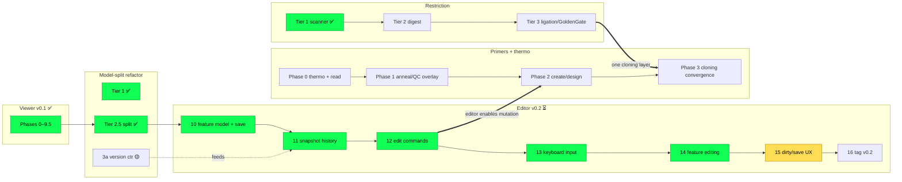

# SeqForge Roadmap

**This is the single source of truth for *where the project is and what comes next*.**
It owns sequencing and status across every workstream. It carries no design
detail — each track links to its own plan under [`plans/`](plans/), and durable
architecture contracts live under [`docs/`](docs/).

| Layer | Where | What it holds |
|---|---|---|
| **Roadmap** (this file) | `ROADMAP.md` | Milestones, per-track status, cross-track ordering |
| **Track plans** | `plans/*.md` | Per-workstream design + phase checkboxes |
| **Architecture** | `docs/*.md` | Cross-module contracts (stable, implementation-spanning) |
| **Users** | `README.md` | Install + usage |

---

## Milestones

| Milestone | Theme | State |
|---|---|---|
| **v0.1** | Read-only viewer + embedded terminal + single command layer | ✅ shipped (no tag — see Tagging policy) |
| **v0.2** | Editor — insert/delete/replace, undo, save, feature editing | ⏳ next |
| **(parallel)** | Restriction cloning depth (digest → ligation → Golden Gate) | 🟡 Tier 1 done |
| **(parallel)** | Primers + thermodynamics (Tm/GC → display → design) | 🟡 Phase 1 complete; Phase 1.5 (Inspector viewer/detail/editor) next |

### Tagging policy (pre-1.0)

`0.x` **is** the pre-release space (semver: below `1.0.0` the API may break between
minor versions), so a version tag here is a *milestone bookmark*, not a release
claim. We only tag when the tag has a consumer:

- **No retroactive `v0.1.0` tag.** Nothing external pins it, so a backdated tag
  buys nothing. v0.1 is simply "done."
- **Tag `v0.2.0` at Phase 16** — once the editor milestone is done *and* verified —
  as a durable "editor-complete" reference (bisect anchor / known-good state).
- The durable habit is **CHANGELOG discipline at milestone boundaries**, not the
  tag itself. Real version discipline starts when `seqforge-restriction` is
  extracted to crates.io (Restriction Tier 4).

---

## Tracks at a glance

Legend: ✅ done · 🟡 partial · ⏳ next · 📋 queued · ❌ removed

| Track | Plan | Status | Next concrete step |
|---|---|---|---|
| **Viewer (v0.1)** | [`plans/viewer.md`](plans/viewer.md) | ✅ Phases 0–9.5 | (complete — no retroactive tag, see Tagging policy) |
| **Model-split refactor** | [`plans/refactor.md`](plans/refactor.md) | ✅ Tier 1 / 2-light / 2.5 · 🟡 3a | (folds into editor) |
| **Editor (v0.2)** | [`plans/editor.md`](plans/editor.md) | 🟡 Stage 2.6 + Phases 10–15 done (14e; Phase 15 dirty/save UX; 14e ORF-colours→theme); GUI walk pending | Phase 16 — v0.2 verify |
| **Render tracks** | [`plans/render-tracks.md`](plans/render-tracks.md) | ✅ complete — T0–T4 (Track/TrackStack, composite Features track w/ 14e C2, layout memoization); minimap reuse dropped | — (primers build on the trait) |
| **Restriction** | [`plans/restriction.md`](plans/restriction.md) | 🟡 Tier 1 done | Tier 2 — digest + fragments |
| **Primers + thermo** | [`plans/primers.md`](plans/primers.md) | 🟡 Phase 1 complete (thermo QC, Inspector 3-tab pane, CLI `primers list`/`find`) | Phase 1.5 — Inspector as unified viewer/detail/editor (inline edit · enzyme→pane · primer oligo-copy), then Phase 2.1 |

---

## Cross-track sequencing

**Reading it:** the editor (v0.2) is the critical path and depends only on the
already-complete model split. Restriction Tier 2+ is fully **independent** — it
can advance any time. Primers Phase 0–1 are **pre-editor** (read-side, no
mutation) and independent; Primer Phase 2 (creation/design) waits on the editor's
mutation rails; Primer Phase 3 converges with Restriction Tier 3 into a single
cloning layer.

**Render tracks precede primers' *view* work — ✅ done.** The
[render-track refactor](plans/render-tracks.md) (rendering/interaction only — no domain
change) landed the `Track`/`TrackStack` abstraction, the composite Features track (deferred
editor 14e "CDS-under-feature"), and the per-frame layout perf fix (`viewer.rs` split into
`viewer/`). Primer + Tm/GC display surfaces are now built native to the `Track` trait. It
never blocked restriction, `seqforge tm`, or any non-view primer/thermo core work.

---

## Decisions of record

Cross-cutting choices that close off re-litigation. One line each; the linked doc owns the full rationale.

| # | Decision | Why (short) | Detail |
|---|---|---|---|
| 1 | Editor mutation = one `Splice` primitive; undo = per-buffer history of **text reverse-delta + annotation snapshot**, byte-budget bounded (no rope/anchors/transactions) | Delta text is cheap & exactly invertible; features are snapshotted (can't inverse-reconstruct a destroyed one). Relies on the single path; cost ≤ whole-buffer snapshot always | [`editor.md`](plans/editor.md) §1/§3/§4a; supersedes [`refactor.md`](plans/refactor.md) Tier 3 |
| 2 | `na_seq` → `seqforge-restriction` (zero-dep, extractable; reached only via `seqforge-bio`) | Need Type IIs/Golden Gate; isolate for crates.io extraction | [`restriction.md`](plans/restriction.md), [`architecture.md`](docs/architecture.md) |
| 3 | Primers = distinct persistent collection in `core`; Tm derived; shared `seqforge-thermo` | One thermo impl; primers ride the single mutation path | [`primers.md`](plans/primers.md) — **refined by decision 14** |
| 4 | Isoschizomers stay as distinct rows | A user may want a specific enzyme they physically have | [`viewer.md`](plans/viewer.md) |
| 5 | All edits are CLI/agent-reachable through one path; editor never mutates directly | Editor ops are `ViewerRequest`s; GUI resolves cursor→command; undo per-buffer + source-agnostic | [`editor.md`](plans/editor.md) §4a |
| 6 | `Fragment`/`Overhang` = two types bridged (not shared) | Mirrors `Site`→`CutSite`: restriction stays zero-copy; `core` owns bytes; bridge is lazy. Overhang = kind+length | direction below |
| 7 | GenBank/FASTA blunt-whole only; overhang never persisted | Overhang is derived from (sequence, enzyme); assembly = pure fn over blunt parts + recipe | direction below |
| 8 | Derived sequence data (complement, Tm, future translation/structure) is computed on demand, never stored on `core`; complement strand dropped from `Buffer` (Stage 2.6) | Storing a pure function of `text` is denormalization with a sync invariant; matches BioPython/OVE convention | [`architecture.md`](docs/architecture.md) "Derived sequence data" |
| 9 | Edits split: content-given primitive (`apply_splice` + insert/delete/replace) in `core`; bio-derived edits (revcomp, cloning, mutagenesis) compose in `command/edit.rs` | Mutation belongs with the aggregate that owns invariants; byte-derivation in `core` would force a `core→bio` cycle | [`architecture.md`](docs/architecture.md) "Edit operations"; [`editor.md`](plans/editor.md) §1 |
| 10 | GUI editing is **staged**: a `PendingEdit` is armed → previewed (realized diff, 13.6) → committed on `Enter` (one `ViewerRequest` = the matching CLI command). Buffer never mutates until commit. **Interactive GUI surfaces stage — keyboard *and* menu** (Cut/Paste/Delete); **only CLI/terminal/agent post immediately** (revised 13.6d: the split is interactive-vs-programmatic, not canvas-vs-menu). Copy + Reverse Complement stay immediate. Supersedes the earlier "always-editable, no modal" wording | DNA edits are deliberate (a stray keystroke can shift a frame); verified Benchling stages insertions; preview-before-destroy has real value regardless of GUI trigger; also simpler — one staging state machine + one commit path, undo = one entry per commit | [`editor.md`](plans/editor.md) §6 + Phase 13; **refined by decision 15** (Inspector entity-editing moves inline-in-pane) |
| 11 | Extensibility = (a) shared serde value vocabulary; (b) two plugin tiers — in-process Rust trait, and out-of-process JSON-RPC over the session socket the terminal already inherits; (c) an open registry extracted **after** two real cloning ops exist, not before. The `ViewerRequest` wire/CLI surface is single-source (clap+serde); dispatch is split — read-ops via `core::dispatch`, write-ops hand-routed in `command/edit.rs` (core⊘bio boundary, decision 9); a plugin op picks the matching path. Desktop-primary; other targets stay viewer + native runtime | Abstraction validated by real ops, not guessed; the socket bus already exists; only the data-model identity (feature handles) is expensive to retrofit | [`extensibility.md`](docs/extensibility.md) |
| 12 | Features are addressed **only by `FeatureId`** (structural, not by convention): `Annotations`' feature API is id-only (`get`/`get_mut`/`remove`/`rename`/ordered `iter`); positional index is a private within-frame render detail, never stored/serialized/returned. Ids are session-scoped (`#[serde(skip)]`, re-minted on load), so GenBank/FASTA stay positional. Resolution = scan over `Vec` (swap for `IndexMap` behind the same API only on profiling evidence — no `HashMap` denormalization, decision 8). Lands in editor Phase 14, before `v0.2.0` freezes the `--id` wire | Makes the stale-index bug class *unrepresentable* rather than reviewer-guarded; fixes persisted `selected_feature` dangling after edits; gives cloning/plugins a durable handle; `--index`→`--id` is a breaking wire change so it must precede the tag | [`editor.md`](plans/editor.md) Phase 14; [`extensibility.md`](docs/extensibility.md) |
| 13 | **In-viewer translation is a display layer, not annotations.** Three surfaces over one primitive (`seqforge-bio::translate`, IUPAC-consensus): (a) **feature-tied CDS translation lanes** under the sequence; (b) a **global 6-frame reading-frame view**, toggled per-view (any of +1/+2/+3, −1/−2/−3); (c) **ORFs are an *emphasis within* the frame lanes** (Met→stop runs highlighted, stops red / starts green) — **not** features. Promoting an ORF to a CDS feature is an explicit, optional opt-in (mirrors SnapGene "Create a Translated Feature"). One codon-aligned lane renderer serves (a) and (b). Feature **geometry** editing (type/range/strand/label) lands as one undoable `UpdateFeature` op + a unified Edit dialog. Pulls the previously-deferred "in-viewer translation lane" into Phase 14 scope | Matches SnapGene/Benchling/NCBI ORFfinder, where translations + ORFs are **view toggles** independent of annotations; ORFs-as-view avoids annotation churn while keeping an explicit commit path; translation is derived data (decision 8) so it never persists | [`editor.md`](plans/editor.md) Phase 14 |
| 14 | **Primers = authored objects attached relationally; thermo = one vendored `seqfold` engine.** A `Primer` (`name` + full 5'→3' `sequence` incl. tail + `binding: Option<Range>` **3'-anchored** + `strand`) is authored state in `core`, addressed by `PrimerId` (id-at-rest, decision 12; `Hit::Primer` carries the id directly). Decomposition (annealed/tail/mismatch) + Tm/GC/QC + attachment-state are **derived** — decision 8 governs template *projections*, not authored annotations. **Edits never delete a primer:** anchor-destroying/below-threshold edits set `Detached` (`binding=None`), surfaced in the staged preview (commit-on-Enter = confirm, no new modal) / reported by CLI. Binding rides a **primer-specific shift handler** (never `shift_features`, which drops collapsed ranges). Thermo = **vendored seqfold** (MIT, deps stripped, pure/zero-dep/extractable), reached only via `bio` (`bio→thermo` is the one new edge); primer3 (GPL) is an offline oracle only. Ungapped heteroduplex is covered by seqfold `tm(seq1,seq2)`; hetero-dimer / gapped-bulge / pair-selection deferred to Phase 3. | Primers are reagents, not sequence sub-ranges (5' tails have no template counterpart, so they can't be `Feature`s); one thermo impl; the audit's `shift_features`-drop + `binding.len()` + `SearchHit`-overload traps are closed against the implemented model. Refines decision 3 | [`primers.md`](plans/primers.md) ("Decisions locked" + "Consistency with the implemented model") |
| 15 | **Inspector pane = unified viewer/detail/editor.** Persistent, inspectable, *editable* collections (Enzymes · Primers · Features) are tabs in the one right-docked Inspector; only transient one-shot view-mutations (Find · GoTo) stay ephemeral bars. Editing is **inline-in-pane** (select → detail → edit-on-initiation), not launcher→center-modal: a transient draft + a `Pane:Inspector:Editing` focus-capture tag (Enter = commit → the one `ViewerRequest`/CLI verb; Esc = cancel), and the pane grabs no keys until an edit/query begins. The **enzyme overlay is retired** — its query re-homes to the Cut-sites tab header and ⌘E re-targets to focus it. One shared edit-mode + query-header mechanism, opt-in per noun (read-only nouns keep none). Refines the primers-track launcher→modal design; extends decision 10's staging grammar | Matches the Inspector/Properties-panel convention (Figma/Xcode/DevTools/Benchling); removes the enzyme-bar special case; preserves the single commit path + orphan-id protection while only *conditionally* relaxing "pane grabs no keys" (an anticipated additive focus tag); nets a LoC cut (drops the parallel enzyme-bar results renderer) | [`primers.md`](plans/primers.md) "Panels / Inspector" + Phase 1.5 |

---

## Reconciliations — resolved

The three prior open items are now settled and folded into their owning docs:

- ✅ **`Fragment` / `Overhang`** → decision 6 above. `&'static` and owned-`Vec<u8>` overhang both dropped; two-types-bridged, kind+length, lazy bridge.
- ✅ **`apply()` signature** → matched to the shipped code in [`docs/focus-refactor.md`](docs/focus-refactor.md) §2.2 (`apply<B: BioOps>(cmd, state, bio) -> Result<_, DispatchError>`, no `events` arg).
- ✅ **Enzyme overlay capture** → documented in [`plans/viewer.md`](plans/viewer.md) ("Post-v0.1: enzyme overlay").

## Deferred — direction recorded (no work now)

Cloning, `.dna`, and assembly workflows are **deferred until the editor handles edits**. We worked through the *direction* only, so wiring done now doesn't conflict later. Nothing here is a current task.

- **Cloning workflow = pure function over blunt parts + recipe.** `assemble(parts, recipe) -> product`; digest→ligate is in-memory; overhangs are transient/derived (decisions 6–7); the product is a new blunt `Buffer`. The *recipe* (which enzymes/parts/order) is the durable artifact, not the overhangs. Rough this out when the editor works.
- **`.dna` import** — the only file route to a *primary* sticky-ended fragment; also the lossless source for primer tails. Port from tg-oss when it lands. No stub now.
- **`WorkflowCommand` / recipe shape** — undesigned on purpose; lands with the cloning track.
- **Cloning forward-decls (`Fragment`/`Overhang`/`WorkflowCommand`) are NOT in editor Phase 10** — added when cloning starts; this direction note is the anti-conflict guard instead of stub types.
- **Plugins/extensibility = trajectory, not work.** Shared value vocabulary + two plugin tiers + registry-after-two-ops + Python-over-socket. Full shape in [`docs/extensibility.md`](docs/extensibility.md) (decision 11); nothing here is a task.
- **Act-now foundation: runtime `FeatureId`.** The only extensibility choice with a retrofit cost; lands in editor [Phase 14](plans/editor.md). Everything else is additive later. Also on record: the terminal exports `SEQFORGE_SOCKET` via process-global `set_var` today — explicit child-env plumbing is a deferred hardening direction (see `docs/extensibility.md`).
