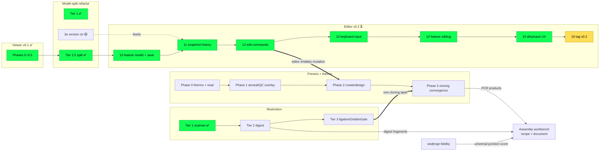

# SeqForge Roadmap

**This is the single source of truth for *where the project is and what comes next*.**
It owns sequencing and status across every workstream. It carries no design
detail — each track links to its own plan under [`plans/`](plans/), and durable
architecture contracts live under [`docs/`](docs/).

| Layer | Where | What it holds |
|---|---|---|
| **Roadmap** (this file) | `ROADMAP.md` | Milestones, per-track status, cross-track ordering |
| **Track plans** | `plans/*.md` | Per-workstream design + phase checkboxes |
| **Architecture** | `docs/*.md` | Cross-module contracts (stable, implementation-spanning) |
| **Users** | `README.md` | Install + usage |

---

## Milestones

| Milestone | Theme | State |
|---|---|---|
| **v0.1** | Read-only viewer + embedded terminal + single command layer | ✅ shipped (no tag — see Tagging policy) |
| **v0.2** | Editor — insert/delete/replace, undo, save, feature editing | ✅ shipped — tagged `v0.2.0` |
| **(v0.2 gate)** | Methylation-aware cut sites (Dam/Dcm/CpG) — cloning correctness | ✅ done (in the tag) |
| **(parallel)** | Restriction cloning depth (digest → ligation → Golden Gate) | 🟡 Tier 1 done |
| **(parallel)** | Primers + thermodynamics (Tm/GC → display → design) | 🟡 Phases 1, 1.5, 2.1, 2.1b, 2.2a complete; 2.2b (generative package: random oligos, barcode/overhang sets) deferred |
| **v0.3** | **Cloning / assembly** — PCR → fragments → ligation/Golden Gate, fidelity-scored, CLI/GUI/agent parity, batch | 🟡 A1/F1 in tree (workbench + matrix %); Gibson / GetSet / polish next |

### Tagging policy (pre-1.0)

`0.x` **is** the pre-release space (semver: below `1.0.0` the API may break between
minor versions), so a version tag here is a *milestone bookmark*, not a release
claim. We only tag when the tag has a consumer:

- **No retroactive `v0.1.0` tag.** Nothing external pins it, so a backdated tag
  buys nothing. v0.1 is simply "done."
- **`v0.2.0` — tagged.** Marks the **viewer + editor foundation** as complete and
  frozen: read a sequence, edit it losslessly (insert/delete/replace/RC, undo,
  save, feature editing), with methylation-aware cut sites for cloning correctness
  (decision 18). It is a milestone bookmark / bisect anchor and the **gate to the
  generative/assembly track** (PCR, restriction digest → fragments, ligation,
  Golden Gate) — not a release claim. Verification bar was deliberately modest to
  match that role: editor GUI walk confirmed + the programmatic round-trip / undo-
  inverse tests green on Linux CI. **Cross-platform (macOS/Windows) CI was
  descoped** from the gate — it belongs to an eventual release milestone, not a
  foundation-freeze bookmark.
- The durable habit is **CHANGELOG discipline at milestone boundaries**, not the
  tag itself. Real version discipline starts when `seqforge-restriction` is
  extracted to crates.io (Restriction Tier 4).

---

## Tracks at a glance

Legend: ✅ done · 🟡 partial · ⏳ next · 📋 queued · ❌ removed

| Track | Plan | Status | Next concrete step |
|---|---|---|---|
| **Viewer (v0.1)** | [`plans/viewer.md`](plans/viewer.md) | ✅ Phases 0–9.5 | (complete — no retroactive tag, see Tagging policy) |
| **Model-split refactor** | [`plans/refactor.md`](plans/refactor.md) | ✅ Tier 1 / 2-light / 2.5 · 🟡 3a | (folds into editor) |
| **Editor (v0.2)** | [`plans/editor.md`](plans/editor.md) | ✅ Phases 10–16 done — GUI walk confirmed, round-trip + undo-inverse tests green; **tagged `v0.2.0`** | (foundation complete — generative/assembly track next) |
| **Render tracks** | [`plans/render-tracks.md`](plans/render-tracks.md) | ✅ complete — T0–T4 (Track/TrackStack, composite Features track w/ 14e C2, layout memoization); minimap reuse dropped | — (primers build on the trait) |
| **Restriction** | [`plans/restriction.md`](plans/restriction.md) | 🟡 Tier 1 done | Tier 2 — the `Fragment`/`End` interface + multi-enzyme digest + Fragments view (the assembly *substrate*) |
| **Methylation** | [`plans/methylation.md`](plans/methylation.md) | ✅ done — pipeline + evaluator + integration + GUI-confirmed (in `v0.2.0`) | (correctness gate met; EcoBI/EcoKI additive later) |
| **Primers + thermo** | [`plans/primers.md`](plans/primers.md) | 🟡 Phases 1, 1.5, 2.1, 2.1b, 2.2a, **3.1 (PCR)** complete (thermo QC; Inspector unified viewer/detail/**inline-editor**; 1.5e oligo-highlight; enzyme-in-pane; CLI list/find + add/update/remove/rescan/add-site-primer; 2.1b binding-site listing + rescan/attach/detach + anneal-Tm; 2.2a restriction-site tail composition; **3.1 PCR** — `seqforge-bio::pcr` + `ViewerRequest::Pcr`/`seqforge pcr --fwd --rev` → product buffer inheriting template annotations via `extract(TruncatePartials)`+`place`, around-the-horn on circular; `PrimerPair` Cmd-click selection + Run-PCR banner) | **Next: 2.2b generative package** / **3.1c** assembly `FragmentSource::Pcr` hook / **3.2** hetero-dimer QC |
| **Feature model + transport** | [`plans/feature-model.md`](plans/feature-model.md) | 📋 design of record | **F0 — Feature `Location` model** (`range`→`location`+`.span()`, stop flattening GenBank locations, fuzzy + join/segments), then F1 transport (extract/place/merge, proven via copy/paste) |
| **Buffer lifecycle & topology** | [`plans/buffer-lifecycle.md`](plans/buffer-lifecycle.md) | ✅ done — `New` scratch buffer, `SetOrigin`/`Linearize`/`Circularize` (topology-undo via history stamp), whole-molecule feature-aware `ReverseComplement`; end-to-end copy→New→paste verified | (transport-verification harness met; PCR/assembly reuse `new_buffer` + topology verbs) |
| **Assembly** | [`plans/assembly.md`](plans/assembly.md) | 🟡 A1 v0 — bins · Digest/PCR/AsIs prepare · Ligate/GG join · combo table · workbench + CLI dry-run | A2+ Gibson / homology; combinatorial UX polish; plugin region API |
| **Fidelity** | [`plans/fidelity.md`](plans/fidelity.md) | ✅ F1 — matrix-first NEB Viewer math (RC expand, palindromes ×2); Join-strip % + CLI `--fidelity-matrix` (session / dry-run only; never recipe IR; never gates Run) | F2 GetSet/SplitSet; F3 crates.io extraction |
| **Workbench shell** | [`plans/workbench.md`](plans/workbench.md) | ✅ done — native-panel regions (Files L / Inspector+minimap R / Terminal ⊥ / editor center) replace the homogeneous dock; last-tab-close collapse fixed; flat `WorkbenchLayout` persistence (visibility-only, egui owns sizes) | assembly track proper — plugin/agent region contribution API |

---

## Cross-track sequencing

**Reading it:** the editor (v0.2) is the critical path and depends only on the
already-complete model split. Restriction Tier 2+ is fully **independent** — it
can advance any time. Primers Phase 0–1 are **pre-editor** (read-side, no
mutation) and independent; Primer Phase 2 (creation/design) waits on the editor's
mutation rails; Primer Phase 3 converges with Restriction Tier 3 into a single
cloning layer.

**Render tracks precede primers' *view* work — ✅ done.** The
[render-track refactor](plans/render-tracks.md) (rendering/interaction only — no domain
change) landed the `Track`/`TrackStack` abstraction, the composite Features track (deferred
editor 14e "CDS-under-feature"), and the per-frame layout perf fix (`viewer.rs` split into
`viewer/`). Primer + Tm/GC display surfaces are now built native to the `Track` trait. It
never blocked restriction, `seqforge tm`, or any non-view primer/thermo core work.

---

## Decisions of record

Cross-cutting choices that close off re-litigation. One line each; the linked doc owns the full rationale.

| # | Decision | Why (short) | Detail |
|---|---|---|---|
| 1 | Editor mutation = one `Splice` primitive; undo = per-buffer history of **text reverse-delta + annotation snapshot**, byte-budget bounded (no rope/anchors/transactions) | Delta text is cheap & exactly invertible; features are snapshotted (can't inverse-reconstruct a destroyed one). Relies on the single path; cost ≤ whole-buffer snapshot always | [`editor.md`](plans/editor.md) §1/§3/§4a; supersedes [`refactor.md`](plans/refactor.md) Tier 3 |
| 2 | `na_seq` → `seqforge-restriction` (zero-dep, extractable; reached only via `seqforge-bio`) | Need Type IIs/Golden Gate; isolate for crates.io extraction | [`restriction.md`](plans/restriction.md), [`architecture.md`](docs/architecture.md) |
| 3 | Primers = distinct persistent collection in `core`; Tm derived; shared `seqforge-thermo` | One thermo impl; primers ride the single mutation path | [`primers.md`](plans/primers.md) — **refined by decision 14** |
| 4 | Isoschizomers stay as distinct rows | A user may want a specific enzyme they physically have | [`viewer.md`](plans/viewer.md) |
| 5 | All edits are CLI/agent-reachable through one path; editor never mutates directly | Editor ops are `ViewerRequest`s; GUI resolves cursor→command; undo per-buffer + source-agnostic | [`editor.md`](plans/editor.md) §4a |
| 6 | `Fragment`/`Overhang` = two types bridged (not shared) | Mirrors `Site`→`CutSite`: restriction stays zero-copy; `core` owns bytes; bridge is lazy. Overhang = kind+length | direction below |
| 7 | GenBank/FASTA blunt-whole only; overhang never persisted | Overhang is derived from (sequence, enzyme); assembly = pure fn over blunt parts + recipe | direction below |
| 8 | Derived sequence data (complement, Tm, future translation/structure) is computed on demand, never stored on `core`; complement strand dropped from `Buffer` (Stage 2.6) | Storing a pure function of `text` is denormalization with a sync invariant; matches BioPython/OVE convention | [`architecture.md`](docs/architecture.md) "Derived sequence data" |
| 9 | Edits split: content-given primitive (`apply_splice` + insert/delete/replace) in `core`; bio-derived edits (revcomp, cloning, mutagenesis) compose in `command/edit.rs` | Mutation belongs with the aggregate that owns invariants; byte-derivation in `core` would force a `core→bio` cycle | [`architecture.md`](docs/architecture.md) "Edit operations"; [`editor.md`](plans/editor.md) §1 |
| 10 | GUI editing is **staged**: a `PendingEdit` is armed → previewed (realized diff, 13.6) → committed on `Enter` (one `ViewerRequest` = the matching CLI command). Buffer never mutates until commit. **Interactive GUI surfaces stage — keyboard *and* menu** (Cut/Paste/Delete); **only CLI/terminal/agent post immediately** (revised 13.6d: the split is interactive-vs-programmatic, not canvas-vs-menu). Copy + Reverse Complement stay immediate. Supersedes the earlier "always-editable, no modal" wording | DNA edits are deliberate (a stray keystroke can shift a frame); verified Benchling stages insertions; preview-before-destroy has real value regardless of GUI trigger; also simpler — one staging state machine + one commit path, undo = one entry per commit | [`editor.md`](plans/editor.md) §6 + Phase 13; **refined by decision 15** (Inspector entity-editing moves inline-in-pane) |
| 11 | Extensibility = (a) shared serde value vocabulary; (b) two plugin tiers — in-process Rust trait, and out-of-process JSON-RPC over the session socket the terminal already inherits; (c) an open registry extracted **after** two real cloning ops exist, not before. The `ViewerRequest` wire/CLI surface is single-source (clap+serde); dispatch is split — read-ops via `core::dispatch`, write-ops hand-routed in `command/edit.rs` (core⊘bio boundary, decision 9); a plugin op picks the matching path. Desktop-primary; other targets stay viewer + native runtime | Abstraction validated by real ops, not guessed; the socket bus already exists; only the data-model identity (feature handles) is expensive to retrofit | [`extensibility.md`](docs/extensibility.md) |
| 12 | Features are addressed **only by `FeatureId`** (structural, not by convention): `Annotations`' feature API is id-only (`get`/`get_mut`/`remove`/`rename`/ordered `iter`); positional index is a private within-frame render detail, never stored/serialized/returned. Ids are session-scoped (`#[serde(skip)]`, re-minted on load), so GenBank/FASTA stay positional. Resolution = scan over `Vec` (swap for `IndexMap` behind the same API only on profiling evidence — no `HashMap` denormalization, decision 8). Lands in editor Phase 14, before `v0.2.0` freezes the `--id` wire | Makes the stale-index bug class *unrepresentable* rather than reviewer-guarded; fixes persisted `selected_feature` dangling after edits; gives cloning/plugins a durable handle; `--index`→`--id` is a breaking wire change so it must precede the tag | [`editor.md`](plans/editor.md) Phase 14; [`extensibility.md`](docs/extensibility.md) |
| 13 | **In-viewer translation is a display layer, not annotations.** Three surfaces over one primitive (`seqforge-bio::translate`, IUPAC-consensus): (a) **feature-tied CDS translation lanes** under the sequence; (b) a **global 6-frame reading-frame view**, toggled per-view (any of +1/+2/+3, −1/−2/−3); (c) **ORFs are an *emphasis within* the frame lanes** (Met→stop runs highlighted, stops red / starts green) — **not** features. Promoting an ORF to a CDS feature is an explicit, optional opt-in (mirrors SnapGene "Create a Translated Feature"). One codon-aligned lane renderer serves (a) and (b). Feature **geometry** editing (type/range/strand/label) lands as one undoable `UpdateFeature` op + a unified Edit dialog. Pulls the previously-deferred "in-viewer translation lane" into Phase 14 scope | Matches SnapGene/Benchling/NCBI ORFfinder, where translations + ORFs are **view toggles** independent of annotations; ORFs-as-view avoids annotation churn while keeping an explicit commit path; translation is derived data (decision 8) so it never persists | [`editor.md`](plans/editor.md) Phase 14 |
| 14 | **Primers = authored objects attached relationally; thermo = one vendored `seqfold` engine.** A `Primer` (`name` + full 5'→3' `sequence` incl. tail + `binding: Option<Range>` **3'-anchored** + `strand`) is authored state in `core`, addressed by `PrimerId` (id-at-rest, decision 12; `Hit::Primer` carries the id directly). Decomposition (annealed/tail/mismatch) + Tm/GC/QC + attachment-state are **derived** — decision 8 governs template *projections*, not authored annotations. **Edits never delete a primer:** anchor-destroying/below-threshold edits set `Detached` (`binding=None`), surfaced in the staged preview (commit-on-Enter = confirm, no new modal) / reported by CLI. Binding rides a **primer-specific shift handler** (never `shift_features`, which drops collapsed ranges). Thermo = **vendored seqfold** (MIT, deps stripped, pure/zero-dep/extractable), reached only via `bio` (`bio→thermo` is the one new edge); primer3 (GPL) is an offline oracle only. Ungapped heteroduplex is covered by seqfold `tm(seq1,seq2)`; hetero-dimer / gapped-bulge / pair-selection deferred to Phase 3. | Primers are reagents, not sequence sub-ranges (5' tails have no template counterpart, so they can't be `Feature`s); one thermo impl; the audit's `shift_features`-drop + `binding.len()` + `SearchHit`-overload traps are closed against the implemented model. Refines decision 3 | [`primers.md`](plans/primers.md) ("Decisions locked" + "Consistency with the implemented model") |
| 16 | **A primer is one authored noun; its binding *sites* are a derived 0..N set.** The `Primer` carries a single authored `binding` (intended/last-known footprint); where the oligo *actually* anneals on the current template is derived and can be many (repeats, off-targets). The projection stops collapsing that to one `PrimerState` — `PrimerInfo.sites: Vec<PrimerSiteInfo>` lists every site (each with anneal-Tm + an `attached` flag), scanned independently of the authored binding so a **floating oligo still surfaces candidate sites**. Attachment is managed on both an **implicit** path (template edits auto-detach via `shift_primers`, decision 4) and now an **explicit** one: **Rescan** (`RescanPrimer` — re-anchor to the best site), per-site **Attach** (`UpdatePrimer` footprint), and **detach** (`UpdatePrimer.detach` flag — breaks the `(start,end)=None`="keep" ambiguity). Tm is shown two ways, each in its place: intrinsic **self-Tm** (oligo-only, always) and **anneal Tm** (duplex vs the footprint, primary when attached — computed where the template is in hand). | A single `PrimerState` scalar can't represent mispriming or let you pick among sites; the same oligo genuinely binds in multiple places, and that's the QC signal that matters. Off-target *listing* is a clean read-side extension of the existing find pass; pair/reaction specificity scoring stays Phase 3. Extends decision 14 (authored-vs-derived) with the site multiplicity it implied | [`primers.md`](plans/primers.md) Phase 2.1b + decision 13 |
| 17 | **View selection is one `ViewSelection` sum type — mutual exclusion is structural, not by-convention** (extends decision 12 from feature ids to selection state). Replaces the three parallel `View` fields (`selection` / `selected_feature` / `selected_primer`, whose "at most one object; range mirrors it" invariant was hand-maintained across ~8 command handlers + ~7 viewer click branches) with `View.selection: ViewSelection` = `None \| Text(Selection) \| Feature{id,range} \| Primer(id) \| CutSite{key,range}`. Object variants carry their template range so `text_range()` is self-contained (a `View` can't reach `Annotations`); accessors (`text_range` / `selected_feature` / `selected_primer` / `selected_cut_site`) derive what consumers read. The `SetSelection`/`SelectFeature`/`SelectPrimer` triple collapses to one `Select(ViewSelection)`; producers set the full intent atomically. **Enzyme parity falls out as the `CutSite` variant**: a map cut-site click and an Inspector row click both set `CutSite{key,range}` (`CutSiteKey{enzyme, recognition_start}` — id-less, position-keyed, the enzyme analog of decision 16's derived sites), giving cut-sites the same bidirectional map↔panel selection primers/features have, at single-site granularity. Persisted DTO unchanged (stores only the derived range; object identity stays session-scoped — ids re-mint on load, decision 12). The payload is the reusable "selectable item" vocabulary a future assembly workbench / plugins consume (decision 11); a `Fragment` variant + multi-select cart are **deferred to the cloning track** (not built). **Follow-ups (same pre-v0.2 pass):** (a) a geometry edit of the *selected* feature re-syncs its stored range from live annotations (`edit_annotations` doesn't reset selection, so the cached range would otherwise lag); (b) the Inspector's three `selected_*` fields collapse to one `selected: Option<SelectedNoun>` (they were mutually-exclusive projections of the one selection); (c) **follow-selection** — selecting an object switches the Inspector's active tab to follow it, behind `inspector.follow_selection` (default on; off = highlight-only), firing only on object *change* so a manual tab switch sticks; (d) `ViewSelection::delete_intent()` centralizes the Delete dispatch (compiler-forced exhaustiveness per noun). | Makes the object-vs-range invariant *unrepresentable* rather than reviewer-guarded (same win as decision 12); closes the enzyme-selection inconsistency for free; one serde-friendly, id-based selection is the clean substrate for plugin/agent addressing + component-style cloning. Landed pre-v0.2 so the tag freezes the consolidated shape | [`viewer.md`](plans/viewer.md) "Post-v0.1: cut-site hover + selection"; [`primers.md`](plans/primers.md) "Rendering" |
| 18 | **Methylation sensitivity rides the same ingestion pipeline as the enzyme table, joined onto the same `Enzyme` record; a blocked-here verdict is two-factor (enzyme sensitivity ∧ methylatable context present in *this* site).** Sensitivity is **not** in `bairoch` (nor any REBASE bulk file) — it lives only in REBASE's per-enzyme `damlist` CGI records, so a bounded scraper (`ms_scrape`, only the ~300 kept enzymes) emits a second **regenerated, gitignored** snapshot (`rebase_methylation.tsv`, fetched-at-ingest like `bairoch`) that `codegen` joins by enzyme name (recognition-seq fallback for isoschizomers) into a **required** `Enzyme.methylation: MethylSensitivity{dam,dcm,cpg}` field baked into the committed `enzymes_generated.rs` (the reviewable artifact). Parity is enforced in three layers: type (non-`Option` ⇒ compiler forces a value), join (exact name key + conflict detector), and a **coverage-gate test** (`every_enzyme_has_sourced_methylation`, fails if a kept enzyme is `Untested` outside a reviewed allowlist at `tests/fixtures/ms_untested_allow.txt`). The per-sequence Dam/Dcm/CpG **context** is authored/persisted state (default Dam+Dcm on = real *E. coli* DNA); the site verdict is derived (decision 8) and surfaces on the Cut-sites tab via the `CutSite` selection (decision 17). | Showing a methylation-blocked enzyme as cuttable is a silent wrong answer, so it's a `v0.2` correctness gate; making sensitivity a required field on the one record makes "enzyme missing its sensitivity data" unrepresentable rather than reviewer-caught (same move as decisions 12/17); one pipeline keeps recognition + sensitivity provably in lockstep on every snapshot refresh | [`plans/methylation.md`](plans/methylation.md) |
| 19 | **The workbench is structural native-panel *regions*, not a homogeneous dock tree.** Files/Terminal/Inspector are `SidePanel`/`TopBottomPanel` regions (toggleable, resizable, never-collapsing); the editor is a privileged `CentralPanel` that always exists (holding the center View dock, or a Welcome empty-state when no file is open). `egui_dock` is demoted to managing **only** the center `View` tab strip (side-by-side split preserved). The homogeneous dock's invariant-maintenance layer (`ensure_welcome_invariant`, cross-leaf `place_view_tab` hunting, the inspector re-docking dance, the tree-mirroring `LayoutSnapshot`) is deleted; persistence becomes a flat `WorkbenchLayout` (panel visibility + sizes + open paths). Tear-off floating windows / drag-anywhere docking are dropped by design. **Regions carry a scope:** left = workspace navigation (Files), right = active-document surface (Inspector + the minimap overview pinned at its bottom — both read the active view), bottom = terminal, center = editor; this let the vestigial `[layout]` split fractions be deleted (egui owns panel sizes). | The homogeneous tree let a neighbor take the collapsed center (last-tab-close stranded the viewer in the Files pane, persisted across launches) — structural regions make that *unrepresentable* (same move as decisions 12/17) and cut the bug-prone invariant code; **named regions are the contribution substrate** the assembly workbench + plugin/agent model need (decision 11) — a free-dock tree has no stable slots to target. Landed as the opening infra of the generative/assembly track, post-`v0.2.0` | [`plans/workbench.md`](plans/workbench.md) |
| 15 | **Inspector pane = unified viewer/detail/editor.** Persistent, inspectable, *editable* collections (Enzymes · Primers · Features) are tabs in the one right-docked Inspector; only transient one-shot view-mutations (Find · GoTo) stay ephemeral bars. Editing is **inline-in-pane** (select → detail → edit-on-initiation), not launcher→center-modal: a transient draft + a `Pane:Inspector:Editing` focus-capture tag, and the pane grabs no keys until an edit/query begins. **The editor is one *staged operation* — pure confirm/cancel** (mirrors decision 10 canvas staging): `Enter` commits the *pending op* (the one `ViewerRequest`/CLI verb — Save when editing, delete when armed), `Esc`/Cancel cancels; a **Delete** button re-stages the pending op (feature delete is keyboard-complete: `Delete → Enter`). **One editor, reached from pane *or* canvas** — canvas edit/delete gestures route in via `EditFeatureInInspector` (the center `FeatureForm` is retired for editing; still used for create until 2.1). The **enzyme overlay is retired** — its query re-homes to the Cut-sites tab header and ⌘E re-targets to focus it. One shared edit-mode + query-header mechanism, opt-in per noun (read-only nouns keep none). Refines the primers-track launcher→modal design; extends decision 10's staging grammar | Matches the Inspector/Properties-panel convention (Figma/Xcode/DevTools/Benchling); removes the enzyme-bar special case; preserves the single commit path + orphan-id protection while only *conditionally* relaxing "pane grabs no keys" (an anticipated additive focus tag); nets a LoC cut (drops the parallel enzyme-bar results renderer) | [`primers.md`](plans/primers.md) "Panels / Inspector" + Phase 1.5 |
| 20 | **PCR ships standalone as the fragment *generator*; two-primer selection = a bounded `PrimerPair` variant, not multi-select.** A Primers-tab action + `seqforge pcr --fwd --rev` produces a product `Buffer` (mismatches bake in = mutagenesis; tails become ends = overhangs; circular templates give around-the-horn/whole-plasmid for free), depending on nothing downstream. Selecting the pair extends decision 17 with `PrimerPair { fwd, rev }` (ordered, orientation from strand + ⇄ swap, derived range = amplicon span); **Cmd-click** promotes/replaces/removes on list *and* map; **Shift is reserved** for the future cart's range/N-select. | PCR reuses the shipped binding/decompose passes, so it's assembly-of-existing-outputs, not new biology; a bounded pair keeps decision 17's structural single-object invariant (no N-select ripple through feature/cut-site consumers) while giving the intuitive gesture + free amplicon highlight; decouples PCR from the assembly cart (neither blocks the other) | [`primers.md`](plans/primers.md) Phase 3.1 |
| 21 | **Assembly = a pure `join` verb over a closed `Fragment` IR; the recipe is provenance; fidelity is a universal % metric, not an IIS "mode".** `Product = Fragment` (closure → hierarchical assembly for free). A method is the *only* method-specific code — one pure `fn(Vec<Fragment>) -> Vec<Product>`; the pipeline around it (prepare · select · expand · join · filter · name · preview) is shared, so a new method (or plugin op) = one function. **Prepare** = a per-bin operator (`Digest(enzyme-SET)`/`Pcr`/`Homology`/`AsIs`, default+override). **Select** = one grammar `source[left..right]` (endpoints: enzyme·feature·coordinate; orientation by order; `:E/E` sugar; semantic-first per decision 12), backed by a structured `FragmentSelector` (the `ViewSelection` analog, decision 17; `End.cut_by` serves selection only). **Topology** is derived (closed↔circular) and filtered by an intent enum (`Circular\|Linear\|Any`), never forced; ambiguous joins return a product *set*. **Individual vs batch is emergent** (combo count), preview appears when >1. The surface is a recipe *document* (decision 19, no floating window) whose recipe = replayable provenance; products → `Buffer → Tab::View`. The Potapov matrix is keyed by **overhang sequence, not enzyme** → the join *always* scores its junction set as a **% correct**; enzyme type only shapes reaction warnings; "no data" for blunt/2-base/3′; Gibson gets homology-uniqueness. Parity = one structured request, three faces (GUI gesture / CLI text / recipe serde), minimal verbs `digest·pcr·assemble·fidelity` with `--dry-run`/`--emit-recipe`. | Closure + pure-verb-over-fragments is the model pydna/DNA Cauldron converged on; it makes new methods, batch, hierarchy, and agent use fall out of one engine instead of four features; the enzyme-agnostic % removes a mode-detection branch and correctly scores palindromic Type II sets low (~1/N); the selector grammar keeps decision 12's semantic addressing for a *derived* object; the whole surface projects to a minimal, dry-run-able CLI/agent API — the parity thesis realized on assembly, which SnapGene (visual-only) and Benchling (GUI-locked batch) lack | [`plans/assembly.md`](plans/assembly.md) |
| 22 | **`seqforge-fidelity` = the methylation pipeline again** (decision 18): gitignored snapshot → `codegen` → committed `fidelity_generated.rs` static matrix, zero-dep/extractable. **API is matrix-first** (`expand_overhang_labels` / `subset_matrix` / `junction_fidelity`); % is the NEB Ligase Fidelity Viewer summary — RC-expand every input, **palindromes appear twice** on the axes, `set = Π M[h][rc(h)] / Σ_j M[h][labels[j]]`. **Data: Potapov 2018 + Pryor 2020 via tatapov_data (CC BY-ND 4.0), including SapI 3-nt.** Score is **informational only** — GUI session or CLI `--dry-run --fidelity-dataset` (`--fidelity-matrix` for the subset JSON); **never** in `recipe.json`; **never** gates/filters Run. In-tree workspace crate (extract later like restriction Tier 4). | One pipeline pattern across REBASE / methylation / fidelity; BY-ND keeps counts unaltered; Viewer-shaped scoring (not GoldenHinges design — that is F2) | [`plans/fidelity.md`](plans/fidelity.md) |
| 23 | **Feature geometry becomes a GenBank-native `Location` (simple + fuzzy + join); annotation transport is one provenance-keyed pipeline (`extract`/`place`/`merge`) shared by copy/paste, PCR, and ligation — built mature *before* the cloning consumers.** `Feature.range: Range` → `Feature.location: Location` (`Simple{range, before/after}` = `<`/`>` partial · `Join(Vec)` = SnapGene "segments" · `Complement`), with a **derived `.span() -> Range`** (never stored — decision 8) so the blast radius is a `range → span()` accessor swap and segment-awareness is opt-in. `genbank.rs` **stops flattening** (`gb_io::Location ↔ core::Location`, no more `find_bounds()` loss). The transport carrier `SeqSlice{bytes, features, primers}` = the blunt/linear degenerate of decision 21's `Fragment` (a lean `Document`); `extract(range, circular, policy)` decides the **partial policy once** (`DropPartials` default = Biopython `record[a:b]` · `TruncatePartials` = fuzzy-mark); `place(slice, offset, orient, merge)` shifts + flips (`Orient::Rev` for ligation) + **re-mints ids** (decision 12) + **merges features by lineage** (`Provenance`, *not* name — name-only false-merges distinct same-named features). **Features and primers both transfer** on one containment predicate (primers keyed on the authored `binding ⊆ range`, reusing `shift_features`/`shift_primers`; a straddling primer *detaches* — reagent survives — and primers never merge); derived data (cut sites/ORFs/QC) recomputes. Proven through **copy/paste-with-features-and-primers** (should have ridden in originally), then PCR (Δ=tail offset), then ligation (per-fragment offset + orient + `End`s). | copy/paste, PCR, and ligation are the *same* extract→place→(merge) op — building it three times invites three divergent partial-feature bugs; making geometry the GenBank location model closes the current silent data loss (we already parse `join`/fuzzy via `gb_io` then discard it); the `.span()` accessor keeps it decision-8-clean + confined; provenance-keyed merge makes SnapGene's "segments" rejoin *unambiguous* where name-matching isn't. Pulled ahead of PCR because a shared foundation should be mature before upstream features rely on it | [`plans/feature-model.md`](plans/feature-model.md) |
| 24 | **Provenance is one primitive — a coordinate-lineage map (`local_span → (source_id, source_span, op)`), the dual of `Location::map_spans`** — of which per-feature provenance, the transport merge key, segment blame, `Fragment` ends, and the recipe are all *projections/compositions*, never independent fields. Down-payment landed now: the whole-span "product" marker feature (a third, divergent mechanism) is **removed**; the merge key is a **source-identity query** (`Lineage::same_source` — `source_doc` + `source_range` geometry, `op` is not part of the key), which fixes the old opaque-`Eq` footgun and is the same query the buffer-level map will run; `Provenance` → `Lineage` (field `Feature.lineage`) with a **typed, closed `LineageOp`** vocabulary so the op label can't drift for its recipe/display consumers; qualifier `seqforge_lineage`. **Deferred to A1:** relocating the map off individual features onto `Annotations`, recipe composition, and the buffer-level ↔ GenBank persistence carrier (A1 must solve that anyway; the typed `LineageOp` + JSON payload is the reusable serialization unit). | Three mechanisms (per-feature record + whole-span marker + recipe) were denormalized copies of one fact plus its composition — collapsing to the map kills the "which provenance?" ambiguity at the root, makes "the recipe is provenance" (decision 21) literal, and gives A1's blame/`Fragment.provenance` for free; typing `op` + moving the merge key onto geometry removes the ad-hoc-string footgun; building the storage relocation now would design the map against consumers that don't exist yet | [`docs/architecture.md`](docs/architecture.md) "Lineage" |
| 25 | **Assembly inputs are buffers *or* files (referenced, not opened, content-pinned); fragments are virtual values — only products materialize.** A recipe is *n* **bins**, each = ≥1 source + a **prepare op with its own enzyme(s)** (`Digest(set)`/`Pcr`/`Homology`/`AsIs`) + optional selector; conventional shape = one vector/backbone bin + insert(1..n) bins. **Bins live in prepare/select only — the `join` verb is role-blind** (flat `Vec<Fragment>`, end-driven, topology *derived*): "vector"/"insert" are UX roles and circularity is never declared, only filtered by intent. Intermediate fragments are in-memory `Fragment` values (`extract` → `SeqSlice`) rendered as **gel-lane/list projections over their live sources**, never their own buffers/tabs; `new_buffer_annotated` materializes only a **product** (→ `Buffer → Tab::View`) or an **opt-in single-fragment export**. A **bin is a pool of candidates**, so an **individual reaction** (one fragment/bin → one product) and a **combinatorial library** (k/bin → kⁿ products, fidelity-scored) are the **same workflow** at different cardinalities; linear ligation = the `ligate` join with no vector bin + `Linear` intent. Refines decisions 20/21 with the input/materialization/bin contract; consumes decision 24 (`Fragment.lineage`). | Materializing every digest/library fragment as a buffer floods the workspace, contradicts recipe-as-provenance (intermediates never saved, decisions 21/24), and hands agents buffer-lifecycle bookkeeping instead of symbolic refs; keeping bins out of the join preserves the one-pure-verb engine (decision 21) while the GUI keeps familiar vector/insert lanes; content-pinning makes replay deterministic; individual-rx and library being one workflow is the j5/DIVA combinatorial model with SnapGene's single-construct ease unified — plus the GUI≡CLI≡agent parity none of them offer | [`plans/assembly.md`](plans/assembly.md) decision 10 |
| 26 | **Assembly authoring is one 5′/3′ language: prepare is ordered ends, bin index is join order; join is identity-only.** `PrepareKind::Digest { five_prime, three_prime }` / `Pcr { fwd, rev }` / `AsIs`; walk the template 5′→3′ of the excised piece; **bin order + prepared orientation are preserved in the join** (no silent fragment flips). Both orientations = multiple sources in a bin or complementary `@E1..E2` walks across bins. Sources are a bulk list (multi-select · glob · open-buffer). **Ambiguity = an endpoint enzyme that cuts >1×** (site dropdown / `@pos` on that end only). Same enzyme twice with exactly two sites defaults to min→max; GUI ⇄ swaps prepare ends. CLI `--dry-run` / workbench status probe join end-compatibility without materializing products. | One sentence for prepare; strict orientation keeps join/features from chasing flip edge cases; combinatorial width is sources-in-bin | [`plans/assembly.md`](plans/assembly.md) "Authoring UX (A1.1)" |

---

## Reconciliations — resolved

The three prior open items are now settled and folded into their owning docs:

- ✅ **`Fragment` / `Overhang`** → decision 6 above. `&'static` and owned-`Vec<u8>` overhang both dropped; two-types-bridged, kind+length, lazy bridge.
- ✅ **`apply()` signature** → matched to the shipped code in [`docs/focus-refactor.md`](docs/focus-refactor.md) §2.2 (`apply<B: BioOps>(cmd, state, bio) -> Result<_, DispatchError>`, no `events` arg).
- ✅ **Enzyme overlay capture** → documented in [`plans/viewer.md`](plans/viewer.md) ("Post-v0.1: enzyme overlay").

## Deferred — direction recorded (no work now)

Cloning, `.dna`, and assembly workflows are **deferred until the editor handles edits**. We worked through the *direction* only, so wiring done now doesn't conflict later. Nothing here is a current task.

- **Cloning workflow = pure function over blunt parts + recipe.** `assemble(parts, recipe) -> product`; digest→ligate is in-memory; overhangs are transient/derived (decisions 6–7); the product is a new blunt `Buffer`. The *recipe* (which enzymes/parts/order) is the durable artifact, not the overhangs. Rough this out when the editor works.
- **`.dna` import** — the only file route to a *primary* sticky-ended fragment; also the lossless source for primer tails. Port from tg-oss when it lands. No stub now.
- **`WorkflowCommand` / recipe shape** — undesigned on purpose; lands with the cloning track.
- **Cloning forward-decls (`Fragment`/`Overhang`/`WorkflowCommand`) are NOT in editor Phase 10** — added when cloning starts; this direction note is the anti-conflict guard instead of stub types.
- **Constraint-based sequence design (DnaChisel-class) = a named future track, not cloning scope.** Sequence optimization / domestication (remove internal Type IIS sites) / rules-driven generation, with **hard vs. preferred constraints as a first-class distinction** (the headline improvement over DnaChisel's uniformly-rigid model). Explicitly *out* of the v0.3 assembly track — internal-site cleanup is the user's job for now; assembly only *warns*/scores, it does not rewrite. Captured here so the idea isn't lost; graduates to `plans/*.md` when it becomes real.
- **Plugins/extensibility = trajectory, not work.** Shared value vocabulary + two plugin tiers + registry-after-two-ops + Python-over-socket. Full shape in [`docs/extensibility.md`](docs/extensibility.md) (decision 11); nothing here is a task.
- **Act-now foundation: runtime `FeatureId`.** The only extensibility choice with a retrofit cost; lands in editor [Phase 14](plans/editor.md). Everything else is additive later. Also on record: the terminal exports `SEQFORGE_SOCKET` via process-global `set_var` today — explicit child-env plumbing is a deferred hardening direction (see `docs/extensibility.md`).
