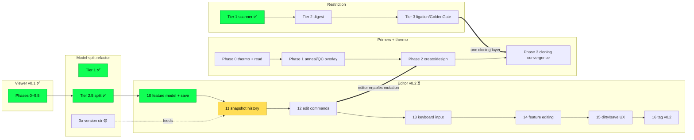

# SeqForge Roadmap

**This is the single source of truth for *where the project is and what comes next*.**
It owns sequencing and status across every workstream. It carries no design
detail — each track links to its own plan under [`plans/`](plans/), and durable
architecture contracts live under [`docs/`](docs/).

| Layer | Where | What it holds |
|---|---|---|
| **Roadmap** (this file) | `ROADMAP.md` | Milestones, per-track status, cross-track ordering |
| **Track plans** | `plans/*.md` | Per-workstream design + phase checkboxes |
| **Architecture** | `docs/*.md` | Cross-module contracts (stable, implementation-spanning) |
| **Users** | `README.md` | Install + usage |

---

## Milestones

| Milestone | Theme | State |
|---|---|---|
| **v0.1** | Read-only viewer + embedded terminal + single command layer | ✅ shipped (tag/verify outstanding) |
| **v0.2** | Editor — insert/delete/replace, undo, save, feature editing | ⏳ next |
| **(parallel)** | Restriction cloning depth (digest → ligation → Golden Gate) | 🟡 Tier 1 done |
| **(parallel)** | Primers + thermodynamics (Tm/GC → display → design) | 📋 not started |

---

## Tracks at a glance

Legend: ✅ done · 🟡 partial · ⏳ next · 📋 queued · ❌ removed

| Track | Plan | Status | Next concrete step |
|---|---|---|---|
| **Viewer (v0.1)** | [`plans/viewer.md`](plans/viewer.md) | ✅ Phases 0–9.5 (9 tag/verify left) | `v0.1.0` tag |
| **Model-split refactor** | [`plans/refactor.md`](plans/refactor.md) | ✅ Tier 1 / 2-light / 2.5 · 🟡 3a | (folds into editor) |
| **Editor (v0.2)** | [`plans/editor.md`](plans/editor.md) | 🟡 Stage 2.6 + Phase 10 done · Phases 11–16 | Phase 11 — per-buffer snapshot history |
| **Restriction** | [`plans/restriction.md`](plans/restriction.md) | 🟡 Tier 1 done | Tier 2 — digest + fragments |
| **Primers + thermo** | [`plans/primers.md`](plans/primers.md) | 📋 not started | Phase 0.1 — `seqforge-thermo` + `seqforge tm` |

---

## Cross-track sequencing

**Reading it:** the editor (v0.2) is the critical path and depends only on the
already-complete model split. Restriction Tier 2+ is fully **independent** — it
can advance any time. Primers Phase 0–1 are **pre-editor** (read-side, no
mutation) and independent; Primer Phase 2 (creation/design) waits on the editor's
mutation rails; Primer Phase 3 converges with Restriction Tier 3 into a single
cloning layer.

---

## Decisions of record

Cross-cutting choices that close off re-litigation. One line each; the linked doc owns the full rationale.

| # | Decision | Why (short) | Detail |
|---|---|---|---|
| 1 | Editor mutation = one `Splice` primitive; undo = whole-buffer snapshot on `Vec<u8>` (no rope/anchors/transactions) | Destructive ops can't be cleanly inverted; snapshots are correct-by-construction at our scale | [`editor.md`](plans/editor.md) §1/§3/§4a; supersedes [`refactor.md`](plans/refactor.md) Tier 3 |
| 2 | `na_seq` → `seqforge-restriction` (zero-dep, extractable; reached only via `seqforge-bio`) | Need Type IIs/Golden Gate; isolate for crates.io extraction | [`restriction.md`](plans/restriction.md), [`architecture.md`](docs/architecture.md) |
| 3 | Primers = distinct persistent collection in `core`; Tm derived; shared `seqforge-thermo` | One thermo impl; primers ride the single mutation path | [`primers.md`](plans/primers.md) |
| 4 | Isoschizomers stay as distinct rows | A user may want a specific enzyme they physically have | [`viewer.md`](plans/viewer.md) |
| 5 | All edits are CLI/agent-reachable through one path; editor never mutates directly | Editor ops are `ViewerRequest`s; GUI resolves cursor→command; undo per-buffer + source-agnostic | [`editor.md`](plans/editor.md) §4a |
| 6 | `Fragment`/`Overhang` = two types bridged (not shared) | Mirrors `Site`→`CutSite`: restriction stays zero-copy; `core` owns bytes; bridge is lazy. Overhang = kind+length | direction below |
| 7 | GenBank/FASTA blunt-whole only; overhang never persisted | Overhang is derived from (sequence, enzyme); assembly = pure fn over blunt parts + recipe | direction below |
| 8 | Derived sequence data (complement, Tm, future translation/structure) is computed on demand, never stored on `core`; complement strand dropped from `Buffer` (Stage 2.6) | Storing a pure function of `text` is denormalization with a sync invariant; matches BioPython/OVE convention | [`architecture.md`](docs/architecture.md) "Derived sequence data" |
| 9 | Edits split: content-given primitive (`apply_splice` + insert/delete/replace) in `core`; bio-derived edits (revcomp, cloning, mutagenesis) compose in `command/edit.rs` | Mutation belongs with the aggregate that owns invariants; byte-derivation in `core` would force a `core→bio` cycle | [`architecture.md`](docs/architecture.md) "Edit operations"; [`editor.md`](plans/editor.md) §1 |

---

## Reconciliations — resolved

The three prior open items are now settled and folded into their owning docs:

- ✅ **`Fragment` / `Overhang`** → decision 6 above. `&'static` and owned-`Vec<u8>` overhang both dropped; two-types-bridged, kind+length, lazy bridge.
- ✅ **`apply()` signature** → matched to the shipped code in [`docs/focus-refactor.md`](docs/focus-refactor.md) §2.2 (`apply<B: BioOps>(cmd, state, bio) -> Result<_, DispatchError>`, no `events` arg).
- ✅ **Enzyme overlay capture** → documented in [`plans/viewer.md`](plans/viewer.md) ("Post-v0.1: enzyme overlay").

## Deferred — direction recorded (no work now)

Cloning, `.dna`, and assembly workflows are **deferred until the editor handles edits**. We worked through the *direction* only, so wiring done now doesn't conflict later. Nothing here is a current task.

- **Cloning workflow = pure function over blunt parts + recipe.** `assemble(parts, recipe) -> product`; digest→ligate is in-memory; overhangs are transient/derived (decisions 6–7); the product is a new blunt `Buffer`. The *recipe* (which enzymes/parts/order) is the durable artifact, not the overhangs. Rough this out when the editor works.
- **`.dna` import** — the only file route to a *primary* sticky-ended fragment; also the lossless source for primer tails. Port from tg-oss when it lands. No stub now.
- **`WorkflowCommand` / recipe shape** — undesigned on purpose; lands with the cloning track.
- **Cloning forward-decls (`Fragment`/`Overhang`/`WorkflowCommand`) are NOT in editor Phase 10** — added when cloning starts; this direction note is the anti-conflict guard instead of stub types.
