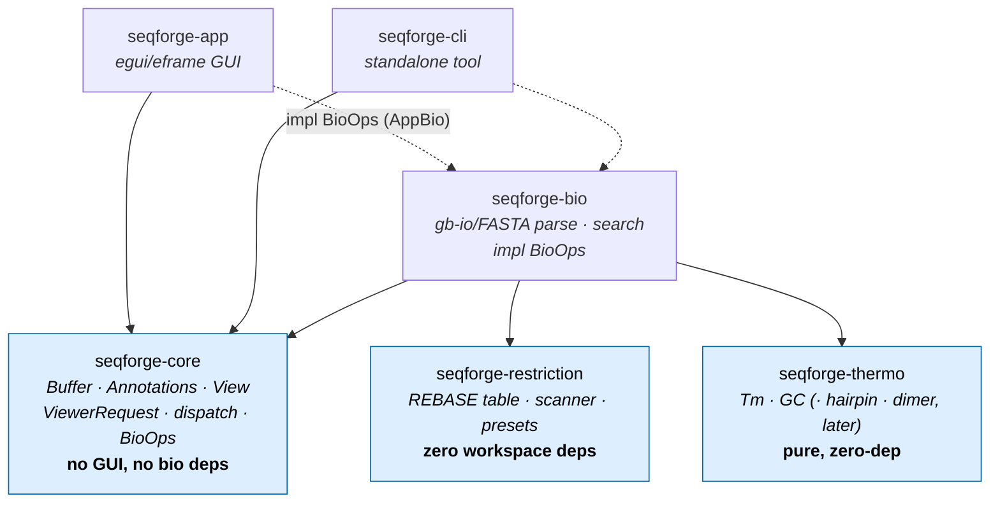
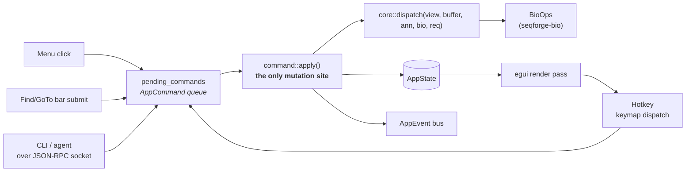

# SeqForge architecture notes

Cross-cutting design notes that don't belong inside a single source
file. Status + sequencing live in [`../ROADMAP.md`](../ROADMAP.md);
per-track design lives in [`../plans/`](../plans/); this document is for
**contracts that span modules and tiers**.

## Crate dependency graph

The workspace is layered so the typed command core never touches GUI or
heavy bio deps, and the restriction/thermo crates stay extractable.



**Invariants the arrows encode:**

- **`seqforge-core` has no GUI and no bio dependency.** It defines the
  data model + typed command surface; it reaches sequence logic only
  through the `BioOps` trait, implemented in `seqforge-app`/`-cli`. This
  is what lets dispatch back a headless CLI, tests, or a future WASM
  worker unchanged.
- **`seqforge-restriction` is reachable only via `seqforge-bio`** (see
  "Restriction backend boundary" below) and carries no workspace deps —
  the constraint that keeps a crates.io extraction a one-file change.
- **`seqforge-thermo`** is pure and sequence-agnostic; `core` never
  depends on it (Tm is *derived*, never stored). It is the **vendored
  `seqfold` Rust core** (MIT, attributed; `rayon`/`smallvec`/`pyo3`
  stripped → zero-dep, `publish = false`, extractable — the same shape as
  `seqforge-restriction`). It is reached **only via `seqforge-bio`**,
  which re-exports the thin `tm`/`gc` surface (Phase 0.1); `bio → thermo`
  is the sole new cross-crate edge the primer/thermo work adds. `primer3`
  (GPL) is never a dependency — an offline validation oracle only. See
  [`../plans/primers.md`](../plans/primers.md).

## Derived sequence data: computed, never stored on `core`

A general rule that the dependency arrows above only hint at:

> **Anything that is a pure function of `Buffer.text` is derived on
> demand — never persisted as authoritative state on `core`.**

The reverse complement strand is the canonical case (normalized in
Stage 2.6): `Buffer` stores `text` only. The complement is computed
where it's needed — by `seqforge-bio::complement` for operations, and
inline over the visible block at render (`viewer.rs`) for the dual-strand
view. It is **not** a field on `Buffer`. This matches the convention in
the field (e.g. BioPython's `Seq` is single-strand; `reverse_complement`
returns a new value, never stored) and removes the `text`/`complement`
sync invariant entirely.

The same rule governs overhangs (decision 7: derived from sequence +
enzyme, never persisted), Tm (decision 3), and every future derived
track (translation, GC, secondary structure). If a derivation is ever
hot enough to need caching, use the version-keyed [`Cache`](#cache-pattern-stage-25e)
— a *cache-aside* over the single source of truth, not a second
authoritative copy. Don't reach for that until a profile demands it.

Consequence: `core` never needs a biology dependency to maintain a
derived field, because it stores no derived fields. This is what keeps
`core ◄── bio` (and the forbidden `core ──► bio` cycle) a non-issue.

### Scope of the rule: template projections, not authored annotations

The "derived, never stored" rule ranges over **pure functions of
`Buffer.text`** — *template projections* (complement, Tm-of-a-range,
translation, overhangs, cut sites). It does **not** range over **authored
annotations** — `Feature`s and `Primer`s — which are first-class stored
state, not projections of the sequence. A `Primer` is an independent oligo
(a reagent) that holds a *relation* to the template: its `name` + full 5'→3'
`sequence` (which may include a 5' tail with **no** template counterpart) and
its `binding` attachment are **authored**; its annealed/tail/mismatch
decomposition, Tm/GC/QC, and attachment state are **derived** (via
`bio` + `thermo`, version-cached). This is why a primer cannot be modelled as
a `Feature` (a labelled sub-range) — the tail has no position to occupy — and
why editing away a primer's binding site **detaches** it (`binding = None`)
rather than deleting the reagent. Full contract + the implemented-model
consistency notes: [`../plans/primers.md`](../plans/primers.md) and ROADMAP
decision 14.

## Edit operations: primitive (`core`) vs composed (command layer)

Editing splits into two tiers, placed by what they depend on:

- **Primitive edits live in `core`.** `mutations::apply_splice` (and its
  content-given reductions `insert` / `delete` / `replace`) take only
  positions + bytes. They splice `text`, apply the feature-shift policy,
  and bump `version` / `dirty`. They are the model's own mutation methods,
  enforcing the `Buffer`/`Annotations` invariants — and they need **no
  biology**. (DDD: mutation belongs with the aggregate that owns the
  invariants, not an external service.)
- **Composed edits live at the command layer** (`command/edit.rs`, reached
  via `ViewerRequest`). These *derive bytes via `bio`, then call the
  primitive*. Reverse-complement is the first: `bio::reverse_complement`
  of the range → `apply_splice`. The whole cloning/primer roadmap is
  composed edits (digest+religate, Golden Gate, codon-optimize,
  primer-based mutagenesis) — all "`bio` derives bytes → `apply_splice` /
  new `Buffer`", riding the single mutation path so undo/dirty/version
  apply uniformly.

This is why `apply_revcomp` is **not** a `core` wrapper: it would force
`core ──► bio`. It belongs where both crates are already in scope.

## Command pipeline (CLI / GUI / agent parity)

SeqForge's defining goal: every action — menu click, hotkey, embedded-
terminal `seqforge` invocation, or external agent over the socket —
converges on **one typed command layer**. There is exactly one place
that mutates state.



The same `ViewerRequest` variants serve the GUI menu, the embedded
terminal, and external agents — so any operation reachable in the UI has
a CLI equivalent with structured output. Per-frame ordering (drain
inputs → dispatch keys → render → apply) is detailed in
[`focus-refactor.md`](focus-refactor.md) §2; this diagram shows the
*convergence + crate boundary*, that one shows the *frame lifecycle*.

## Single-applier mutation pattern

See `docs/focus-refactor.md` §2 for the full lifecycle. In short:

- `AppCommand` is a closed enum of every user-, agent-, or code-
  initiated action.
- `AppState::pending_commands: Vec<PendingCommand>` is a per-frame
  queue.
- `command::apply` is the **only** function in the crate that mutates
  the fields a command can touch. Every menu, hotkey, socket request,
  bar submission, focus change, and (future) edit op goes through it.
- The applier drains the queue exactly once per frame. Commands
  enqueued *during* application (chaining) are processed next frame —
  predictable ordering, no infinite-loop risk.

## Workspace / Layout / Persistence boundary (Stage 2.5e)

State is split by **lifetime**, not by struct:

```
Workspace            ← in-session identity & state
├── buffers (Arc<RwLock<Buffer>>)
├── views (HashMap<ViewId, View>)
├── active_view
└── seq_views (per-view render caches)

DockState<Tab>       ← egui_dock owns layout during a session
                       Tab::View(ViewId) refs are session pointers

PersistedSession     ← the only thing that round-trips to disk
├── recent_files
├── layout (LayoutSnapshot — path-keyed)
└── file_state[path] (selection, scroll)
```

`ViewId`/`BufferId` are session-scoped and never persisted. The
save/load boundary speaks `PathBuf`. This makes orphan-id bugs
impossible by construction.

See `crates/seqforge-app/src/persistence.rs` for the types and
`SeqForgeApp::new` / `save` for the wiring.

## Background-task contract (Stage 2.5d)

SeqForge runs UI on the main thread (egui). Long-running biological
computations (alignment, Golden Gate enumeration, PCR primer scoring,
post-MVP) must not block paint. This section documents the contract
that **all** future background tasks must follow. Today no background
tasks exist; documenting the rules now keeps the door open without
forcing a retrofit later.

### Threading rules

1. **Write locks live on the UI thread.** A `Buffer`'s `RwLock` may
   only be `.write()`-locked inside `command::apply` (running on the
   main thread). Background tasks **never** take a write lock.
2. **Background tasks read-lock or snapshot.** Either
   - `buf_arc.read()` — short-lived shared read; cheap but blocks
     UI-thread writes for its duration, so suitable only for
     bounded work; or
   - `BufferSnapshot::from(&buf)` (Tier 4) — a structural-share
     clone of the rope. Detaches from the original entirely; the
     UI is free to edit while the task runs. Becomes available
     when Tier 3b lands the rope-backed `Buffer`.
3. **Results post back as commands.** Background work that produces
   data the UI must react to (search hits, alignment results, primer
   scores) sends `AppCommand::TaskResult { buffer_id, payload }` on
   the existing `pending_commands` channel. The applier routes it to
   the right view(s) and emits the corresponding `AppEvent`.
4. **Cancellation by token.** Each task receives a
   `CancellationToken` (Zed's pattern). The applier signals it when
   the task's premise changes (buffer edited, view closed). Tasks
   poll the token between work units and abort cleanly.

### Why these rules

- No write contention on the UI thread → no jank.
- Edits and background-task results funnel through the same applier
  → consistent event emission, no order-of-arrival bugs.
- Buffer version is the cache key for derived data; tasks tag their
  result with the buffer version they computed against; the applier
  drops stale results.

### What this looks like in code

(Sketch — none of this exists yet. Lands alongside the first concrete
background user, probably alignment or primer scoring.)

```rust
// In command::apply
pub enum AppCommand {
    // ... existing variants ...

    /// A background task returned a payload. The applier looks up the
    /// buffer version and either applies (current) or drops (stale).
    TaskResult {
        buffer_id: BufferId,
        buffer_version: u64,
        payload: TaskResultPayload,
    },
}

pub enum TaskResultPayload {
    Alignment(AlignmentResult),
    PrimerScores(Vec<PrimerScore>),
    // ...
}

// In some future executor module
pub fn spawn_alignment(
    buf: Arc<RwLock<Buffer>>,
    queue: AppCommandQueue,
    cancel: CancellationToken,
) {
    std::thread::spawn(move || {
        let snapshot = buf.read().expect("not poisoned").snapshot();
        let buffer_id = snapshot.buffer_id;
        let version = snapshot.version;
        let result = compute_alignment(&snapshot, &cancel);
        if cancel.is_cancelled() { return; }
        queue.enqueue(AppCommand::TaskResult {
            buffer_id,
            buffer_version: version,
            payload: TaskResultPayload::Alignment(result),
        });
    });
}
```

### Egui specifics

- `egui::Context::request_repaint()` from the background thread wakes
  the UI to pick up the new command. We already do this from the
  socket listener.
- Long tasks should periodically `cancel.check()` and consider yielding
  with `std::thread::yield_now()` to keep the worker pool responsive.
- For multi-stage work, post intermediate `TaskResult`s with
  partial-result payloads; the UI can render progress live.

## ViewKind dispatch (Stage 2.5d)

The viewer renderer in `tabs.rs::Tab::View(_)` matches on
`view.kind: ViewKind` to pick the per-kind renderer. Today only
`ViewKind::TextView` exists, paired with `SequenceView::show`. Adding
a new kind (`LinearView`, `CircularView`, post-MVP) requires:

1. New variant on `ViewKind` (in `seqforge-core::model`).
2. New entry in `ViewKind::context_tag()` (e.g. `"Pane:LinearView"`).
3. New widget module in `seqforge-app` exposing a `show()` with the
   same signature shape as `SequenceView::show`.
4. New match arm in `tabs.rs::Tab::View(_)`'s render dispatch.

The keymap stack picks up the new kind tag automatically via
`FocusState::rebuild_context`, so kind-specific bindings (e.g.
`"r"` for "rotate origin" only in `Pane:CircularView`) work without
keymap-table refactors.

## Restriction backend boundary

Restriction-enzyme data and scanning live in the `seqforge-restriction`
crate, not in `seqforge-bio`. The dependency direction is:

```
seqforge-app / seqforge-cli
        │  (call find_cut_sites / resolve_query)
        ▼
seqforge-bio          ← thin bridge; owns the CutSite/SearchHit shape
        │  (delegates scanning + presets)
        ▼
seqforge-restriction  ← REBASE table, scanner, presets. No deps on the rest
                        of the workspace; designed to extract to crates.io.
```

Contract rules:

- `seqforge-bio` is the **only** crate that depends on
  `seqforge-restriction`. `seqforge-core`, `-app`, and `-cli` never name it
  directly — they speak `core::CutSite`. This keeps the future crates.io
  extraction ([`../plans/restriction.md`](../plans/restriction.md) Tier 4) a one-file change.
- The bridge is `search::site_to_cutsite` (`restriction::Site → core::CutSite`)
  and the grammar mapper in `enzyme_query.rs` (`EnzymePreset → restriction::Preset`).
  `CutSite` is deliberately a lossy projection of `Site` — it currently drops
  `strand` and `enzyme_type`; add them to `CutSite` when a UI feature needs them.
- The enzyme table is `&'static`, generated by `src/bin/codegen.rs` from
  `data/rebase_bairoch.txt`. The generated `enzymes_generated.rs` is committed
  and reviewable; regular builds never run codegen.
- The crate carries **no** non-std dependencies and `publish = false`. Keep it
  that way until Tier 4 — it is the constraint that makes extraction cheap.

## Cache pattern (Stage 2.5e)

`crate::cache::Cache<K, V>` is the canonical pattern for derived data.
Examples in `viewer.rs`: feature stacking keyed by `(BufferId, u64)`,
cut-label stacking keyed by `(Vec<usize>, u32)`. New caches in
Tier 3+ work (alignment overlays, primer scores, mutation tracks)
should use this helper, not roll bespoke invalidation predicates.

Key rules:
- Include the **buffer version** in any cache that depends on sequence
  content. Edits bump the version (Tier 3d); your cache invalidates
  automatically.
- Include any **layout-derived inputs** (line width, char width,
  zoom level) if they affect the computed value. Quantize floats
  before keying so floating-point noise doesn't thrash.
- For caches whose computation cost exceeds the per-paint budget,
  consider moving to a background task and storing the result back
  via `AppCommand::TaskResult`.

## Render layer: block-aware Track abstraction

The sequence viewer renders through a **Track** abstraction (design +
migration in [`../plans/render-tracks.md`](../plans/render-tracks.md)). It is a
**rendering/interaction concern only** — it does not touch the domain model. The
model stays **sequence/position-centric**: `Buffer` owns bytes, features are
position-ranged annotations addressed by `FeatureId`, and translation / cut-sites /
ORFs are derived-on-demand and never stored (see "Derived sequence data" above and
editor decisions 8/12/13).

Key rules:
- A track owns its own **block height + paint + hit-test from one geometry**.
  Painting and hit-testing must not re-derive geometry independently — that
  divergence is the bug class the abstraction exists to remove. Assert the
  co-location invariant (painted rect == hit rect) in tests.
- Tracks are **mostly position-owned** (ruler, strands, global frame translation,
  cut sites). Exactly one — **Features** — is composite/feature-owned: it draws each
  bar plus that feature's CDS translation sub-lane. Global reading-frame translation
  stays position-owned (a band hugging the sequence); it is *not* attached to a
  feature.
- Selection, cursor, search-hit wash, and the staged preview diff are **decorations
  owned by the Sequence track**, not standalone stacked tracks.
- Hit results use one `Hit` enum resolved in one place; do not reintroduce parallel
  per-element hit vectors.
- Derived per-track data (translation lanes, layout) follows the Cache pattern above
  (version-keyed); block layout is memoized, not recomputed per frame for all blocks.
