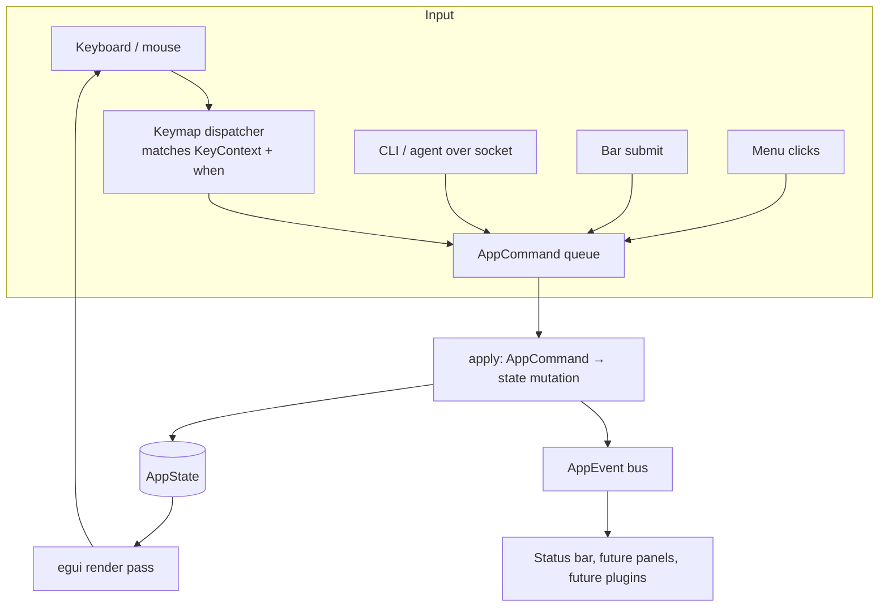

# Focus & Command Refactor

Status: **active** — all six stages landed. This document is the binding architecture reference; the staged checklist below records how we got here and what each commit changed.

This document is the durable reference for SeqForge's keyboard-focus, command-dispatch, and event architecture. It supersedes the "Keyboard focus model" sketch in `PLAN.md` (which now links here).

If you're adding a feature — a new hotkey, a new pane, a new modal, a new agent action — start at [How to add X](#how-to-add-x). The earlier sections explain *why* the architecture looks the way it does so you can judge edge cases instead of guessing.

---

## 1. Why this refactor

The current `app.rs::update()` mixes three concerns that need to come apart before editing, agents, or a metadata panel can land:

1. **Input routing** is implicit. `ctx.input_mut().consume_key(...)` runs unconditionally at the top of every frame, before any pane sees input. ⌘F fires the Find bar even when the visible tab is the Terminal. As we add more chords (editing, vim-style nav, palette, agents triggering commands), this gets worse, not better.
2. **Focus state is inferred, not declared.** `bar_field_has_focus()` in `bar.rs` probes `egui::Memory` by hard-coded widget IDs to figure out who owns the keyboard. Widgets without stable IDs (e.g. `DragValue`) silently fall outside the check; new overlays mean new IDs in that function. State should flow outward (app says "this widget is active"), not be reconstructed from widget internals after the fact.
3. **Commands are not first-class.** Menu handlers, hotkeys, and the bar's submit button each construct `ViewerRequest`s inline and push to `pending_requests`. Enablement (`open_doc.is_some()`) is duplicated at every site. There is no single inspectable surface that says "here is every action the app can perform and when it is allowed."

The target architecture borrows three concepts from Zed (`KeyContext` stack, `Action` enum, declarative keymap), wired into idiomatic egui (immediate-mode render, closed `AppCommand` enum, `egui_dock` for panes). We are **not** porting GPUI runtime machinery; we are porting the logical model that makes a multi-pane editor-with-terminal feasible.

See the design conversation that produced this plan for the full reasoning trail; this document is the binding artifact.

---

## 2. Target architecture

Three layers, strictly separated:



**Frame lifecycle, in order, every frame:**

1. **Drain external inputs.** Socket requests, OS events. Convert each to one or more `AppCommand` values, append to `pending_commands`.
2. **Dispatch keys.** Single call to `keymap::dispatch(&focus, &state, ctx) -> Vec<AppCommand>`. Each binding's `when` predicate is checked against the current `KeyContext` stack and `AppState`; only matching bindings call `consume_key`. Results appended to `pending_commands`.
3. **Render.** Menus, dock area, panes, overlays. Click handlers and widget submits enqueue more `AppCommand`s. **Render never mutates `AppState` directly.**
4. **Apply commands.** Drain `pending_commands`, call `apply(cmd, &mut state, &bio)` for each. `apply` is the single place where state mutates and `AppEvent`s are emitted.

This ordering is load-bearing. Mixing render-time mutation with command application is what produces the "ghost frame" bugs (a click fires this frame but the visual reflects last frame's state).

### 2.1 Focus state

```rust
// crates/seqforge-app/src/focus.rs

/// Which pane "owns" the keyboard when no overlay is active.
/// Set by clicks and by explicit `AppCommand::FocusPane`. Sticky across frames.
#[derive(Copy, Clone, Eq, PartialEq, Debug, Serialize, Deserialize)]
pub enum FocusScope { Viewer, Terminal, Browser }

/// Stack of context tags. Top of stack is the innermost active context.
/// Keymap `when` predicates match against this stack.
///
/// Example stack while Find bar is open over the Viewer:
///   ["Workspace", "Pane:Viewer", "Overlay:FindBar", "TextInput"]
///
/// Tags are `&'static str` for cheap comparison and to keep the set inspectable.
/// Plugins (future) get their own namespace prefix; see §7.
pub struct KeyContext { stack: Vec<&'static str> }

pub struct FocusState {
    pub scope: FocusScope,
    pub context: KeyContext,
}
```

Rules:
- **Pane click** → `AppCommand::FocusPane(scope)` → updates `scope`, rebuilds context base.
- **Overlay open** → push `"Overlay:<Name>"` and (if it captures text) `"TextInput"`.
- **Overlay close** → pop the overlay tags. `scope` is unchanged; the pane that owned input regains it automatically.
- **Widgets never read `scope` directly.** They read `is_focused: bool` derived from state by the dispatcher and passed down. This keeps the source of truth single.

### 2.2 Commands

```rust
// crates/seqforge-app/src/command.rs

/// Every user-visible or agent-visible action. Closed enum (for now — see §7).
///
/// `Viewer(ViewerRequest)` wraps the existing seqforge-core request type so the
/// socket / CLI surface remains unchanged. GUI-only commands live alongside.
#[derive(Debug, Clone)]
pub enum AppCommand {
    // File / document
    PromptOpenFile,
    OpenFile(PathBuf),
    OpenRecent(PathBuf),
    ClearRecent,

    // Overlays
    OpenFind,
    OpenGoTo,
    DismissOverlay,
    SubmitFind { pattern: String, mismatches: u8 },
    SubmitGoTo { position: usize },

    // Focus
    FocusPane(FocusScope),

    // Layout
    ResetLayout,

    // Tools
    InstallCli,

    // Wrapped viewer request (from menu, hotkey, bar, socket, or agent)
    Viewer(ViewerRequest),
}

/// The single place where state mutates. Emits zero or more AppEvents.
pub fn apply(
    cmd: AppCommand,
    state: &mut AppState,
    bio: &dyn BioOps,
    events: &EventSink,
) -> Result<Option<ViewerResponse>, AppError>;

/// Is this command currently allowed? Used to grey menu items, gate keymap,
/// and reject agent requests with a clear error.
pub fn is_enabled(cmd: &AppCommand, state: &AppState) -> bool;
```

`is_enabled` replaces every ad-hoc `if open_doc.is_some()` check at hotkey + menu + bar call sites.

### 2.3 Events

```rust
// crates/seqforge-app/src/event.rs

/// Broadcast after `apply()` finishes for any state change downstream surfaces
/// might care about. Currently internal; the socket-facing subscription surface
/// is future work (see §7).
#[derive(Debug, Clone)]
pub enum AppEvent {
    DocOpened { name: String, len: usize },
    DocClosed,
    SelectionChanged { selection: Option<Selection> },
    SearchCompleted { hits: usize },
    FocusChanged(FocusScope),
    OverlayPushed(OverlayKind),
    OverlayPopped(OverlayKind),
}

pub struct EventSink { /* crossbeam or tokio broadcast */ }
pub struct EventSubscription { /* drop = unsubscribe */ }
```

Subscribers in scope for this refactor: the status bar (currently reads state directly each frame — fine to leave for now, but using `AppEvent` makes future caching trivial). Subscribers explicitly out of scope: socket-facing event stream, in-process plugins.

### 2.4 Keymap

```rust
// crates/seqforge-app/src/keymap.rs

pub struct Binding {
    pub chord: (Modifiers, Key),
    /// Required context tags. All must be present on the KeyContext stack.
    pub when_context: &'static [&'static str],
    /// Additional state predicate (e.g. requires open doc).
    pub when_state: fn(&AppState) -> bool,
    pub command: fn() -> AppCommand,
}

pub const KEYMAP: &[Binding] = &[
    Binding {
        chord: (CMD, Key::O),
        when_context: &["Workspace"],
        when_state: |_| true,
        command: || AppCommand::PromptOpenFile,
    },
    Binding {
        chord: (CMD, Key::F),
        when_context: &["Pane:Viewer"],
        when_state: has_open_doc,
        command: || AppCommand::OpenFind,
    },
    Binding {
        chord: (NONE, Key::Escape),
        when_context: &["Overlay:FindBar"],   // or any Overlay:* — see resolve()
        when_state: |_| true,
        command: || AppCommand::DismissOverlay,
    },
    // …
];

pub fn dispatch(focus: &FocusState, state: &AppState, ctx: &egui::Context) -> Vec<AppCommand>;
```

Why a const table and not a registry: the binding set is closed during the focus refactor (plugin registration is future work — §7). A const table compiles, the exhaustive-match in `apply` catches missing branches, and the entire keymap fits on one screen for review.

### 2.5 Overlays

```rust
// crates/seqforge-app/src/overlay.rs

/// All transient UI that captures input. Stacked; top renders on top and
/// receives Esc first. Existing `ActiveBar`, `open_dialog`, and `cli_status`
/// all collapse into this.
pub enum Overlay {
    FindBar(FindBar),
    GoToBar(GoToBar),
    FileDialog(FileDialog),
    CliStatus(String),
    // Future: CommandPalette, ConfirmDialog, AgentPrompt, …
}

pub struct OverlayStack(Vec<Overlay>);

impl OverlayStack {
    pub fn push(&mut self, o: Overlay);
    pub fn pop(&mut self) -> Option<Overlay>;
    pub fn top(&self) -> Option<&Overlay>;
    pub fn context_tags(&self) -> impl Iterator<Item = &'static str>;
}
```

The stack is the reason metadata panels, modals, and bars compose cleanly: open a confirm dialog over an open Find bar; Esc pops the dialog, the bar remains, keyboard returns to the bar's text field. Today this would require bespoke logic.

---

## 3. Module layout after refactor

```
crates/seqforge-app/src/
├── main.rs
├── app.rs              // SeqForgeApp, AppState; frame lifecycle only
├── focus.rs            // FocusScope, KeyContext, FocusState           [new]
├── command.rs          // AppCommand, apply(), is_enabled(), AppError  [new]
├── event.rs            // AppEvent, EventSink, EventSubscription       [new]
├── keymap.rs           // Binding, KEYMAP, dispatch()                  [new]
├── overlay.rs          // Overlay enum, OverlayStack                   [new — absorbs bar.rs]
├── tabs.rs             // Tab, TabViewer; pane click → AppCommand::FocusPane
├── viewer.rs           // SequenceView (unchanged sequence rendering)
├── terminal.rs         // TerminalPane; reads `is_focused` from FocusState
├── browser.rs          // BrowserState
├── socket.rs           // unchanged wire protocol; produces AppCommand::Viewer(...)
└── cli_install.rs
```

`bar.rs` is deleted; `FindBar`/`GoToBar` move into `overlay.rs` as inner types. `app.rs::update()` shrinks to the four-step lifecycle in §2.

---

## 4. Staged rollout (six PRs)

Each stage compiles, runs, and is independently mergeable. `main` stays shippable.

### Stage 0 — Pre-flight (no code)
- [x] This document merged.
- [x] `PLAN.md` "Keyboard focus model" section updated to point here.

### Stage 1 — `FocusState` + `KeyContext` (skeleton only) — commit `42efc2f`
- [x] Add `focus.rs` with `FocusScope`, `KeyContext`, `FocusState`.
- [x] Add `FocusState` to `AppState` (`#[serde(skip)]`).
- [x] `tabs.rs` pane click → `focus.scope` (geometry-only rect check, does not consume widget clicks).
- [x] `terminal.rs::show` ANDs the new `terminal_has_focus` signal with the legacy `bar_field_has_focus` check.

### Stage 2 — `AppCommand` + `apply()` — commit `3361170`
- [x] `command.rs` with `AppCommand`, `apply`, `is_enabled`, `PendingCommand`.
- [x] `event.rs` with `AppEvent` and a no-op `EventSink` for the wire surface.
- [x] `pending_requests` → `pending_commands` (commands carry the optional one-shot for socket replies).
- [x] Every menu, hotkey, bar, socket, and pane-click handler enqueues `AppCommand`; no inline state mutation.
- [x] Single `apply` loop at end of `update()`.
- [x] Menus use `is_enabled` for greying.

### Stage 3 — `AppEvent` bus + first subscriber — commit `62d83a2`
- [x] `EventSink` wraps `mpsc::Sender<AppEvent>`; receiver lives on `AppState`. (stdlib `mpsc` since emit + consume are both on the UI thread — `crossbeam` is unnecessary today.)
- [x] Each frame drains receiver into a bounded `EventLog` (cap 100).
- [x] `apply` emits `DocOpened`/`Closed`, `SelectionChanged` (via before/after snapshot), `SearchCompleted`, `FocusChanged`, `OverlayPushed`/`Popped`.
- [x] Pass-through `Viewer(req)` classifies the response so socket-originated commands generate the same events as GUI-originated equivalents.

### Stage 4 — Declarative keymap — commit `4d73110`
- [x] `keymap.rs` with `Binding` and a const `KEYMAP`.
- [x] `keymap::dispatch` called once per frame; inline `consume_key` block in `update()` deleted.
- [x] All Cmd-letter chords are `Workspace`-scoped per the Zed/VSCode convention. Pane-scope scaffolding stays in `KeyContext` for future unmodified-key bindings (editor mode, vim-style chords).

### Stage 5 — Overlay stack — commit `3bac5a2`
- [x] `overlay.rs` with `Overlay`, `OverlayStack`, `show_inline_bar`.
- [x] `FindBar`/`GoToBar` moved from `bar.rs`; `bar.rs` deleted.
- [x] `active_bar`, `open_dialog`, `cli_status` → `overlays: OverlayStack`.
- [x] `OverlayStack::context_tags` layered onto `KeyContext` each frame before keymap dispatch.
- [x] Escape binding in `KEYMAP` gated on `Overlay::TAG_ACTIVE` — dismisses any overlay regardless of widget focus.
- [x] Terminal yields when `scope == Terminal && overlays.is_empty()`. `bar_field_has_focus` deleted.

### Stage 6 — Cleanup + docs
- [x] Module-level `//!` docstrings on `focus.rs`, `command.rs`, `event.rs`, `keymap.rs`, `overlay.rs` link back to this document.
- [x] `PLAN.md` "Find / GoTo UX" section points at `overlay.rs`.
- [x] `PLAN.md` "Keyboard focus model" section: short summary + pointer here.
- [x] Recipes in §5 verified against real code.
- [x] Tick all stage checkboxes; status → **active**.
- [x] Remove the temporary `focus:` / `last event:` status-bar debug indicators.

---

## 5. How to add X

### A new hotkey
1. Add an `AppCommand` variant if no existing command fits.
2. Handle it in `apply`. Add to `is_enabled` if availability is conditional.
3. Append a `Binding` to `KEYMAP` with the right `when_context` and `when_state`.

Do **not** add `ctx.input_mut().consume_key(...)` anywhere else.

### A new menu item
Same as a hotkey, minus the `KEYMAP` entry. Menu code calls `pending_commands.push((AppCommand::X, None))` and uses `is_enabled` to grey itself.

### A new overlay (modal, dialog, popup bar)
1. Add an `Overlay::X(...)` variant in `overlay.rs` and a matching `Overlay::TAG_X: &'static str` constant; extend the `Overlay::tag()` match.
2. Add a typed accessor on `OverlayStack` (`x_mut(&mut self) -> Option<&mut X>`) if callers need to read the inner state.
3. Choose a render site:
   - **Inline-in-pane** (Find/GoTo style): render inside `overlay::show_inline_bar` (or a sibling fn) called from the relevant `tabs.rs` arm.
   - **Top-level window/dialog**: render directly in `app.rs::update()` after fetching state via the typed accessor, the same way `cli_status()` and `file_dialog_mut()` do.
4. Push from `command::apply` via `state.overlays.push_unique(Overlay::X(...))`; on push emit `AppEvent::OverlayPushed(tag)`. Dismiss via `pop_kind(Overlay::TAG_X)` or generic `DismissOverlay` (top-of-stack).
5. `OverlayStack::context_tags` already emits the tag and the generic `"Overlay"` — no change needed there.
6. If the overlay should be Escape-dismissable from any widget focus, no work needed: the keymap's existing Escape binding handles it via `TAG_ACTIVE`.

### A new pane (e.g. live metadata panel)
1. Add a `Tab::X` variant; render in `tabs.rs::TabViewer`.
2. Decide: focusable (gets a `FocusScope`) or non-focusable (read-only / click-into-field-only)?
   - **Focusable** (claims keyboard exclusively when active): add to `FocusScope`, handle click → `FocusPane`.
   - **Non-focusable** (default for panels): no `FocusScope` change. Individual fields can `request_focus` for inline edits, push `"TextInput"` while editing.
3. Subscribe to `AppEvent` if the panel needs to react to state changes (preferred over per-frame state polling for derived data).

### A new agent action
Agents do not exist as a first-class concept yet; they appear via the existing socket. To make a viewer-side operation reachable by an agent today:

1. Add a `ViewerRequest` variant in `seqforge-core` (existing pattern).
2. Handle in `seqforge-core::dispatch`.

To make a *GUI-side* operation reachable (open the Find bar, focus a pane, scroll the metadata panel):

1. Add an `AppCommand` variant.
2. Until §7 lands, surface it via a new `ViewerRequest::Gui` wrapper or a small extension to the JSON-RPC method set.

### A new keymap context
1. Identify the scope: pane (`Pane:X`), overlay (`Overlay:X`), or modal mode (`Mode:Y`).
2. Push the tag in the right place: `FocusState::set_scope` for panes, `OverlayStack` for overlays.
3. Reference the tag in `when_context` on relevant `Binding`s.

---

## 6. Glossary

| Term | Meaning |
|---|---|
| `AppCommand` | A typed, queueable action. Single channel for all user-, agent-, and code-initiated mutations. |
| `apply` | The one function that mutates `AppState` and emits `AppEvent`s. Pure w.r.t. inputs; deterministic. |
| `AppEvent` | A broadcast notification of something that happened. Subscribers react to changes without polling state. |
| `FocusScope` | Which pane "owns" the keyboard when no overlay is active. Set by click. |
| `KeyContext` | Stack of `&'static str` tags describing the current input situation. Keymap `when` clauses match against it. |
| `Overlay` | A transient UI surface (bar, dialog, modal). Stacked; top owns input first. |
| `Binding` | A row in the keymap table: chord + context predicate + state predicate + command. |
| `is_enabled` | Predicate that says whether a command is currently runnable. Used by menus, keymap gating, and agent rejection. |

---

## 7. Out of scope (deferred to future plan)

Documented here so the design stays open without expanding this refactor.

**Plugin ABI (Phase 2 plugin work):**
- `AppCommand::Custom(String, serde_json::Value)` opens the closed enum.
- `AppEvent` becomes subscribable over the JSON-RPC socket (server-sent events or a poll method).
- Plugins register `KEYMAP` bindings at runtime via a separate registry that the dispatcher checks after the const table.
- `KeyContext` plugin tags use a `"plugin:<id>:<tag>"` namespace.

**In-process plugin runtime (Phase 3):**
- WASM via `wasmtime` + `wit-bindgen`, or dynamic libraries.
- Only justified when ≥2 concrete plugins exist that cannot ship over the socket.

**Declarative panel API:**
- Plugins describe panels as a tree of `{label, value, action}` nodes; host renders in egui.
- The internal metadata panel will be built on top of this same API once it exists, so plugins and built-ins use the same surface.

The architecture in §2 is chosen so that all three of the above slot in **without** changing existing call sites.
