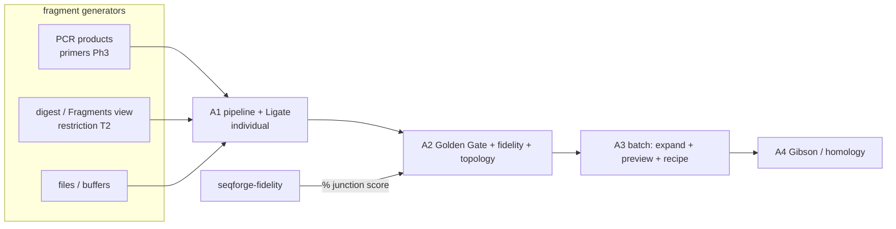

# Assembly Workbench — Ligation-Based Cloning Plan & Tracker

> Canonical cross-track status: [`../ROADMAP.md`](../ROADMAP.md) (v0.3 milestone).
> Boundary contracts: [`../docs/architecture.md`](../docs/architecture.md)
> ("Restriction backend boundary") + [`../docs/extensibility.md`](../docs/extensibility.md)
> (bin → op → product). Depends on Restriction **Tier 2** (the `Fragment`
> interface + digest), the new [`fidelity.md`](fidelity.md) crate, and the
> **feature-model / transport track** ([`feature-model.md`](feature-model.md),
> decision 23 — the `Location` model + `extract`/`place`/`merge`); consumes PCR
> products from Primers **Phase 3** ([`primers.md`](primers.md)).
>
> **`Fragment` = the transport `AnnotatedSlice` + `End`s.** The annotation-carrying
> half of a fragment (bytes + re-homed features) is the shared transport carrier
> (decision 23); assembly adds only the `End`/overhang typing below. A join's
> feature bookkeeping — shifting each fragment's features into the product frame,
> flipping on `Orient::Rev`, and **rejoining split pieces by lineage** (a feature
> straddling a junction, or spanning a circular origin → one `Join`/segmented
> feature) — is `Annotations::place(..., merge=true)`, *not* new assembly code.

> **Status — NOT STARTED (design of record).** This is the convergence track:
> Restriction Tier 3 + the primers cloning convergence + the workbench region
> substrate (decision 19), unified into one ligation-based cloning surface. PCR
> (a fragment *generator*) ships first and standalone in the primers track; this
> doc owns everything downstream of "I have fragments."

## Goal

One cloning layer where **fragments are the universal currency**: everything either
produces fragments (digest, PCR, a file/buffer, a prior product) or consumes them
(ligate, Golden Gate, Gibson). A cloning operation is a **verb over a set of
fragment bins**; the product is *itself a fragment*, so pipelines compose. GUI,
CLI, and agent drive the *same* pure verbs through one dispatch; batch/combinatorial
assembly is emergent, not a separate feature.

The load-bearing decision is **closure**: `Product = Fragment`. Overhangs are
transient/derived (decisions 6–7); the **recipe** — the serialized record of verbs
+ inputs — is the durable artifact. Products re-enter the existing `Buffer →
Tab::View` machinery unchanged (extensibility.md).

## Ecosystem findings (2026)

- **SnapGene** — per-method actions (TA/GC, Gibson, Golden Gate,
  restriction–ligation), split insert/vector view, exact overhangs, methylation
  tracking, reading-frame check, and a **graphical history tree** (provenance).
  No hairpin/dimer/specificity QC. Fragment/orientation selection is **visual-only**
  (click the band) — no reproducible textual selector.
- **Benchling** — one **Assembly Wizard** for digest-ligate / Gibson / Golden Gate;
  the **Golden Gate wizard was co-built with NEB**; has **combinatorial +
  concatenation** (batch/matrix) assembly; does hairpin/dimer/ΔG QC. Its built-in
  GG fidelity *warnings* are the older similarity/GC heuristic, **not** the
  data-driven Potapov %. Combinatorial tool is **GUI-locked**.
- **pydna** (LGPL, ref only) — the cleanest *programmatic* model and our conceptual
  grammar: `cut → select → (ligate | Assembly) → circular|linear`. `vector.cut(E)[i]`
  (select by index), `+` ligation, `.looped()` circularize, `Assembly([...],
  limit=N)` homology (a 5′/3′-node graph that **traces linear *and* circular
  products, then picks**). **We adopt its concepts; we replace its one weakness —
  positional `[i]` selection — with semantic selectors** (see below).
- **DNA Cauldron** (EGF) — purpose-built for **single, combinatorial, and
  hierarchical** assemblies (Golden Gate incl. MoClo/EMMA/Phytobrick, Gibson, LCR,
  BASIC, BioBrick) with enzyme/connector auto-selection and **traceability
  reports**. **Our workflow / batch-job / report discipline reference.**
- Adjacent EGF tools, **not in this track**: GoldenHinges (overhang-set design — a
  second reference for [`fidelity.md`](fidelity.md)); DnaChisel / genedom
  (domestication / constraint-based design — **parked** as its own future track,
  ROADMAP "Deferred").

### Where we improve on all of them

1. **CLI/GUI/agent parity on *assembly*, not just editing** — one structured
   request set drives all three; nobody else has the scriptable/agent path.
2. **Offline, local, in-the-loop fidelity as a % — in batch** (NEB's tools are a
   web app; Benchling uses the outdated heuristic).
3. **The recipe is a durable, replayable, agent-authorable provenance artifact** —
   SnapGene's history tree done right.
4. **Fragments from anywhere, selected by one grammar** — files/buffers/PCR/digest,
   with a reproducible selector that reads the same in GUI, CLI, and recipe.

## The engine: a closed algebra over `Fragment`

### The fragment interface (the one type everything reads)

```rust
struct Fragment {
    bytes: …,                 // owned/borrowed per the decision-6 bridge
    left:  End,               // 5'-side join interface
    right: End,               // 3'-side join interface
    topology: FragTopology,   // Linear | Circular  (circular = whole plasmid, no free ends)
    lineage: Lineage,         // the fragment's slice of the composed lineage map → naming + history
}
// `cut_by` is the boundary segment's op (`LineageOp::Digest`), read off `lineage` —
// not a second copy of enzyme identity. See docs/architecture.md "Lineage".
enum End { Blunt, Overhang { kind: FivePrime | ThreePrime, seq: OverhangSeq, cut_by: EnzymeRef } }

type Product = Fragment;      // ← CLOSURE: a product IS a fragment → hierarchical assembly falls out
```

Why this is the interface and not just *an* interface: overhang compatibility,
fidelity lookup, and topology detection all read the `End`s; homology join reads
terminal `bytes`; naming/history read `lineage`; fragment *selection* (below)
reads `End.cut_by` + `lineage`. Four unrelated concerns bottom out in the same
tuple. `cut_by` on the end exists **only** for selection/orientation naming —
compatibility and fidelity still read only `kind`+`seq`.

### Fragments are virtual — only products materialize

A `Fragment` is an **in-memory value** (the transport `AnnotatedSlice` + `End`s),
computed on demand from a source + prepare op. Intermediate fragments are **never
written to a buffer or file**: the Fragments view and the recipe's fragment picker
render them as **gel-lane / list projections over their live source(s)**,
addressed by the selector grammar — not as tabs. `Workspace::new_buffer_annotated`
is called for exactly two things: a **product** (the artifact you keep →
`Buffer → Tab::View`), and an **opt-in "open fragment as buffer"** export for the
occasional case where someone wants a single excised piece as its own document.

This is load-bearing: materializing every digest fragment (or every member of a
combinatorial library) would flood the workspace with tabs, contradict
recipe-as-provenance (intermediates never need saving — decisions 21/24), and hand
an agent buffer-lifecycle bookkeeping instead of symbolic refs. The clean seam
already exists — `transport::extract` yields a `SeqSlice`/`Fragment` **value**;
`new_buffer_annotated` is the *separate* promote-to-buffer step, called only for
products and opt-in exports.

### The pipeline: a method is *just the join function*

```
prepare (per-bin operator)  →  select (fragment/orientation)  →  expand (all-to-all | zip)
   digest(enzyme-SET)              the selector grammar            combos of one-per-bin
   pcr / homology-tail / as-is
                                                       →  JOIN (the verb)  →  filter (intent + fidelity)  →  name (template/provenance)  →  preview
                                                          [Fragment] -> [Product]
```

- **`prepare`** = the **per-bin operator**: how to derive assemblable fragments from
  a source. Assembly-level **default + per-bin override** (so Golden Gate is one
  setting; traditional/mixed overrides the bins that differ):
  - Golden Gate → `Digest(BsaI)` on every bin (uniform default).
  - Traditional / multi-enzyme → `Digest({EcoRI,BamHI})`, possibly per-bin.
  - Gibson / overlap-extension → `Homology` (no digest; interface is sequence overlap).
  - PCR product / already-a-fragment → `AsIs`.
- **`JOIN`** = the **only** method-specific code, a pure `fn(Vec<Fragment>) ->
  Vec<Product>` (sticky/blunt ligate · Golden-Gate one-pot · Gibson homology), with
  **topology derived inside it**. Homology is *not* an `End` variant — it is a
  pairwise comparison of terminal `bytes` the Gibson join performs.
- **`expand / select / filter / name / preview` are shared** across every method.

So **adding a method = writing one `join` function.** Everything else is reused —
this is the modularity payoff and the plugin-op story (extensibility.md: ops are
pure functions; here the pure function is the join).

### Bins: the n-bucket scaffold — roles are UX, the join is role-blind

A recipe is **n bins**. A bin = **≥1 source** (an open buffer *or* a file at rest,
referenced — not opened) + a **prepare op with its own enzyme(s)** (`Digest(set)` /
`Pcr` / `Homology` / `AsIs`) + an optional **selector**. The conventional shape is
one **backbone/vector** bin + **insert(1..n)** bins, each digestible with a
*different* enzyme (MoClo levels do exactly this; a destination vector's digest
yields backbone + dropout, and the vector bin's selector picks the backbone).

But **"vector" and "insert" are ergonomic role labels, not join logic.** Bins live
entirely in **prepare + select**; the `join` verb receives a flat `Vec<Fragment>`
and is **role-blind** — it finds valid assemblies from end compatibility alone and
**derives** topology. A "vector" is merely the bin whose fragment closes the
circle; **circularity is derived, never declared** (topology *intent* filters the
result set, it never forces the biology). Keeping bins out of the join is what
preserves the one-pure-verb engine (decision 1) while the GUI still shows familiar
vector/insert lanes.

**A bin is a pool of candidate fragments**, so the combinatorial axis is built in:
one fragment per bin → **one product** (an easy-to-configure individual reaction);
k options in a bin → the assembler takes **one per bin** → a **k₁·…·kₙ product
library** (the MoClo / j5 combinatorial case), each scored by fidelity. Same bins,
same UI — a single cloning reaction and a batch library differ *only* by how many
candidates a bin holds (decision 7). **Linear ligation is not a separate engine**:
it is the `ligate` join with **no vector bin** and **topology intent `Linear`**.

### Topology is derived, filtered by intent

The join builds the overhang/homology graph and stamps each product with its
**derived** topology: **circular** iff the chain closes with no free ends,
**linear** iff two free ends remain. This is a **correctness feature** (a plasmid
that doesn't close won't replicate). Blunt / low-fidelity sticky ligations are
ambiguous → the join returns a **set** of products, each with its topology (this is
pydna's linear-and-circular tracing). The recipe's **intended topology**
(`Circular | Linear | Any`) is a **filter/validator** over that set — it selects
which product you meant and **warns if intent is unachievable** (e.g. "GG produced
only a *linear* product"). Intent never forces the biology.

### Fragment selection — one location grammar (semantic-first)

A digest yields a *set*, and each fragment has two ends, so "which fragment + which
orientation" must be expressible. There are two regimes:

- **Golden Gate / distinct overhangs → implicit.** Throw the whole digest in; the
  join only ligates compatible overhangs and the topology filter keeps the closed
  product. Spurious pieces drop out automatically (the point of GG). No selection.
- **Traditional / ambiguous → explicit**, via **one location grammar** with
  polymorphic endpoints (enzyme cut · feature · coordinate); **orientation = the
  order** of the two endpoints (swap to flip):

```
vector[EcoRI..BamHI]     # directional restriction fragment (enzyme endpoints) — the common case
vector[ori]              # the fragment containing feature "ori" (backbone)     — semantic, edit-stable
vector[100..2700]        # arbitrary span (blunt, PCR region, anything)         — universal fallback
vector[BamHI..EcoRI]     # same fragment, reversed orientation
```

Optional sugar for the common directional case: `vector:EcoRI/BamHI ≡
vector[EcoRI..BamHI]`. So it is **one pattern + one shorthand**, not five routes.

The grammar is **expressive-complete** (coordinates are the universal escape hatch,
so nothing is unbuildable) and **semantic-first** (enzyme/feature endpoints are
biologist-native and, for features, edit-stable). Positional index is *not* a
primary route — consistent with **decision 12** (address by stable/semantic handle,
not position). Fragments can't carry a persistent id (they're *derived* — decisions
6–7), so the grammar is the semantic handle, with coordinates as the precise
fallback.

**Backed by a structured type** (mirrors `ViewSelection`, decision 17 — one value,
two faces):

```rust
struct FragmentSelector { source: BufferHandle, location: Location }
enum  Location { Ends(EnzymeRef, EnzymeRef), Contains(FeatureRef), Span(Range, Orient) }
```

The text grammar is this struct's `Display`/`FromStr`; the GUI produces the struct
from a click and shows the same string as the fragment's label.

### Fragment references — by-handle · by-provenance · by-content

A bin points at its source; that reference resolves differently for *live* use vs a
*durable* recipe, and **no case requires saving intermediates first**:

- **By-handle (`Ref`, live)** — `buffer:<handle>` resolves against the **open
  documents** (index / basename / path, the `buffers`/`focus` vocabulary). A PCR
  product is an open `Buffer` the moment it's made, so "PCR → assemble it" works
  **without saving**. This is extensibility.md's live-state coupling.
- **The catch:** an *unsaved* buffer has only a **session-scoped** handle (index /
  auto-name, no path), so a `buffer:2` reference **dangles** when a recipe is
  replayed in a fresh process or after relaunch (same fragility as positional
  handles, decisions 12/17).
- **Durable recipes resolve it via provenance, not saving.** A reference to a
  produced fragment serializes, in preference order: **(1) its generating step**
  (`pcr(template, fwd, rev)` — replay regenerates it deterministically from primary
  inputs; the recipe-as-provenance ideal, decision 21; no saved intermediate);
  **(2) a saved path** (only if the buffer *was* saved); **(3) an inlined
  `Sequence`** (by-content, portable but larger, loses the live link).

- **A *source* input pins content, not just a location.** A `path`/glob source
  records the file's **content hash** (+ optional version) alongside its path, and
  an open-buffer source pins the **buffer version** (already stamped). So a replayed
  recipe either resolves to the *same* input bytes or reports a mismatch — it never
  silently assembles a drifted input. (This is the source-side counterpart of the
  provenance step above, which covers *produced* fragments.)

So: interactive assembly uses direct by-handle refs (no save); a durable recipe
defaults to storing the **generating provenance step**, so intermediates still never
need saving — you save-first only if you specifically want the path form; and every
primary source is content-pinned so replay is deterministic.

### Individual vs batch is emergent, not a mode

Individual is the degenerate case of batch: bins-of-one → one combo → one product,
**same pipeline**. The preview simply appears when expansion yields more than one:

```
combos = expand(bins);              // all-to-all (default) | zip (positional pairing)
if combos.len() == 1 { run + auto-name }               // "individual"
else                 { preview grid → subset → run }   // "batch"
```

The **preview grid** (pure ops, nothing materialized) lists each candidate with
**derived name · topology · fidelity % · warnings**; you deselect rows to subset.
**Naming from provenance** is the extensibility.md pattern (`Product { name }` =
"template against provenance") — default `{backbone}_{insert}`, user-overridable,
falling back to `suggest_*_name` (decision 9) on collision.

## Parity: one structured request, three faces

Parity is **not** the GUI shelling out CLI text. Per decisions 5/11/17, GUI and CLI
both produce the **same structured `ViewerRequest`** through one dispatch: the CLI
parses text → request; the GUI resolves a gesture → the same request; the recipe is
the serde serialization. `FragmentSelector` is the fragment analog of
`ViewSelection`. So a GUI band-click, a CLI `vector[EcoRI..BamHI]`, and a recipe
entry are three faces of one value — a GUI selection round-trips into a replayable
recipe and back.

## CLI + agent surface (the minimal verb set)

Because the engine is a closed IR + pure verbs, the CLI is a *projection* of the
verb set — minimal by construction. ~4 verbs:

```
# producers (source → Fragments)
seqforge digest <source> --enzymes BsaI,EcoRI [--circular]        # → fragments (Tier 2)
seqforge pcr --fwd <id> --rev <id> [--template <h>]               # → one product fragment (primers Ph3)

# join (fragments → product) — inline OR recipe
seqforge assemble --method golden-gate --enzymes BsaI  vector.gb  parts/*.gb
seqforge assemble --method ligate   vector.gb:EcoRI/BamHI  insert.gb:EcoRI/BamHI  --topology circular
seqforge assemble --method gibson   --overlap 25  a.gb b.gb c.gb
seqforge assemble recipe.json          # structured; --emit-recipe out.json on any run

# score (fidelity)
seqforge fidelity AATG,GCTT,CGCT [--dataset t4-25c-18h]           # Ligase Fidelity Viewer analog
```

Everything discussed is a **flag or recipe field, not a new verb**: `--method`
picks the join; `:sel` / `[..]` is the per-bin selector; `--enzymes` is the
assembly-level prepare default; `--topology` is intent; `--expand all|zip` is
combinatorial mode; `--name '{a}_{b}'` is the template. Sources resolve as
`path`/glob → files, `buffer:<h>` → active buffers, `pcr:<name>` → PCR products.

**Why it holds up for agents:**
- **One dispatch, three faces (decision 11)** — clap+serde project every verb to
  CLI *and* JSON-RPC; agent capability == CLI == GUI, no drift.
- **The recipe is the agent's native artifact** — structured JSON it authors,
  mutates, diffs; batch is the *same* verb with multi-fragment bins.
- **`--dry-run` = the reasoning hook** — returns the combo grid + topologies +
  fidelity + warnings **without materializing** (the preview as machine-readable
  output); the agent inspects and iterates before committing.
- **Closure + stable handles** — `Product = Fragment` lets an agent chain `pcr →
  assemble → assemble` (hierarchical), each step returning a stable handle
  (path/index/name, never an opaque id) the next consumes.
- **Errors as data** — no-product / multiple-products / detached-primer /
  linear-when-circular-intended are structured diagnostics, not hard failures.

## Architecture

```
seqforge-restriction (Tier 2/3)            seqforge-fidelity (NEW, codegen table)
  Fragment / End (with cut_by)               junction_fidelity(overhangs) -> Report (% correct)
  digest(seq, enzyme-SET) -> Vec<Fragment>   getset / splitset (design / partition)
  ends_compatible / ligate / gg_onepot            │
        └──────────────────┬─────────────────────┘
                           ▼
                     seqforge-bio
                       assembly module: the shared pipeline (prepare · select ·
                       expand · JOIN · filter · name · preview); gibson overlap
                       (seed-and-extend, crate-local, NOT rust-bio); reaction warnings
                           │  (BioOps)
                           ▼
                     seqforge-core
                       Recipe (serde, durable/provenance) + FragmentSelector +
                       Product provenance; write-op via command/edit.rs
                     ┌─────┴─────┐
              seqforge-app     seqforge-cli
              Tab::Recipe +    digest · pcr · assemble · fidelity (inline + recipe.json);
              fidelity strip   --dry-run / --emit-recipe; batch is emergent
```

Dependency discipline (decisions 1/2/18): engine crates stay pure/zero-dep/
extractable. Gibson overlap is hand-rolled seed-and-extend (the
`find_primer_binding_sites` pattern) — **not** `rust-bio` (heavy tree; full SW is
overkill for 20–40 bp near-exact arms). Fidelity is a codegen static table.

## Fidelity is a universal junction metric — no IIS "mode"

The Potapov matrix is indexed by **overhang sequence**, not enzyme, so the join
**always** scores its junction overhang set as a **% correct** (`on_target /
(on_target + Σ off_target)` per junction, product across the set — the number NEB's
Viewer returns; full engine + formula: [`fidelity.md`](fidelity.md)).

- **Type II** cut palindromic sites → **self-complementary overhangs** (EcoRI →
  `AATT`, RC `AATT`); a single-Type-II digest gives every fragment the same overhang
  → **low fidelity %** (toward ~1/N) — why single-enzyme Type II only controls a
  1-insert/1-vector reaction; directionality needs a two-enzyme double digest.
- **Type IIS** overhangs are designable to be all-distinct → **high fidelity %**.
  Same math, same units.

So Golden Gate vs restriction–ligation is **not** two code paths; enzyme type only
shapes **reaction-semantics warnings** (Type II regenerates its site on ligation →
re-cuttable → warn; Type IIS consumes its external site → scarless → no warning).

**Dataset selection** (the *table* tracks the enzyme, not the algorithm): default
**T4, 25 °C, 18 h** (NEB's Viewer default — mirrors an overnight ligation *and*
predicts cycled GG, so one default serves normal ligation and GG); auto-select a GG
enzyme's own table (BsaI/Esp3I/SapI) when it drives the reaction; a **dropdown
overrides**, gated so it only offers datasets whose overhang geometry matches the
current junctions (a 3-base SapI assembly never shows a 4-base table). Graceful
degradation: blunt / 2-base / 3′ overhangs with no dataset report **"no fidelity
data"**, never a fabricated number. Gibson has no overhangs → not this metric (it
gets homology-arm uniqueness, A4).

## Phasing (sequenced by "the Fragments view is the substrate")

Each phase runnable + testable. The ordering principle: **type first (Tier 2), then
one join (A1), then the two axes that generalize it — correctness (A2) and scale
(A3) — then a second join to prove modularity (A4).**

- **(prereq) Restriction Tier 2** — lock the `Fragment`/`End` interface (incl.
  `cut_by`, `topology`, `lineage`, closure `Product = Fragment`) + multi-enzyme
  `digest` returning **virtual `Fragment` values** (`extract` → `SeqSlice`, **not**
  buffers) + the **Fragments view *as the workspace*** — a read-only gel-lane/list
  **projection** over one source (which the A1 recipe picker reuses at multi-source
  scale), not a result pane and not per-fragment tabs. Independent; start now.
- **(parallel) PCR** — Primers Phase 3; produces `Fragment`s (tails = ends). Feeds
  the workspace; neither blocks nor is blocked by this track.
- **A1 — Pipeline skeleton + per-bin operator + `Ligate` join (individual path).**
  `Recipe` + `FragmentSelector` + the shared pipeline; `Tab::Recipe`; verb dispatch
  over the fragment selection; **derived topology** from the start; combos == 1
  (no preview yet). `seqforge digest`/`assemble` inline arg parsing. First product.
- **A2 — Golden Gate join + fidelity + intent filter.** `GoldenGate` one-pot
  (enzyme-**set**, no mode); wire `seqforge-fidelity` F1 (% readout + worst
  junction); intended-vs-derived topology filter + reaction warnings.
- **A3 — Batch: `expand` (all-to-all | zip) + preview grid + subset + provenance
  naming + recipe files.** Pure engine already supports it; this is the preview UI +
  name template + `assemble recipe.json` + `--dry-run` / `--emit-recipe` + a
  per-assembly traceability **report** (DNA Cauldron discipline).
- **A4 — Gibson / homology join.** One new `join` fn over the same pipeline;
  homology-arm **uniqueness** specificity check (Gibson's analog of fidelity).



## Testing

- **Spec-anchored:** a MoClo GG pair → expected scarless circular product +
  expected fidelity %; a two-enzyme double digest with `[EcoRI..BamHI]` selection →
  the directional product in the right orientation; a single-Type-II digest →
  correctly *low* fidelity %.
- **Property:** digest → ligate with compatible ends recovers the input (reuses
  Tier 2 invariants); derived topology (closed ↔ circular); `Product = Fragment`
  closure (a product re-digests/re-assembles); recipe + `FragmentSelector`
  serialize/deserialize round-trip; combinatorial count = ∏|binᵢ|; `--dry-run`
  materializes nothing.
- **Fixture/integration:** pUC19 restriction–ligation + a small GG, cross-checked
  once against SnapGene/Benchling, committed.
- **Parity:** a GUI band-click and its CLI selector string resolve to the same
  `FragmentSelector`; GUI Run and `seqforge assemble` produce byte-identical
  products + identical fidelity from the same recipe.

## Out of scope (this track)

- **Domestication / constraint-based sequence design** (DnaChisel-class) — parked
  (ROADMAP "Deferred"); internal-site cleanup is the user's job; assembly only
  warns/scores, never rewrites.
- **Gapped/bulge heteroduplex, hetero-dimer** — primers Phase 3.2/3.1.
- **App-wide primer/part library**, `.dna` primary sticky-ended import — deferred.
- **Deep hierarchical (multi-level MoClo) orchestration** beyond what closure gives
  for free — a later extension once single-level batch is proven.
- **Removing `egui_dock`**, tear-off windows — never (decision 19).

## Decisions (this track — promoted to ROADMAP on landing)

1. **`Fragment` is the closed IR; a method is a pure `join` verb over fragment
   bins.** `Product = Fragment` (closure → hierarchical assembly); the pipeline
   (prepare · select · expand · join · filter · name · preview) is shared and only
   the `join` varies, so a new method = one function (and the plugin-op unit).
2. **The assembly surface is a recipe *document* whose recipe = provenance** (not a
   blank authored form): interactive verbs emit a recipe; batch consumes/authors
   one; both replay through the same ops. Rides decision 19 (no floating window);
   products → `Buffer → Tab::View`.
3. **Fidelity is a universal junction *% correct*, no IIS mode** — enzyme type only
   shapes warnings; degrades to "no data" for blunt/2-base/3′; N/A to Gibson.
4. **Topology is derived and filtered by intent** (`Circular|Linear|Any`) — never
   forced; ambiguous joins return a product *set*; unachievable intent warns.
5. **Per-bin operator (prepare) with an assembly-level default + override** —
   `Digest(enzyme-SET)` / `Pcr` / `Homology` / `AsIs`; enzymes are always a **set**.
6. **One fragment-selection grammar** — `source[left..right]` with polymorphic
   endpoints (enzyme · feature · coordinate), orientation by order; `:E/E`
   shorthand; semantic-first per decision 12; backed by a structured
   `FragmentSelector` (the `ViewSelection` analog, decision 17). `End` carries
   `cut_by` for selection/orientation only.
7. **Individual vs batch is emergent** (combo count), not a mode; preview appears
   when combos > 1; naming is a provenance template.
8. **Parity is one structured request, three faces** (GUI gesture / CLI text /
   recipe serde), not GUI-emits-CLI-strings; minimal verb set (`digest` · `pcr` ·
   `assemble` · `fidelity`) with `--dry-run`/`--emit-recipe` for agents.
9. **Gibson overlap is hand-rolled seed-and-extend, crate-local — not `rust-bio`;**
   engine crates stay pure/zero-dep/extractable (decisions 1/2/18).
10. **Sources are buffers *or* files (referenced, not opened, content-pinned);
    fragments are virtual values — only products (and an opt-in single-fragment
    export) materialize to `Buffer`s.** A recipe is *n* bins (≥1 source + a prepare
    op with its own enzyme(s) + optional selector); the conventional shape is one
    vector/backbone bin + insert(1..n) bins. **Bins live in prepare/select only —
    the `join` is role-blind** (flat `Vec<Fragment>`, end-driven, topology derived);
    "vector"/"insert" are UX roles and circularity is never declared. A bin is a
    pool of candidates, so an individual reaction (one/bin) and a combinatorial
    library (k/bin → kⁿ) are the same workflow at different cardinalities; linear
    ligation = `ligate` + no vector bin + `Linear` intent.
