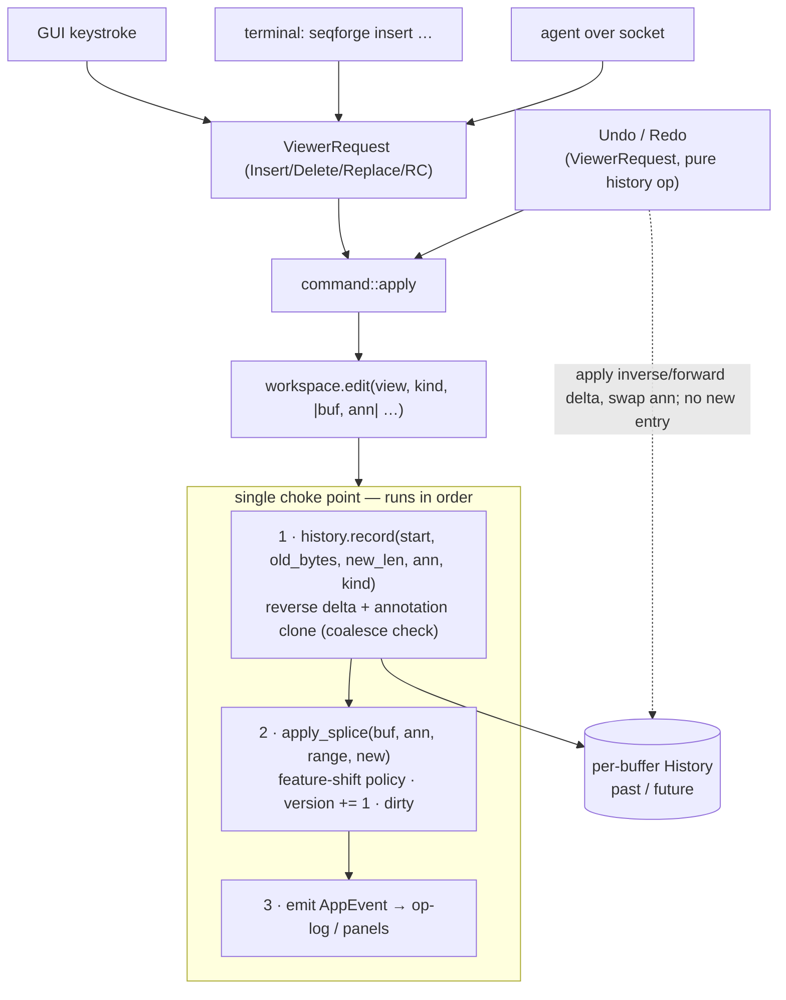
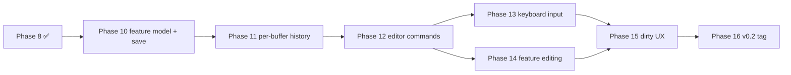

# SeqForge Editor Plan (v0.2) — revised after Stage 2.5 refactor

> **Status: Stage 2.6 + Phases 10–12 done** (Phase 13 next). Canonical cross-track
> status lives in [`../ROADMAP.md`](../ROADMAP.md). The mutation model is settled: a
> single **`Splice` forward primitive** (§1) reached through the **one execution path**
> (GUI keystroke / terminal / agent all lower to it, §4), with **delta-based undo**
> (text reverse-delta + annotation snapshot, §3) — this supersedes the
> rope/anchor/transaction path in [`refactor.md`](refactor.md) Tier 3.

## Context

The viewer track ([`viewer.md`](viewer.md)) locked v0.1 as a read-only viewer. Phases 0–8 of that plan are complete; Phase 9 (v0.1.0 tag + verification) remains but does not block editor work. v0.2 is where SeqForge becomes an editor: bases can be inserted, deleted, replaced, and the document saved back to disk.

The original EDITOR_PLAN.md was written before Stages 2.5a–e landed. Those stages refactored the entire state model — splitting `Document` into `Buffer + Annotations`, introducing `BufferStore`, `Workspace`, `Cache<K,V>`, `PersistedSession`, the `with_buffer_mut` locking helper, and splitting the command module into subfiles. Every section below has been updated to reflect what actually exists in the codebase rather than what was assumed when the plan was first drafted.

**v0.2 scope (locked):** single-document editor. Insert/delete/replace bases at cursor or over a selection. Undo/redo. Save and Save As. Add/remove/rename features. Cut/Copy/Paste. Reverse-complement of a selection. Dirty-state UX. **Out of scope for v0.2:** multi-document tabs (separate buffers; multi-view of same buffer already works), feature drawing in graphical views (no graphical views yet), primer design, Gibson/Golden Gate, agent-driven editing beyond the typed-command layer.

---

## What the 2.5 refactor changed (and why it matters for the editor)

### The old model (at time of original EDITOR_PLAN)

```
ViewerState {
    open_doc: Option<Document>,   ← one doc, owned here
    selection, scroll_to,
    search_hits, cut_sites, ...
}
```

Mutations would operate on `state.open_doc.as_mut()`. History would live on `ViewerState`. Save would read back from `Document`.

### The actual model (post 2.5)

```
AppState {
    workspace: Workspace {
        views: HashMap<ViewId, View>,       ← per-render state
        active_view: Option<ViewId>,
        buffers: BufferStore {              ← Buffer + Annotations, Arc-shared
            buffers: HashMap<BufferId, Arc<RwLock<Buffer>>>,
            annotations: HashMap<BufferId, Annotations>,
            ...
        },
        seq_views: HashMap<ViewId, SequenceView>, ← render caches
    },
    ...
}
```

Consequences for the editor — all positive:

| Original plan assumed | What's actually there | What it buys |
|---|---|---|
| Mutations call `doc.sequence.splice(...)` directly | `workspace.with_active_buffer_mut(\|view, buf, ann\| {...})` acquires/releases the write lock | No manual lock management in mutation code |
| History lives on `ViewerState` | History in `BufferStore` alongside `annotations` | Shared correctly across views; GC'd with the buffer |
| Cache invalidation is ad-hoc per field | `buf.version += 1` → all `Cache<K,V>` caches recompute next frame | Zero extra invalidation code |
| `dispatch` signature changes needed | `with_buffer_mut` already passes `(&mut View, &mut Buffer, &mut Annotations)` | Signature already correct |
| Editor commands need a new enum | Add to existing `ViewerRequest`; route to new `command/edit.rs` | No new type; socket/CLI surface unchanged |
| Save takes `&Document` | `save(buf, ann, path)` | Cleaner bio/core boundary |

`Document` survives only as a load/save intermediary (via `BioOps::load` and the writer) — the `Buffer`/`Annotations` model is not re-coupled to it.

---

## Resolved design decisions

### 1. Mutation primitives — one `Splice` over `Vec<u8>`

**Every sequence edit is a splice:** replace the content in `[start, end)` with new
bytes. The four user-facing ops are reductions of that one primitive:

```
Insert(p, bases)     = splice(p..p,       bases)      // empty range
Delete(start, end)   = splice(start..end, [])         // empty replacement
Replace(s, e, bases) = splice(s..e,       bases)
RevComp(start, end)  = splice(start..end, rc(slice))  // a replace
```

So `seqforge-core::mutations` exposes a **single** `apply_splice(buf, ann, range, new_bytes)`;
`apply_insert/delete/replace` are thin wrappers (or just call sites) — all *content-given*,
needing no biology, so they live in `core` with the model. The feature-shift policy (§2)
is the *one* place that logic lives — inside `apply_splice` — and it bumps `buf.version += 1`
and sets `buf.dirty = true`. This keeps the forward operation elegant and serializable (it
doubles as the op-log / agent-replay entry, §4) without duplicating shift logic.

**`revcomp` is the exception — it is a *composed* edit, not a `core` wrapper.** RC is still a
reduction of splice (`splice(start..end, rc(slice))`, decision 1), but its bytes are *derived*
by `seqforge-bio::reverse_complement`, which `core` may not depend on (cycle). So revcomp lands
at the command layer (`command/edit.rs`, Phase 12): bio derives the bytes → `apply_splice`
installs them. This is the **primitive-vs-composed** split — see
[`../docs/architecture.md`](../docs/architecture.md) "Edit operations" — and it's the rail the
whole cloning/primer roadmap rides (digest+religate, Golden Gate, mutagenesis are all
"bio derives bytes → `apply_splice`").

**Backing store stays `Vec<u8>`** (`apply_splice` is `text.splice(range, new_bytes)`).
The primitive is store-agnostic, so this is an internal detail, not a commitment. We keep
`Vec<u8>` for the **read path**: galleys rebuild every frame and enzyme/search/complement
scans run constantly, all wanting contiguous zero-cost slices — rope would tax the hottest
code for a benefit only seen at genome scale. Rope is therefore **deferred, on-evidence**
(see [`refactor.md`](refactor.md) Tier 3, superseded); if ever needed the swap touches only
`Buffer::text`, `apply_splice`, and the scan/render readers, and makes snapshots *cheaper*,
not obsolete.

### 2. Feature shift policy

When `apply_insert(buf, ann, pos, bases)` is applied (length `n`), for each `Feature` in `ann.features`:
- `feat.range.end <= pos` → untouched (left of edit).
- `feat.range.start >= pos` → shift both endpoints by `+n` (right of edit).
- `feat.range.start < pos < feat.range.end` → extend (`end += n`); feature covers the inserted bases.

When `apply_delete(buf, ann, start, end)` (region length `n = end - start`):
- Feature fully left (`feat.end <= start`) → untouched.
- Feature fully right (`feat.start >= end`) → shift by `-n`.
- Feature fully inside (`start <= feat.start && feat.end <= end`) → **remove**.
- Feature straddles deletion start (`feat.start < start < feat.end <= end`) → clamp: `feat.end = start`.
- Feature straddles deletion end (`start <= feat.start < end && feat.end > end`) → `feat.start = start`, `feat.end -= n`.
- Feature spans deletion (`feat.start < start && feat.end > end`) → contract: `feat.end -= n`.

`apply_replace(buf, ann, start, end, bases)` is a single operation (not two) so feature shift fires once. Length delta `δ = bases.len() - (end - start)`. Same Delete case-analysis on the removed region, then fully-right features shift by `δ`.

This case-analysis is the body of the single `apply_splice` (§1) — insert is the
zero-length-range case, delete the empty-replacement case, replace/revcomp the general
case. It bumps `buf.version += 1` and sets `buf.dirty = true`. Ten tests (one per
shift-policy bullet) against synthetic 100-bp sequences.

### 3. Undo/redo — per-buffer history (text reverse-delta + annotation snapshot)

Each history entry stores a **reverse-splice delta for the text** (the operands
`apply_splice` already has) plus a **full clone of the annotations**, *not* a
whole-buffer snapshot. This is the long-run representation (decided after the
Stage 2.6 / Phase 10 discussion); it supersedes the original whole-buffer-snapshot
wording below while keeping its correctness intent.

> **Decision: undo model — text reverse-delta + annotation snapshot.**
> *(Refines the earlier "whole-buffer snapshot" decision; supersedes
> [`refactor.md`](refactor.md) Tier 3's rope+anchors+transactions path.)*
>
> Most edits *look* trivially invertible — an `Insert`'s inverse is a `Delete` of the
> range, with features shifted back. But that only holds for **non-destructive** ops.
> A `Delete`/`Replace` can *remove* a feature (fully inside the cut) or *clamp* one
> (straddling the boundary); the geometric inverse restores the bytes but **cannot
> reconstruct a destroyed feature** — that data is gone.
>
> So we **split the entry by what's cheap-and-invertible vs. hard:**
> - **Text → reverse-splice delta.** A splice's inverse is a splice: to undo
>   `splice(start..start+new_len, new_bytes)` you `splice(start..start+new_len, old_bytes)`.
>   The entry stores `{ start, old_bytes, new_len }` — **O(edit size), not O(sequence)**.
>   The operands are already in hand at the `apply_splice` choke point, so capture is free.
> - **Annotations → full clone.** Features are small relative to the sequence and the
>   *hard* part (a destroyed/clamped feature can't be inverse-reconstructed), so we
>   **snapshot them** — capture everything, nothing missed. "Snapshot what's hard, delta
>   what's easy."
>
> Undo applies the inverse splice + swaps the annotations; redo re-applies the forward
> splice + swaps. This relies on the **single execution path** guaranteeing that the live
> buffer is exactly the post-last-edit state (only one mutation channel exists), which is
> a core invariant of the repo, not an assumption. Cost is strictly ≤ whole-buffer
> snapshots across every edit profile (equal only for a whole-buffer replace, which never
> happens — assembly produces a *new* buffer). A future rope (deferred, on-evidence) is
> orthogonal: deltas stay deltas.

**Mutation + undo flow (one choke point for every source):**



```rust
// in seqforge-core::history
pub struct History {
    past: VecDeque<HistoryEntry>,   // bounded by a byte budget (below)
    future: Vec<HistoryEntry>,      // cleared on any non-undo mutation
    bytes: usize,                   // running total of past+future entry sizes
    last_edit_kind: Option<EditKind>,
    last_edit_at: std::time::Instant,
}

pub struct HistoryEntry {
    pub start: usize,
    pub old_bytes: Vec<u8>,   // removed slice — restores on undo
    pub new_len: usize,       // inserted length — locates the forward splice for redo
    pub annotations: Annotations, // full clone (small; the un-invertible part)
}

pub enum EditKind { Insert, Delete, Other }
```

**Bounding — by bytes, not count.** Because deltas are variable-size (a point edit is
tens of bytes; a fragment paste is kilobytes), a count cap is a false guard — the thing
that overflows is *total bytes*. Each `History` self-bounds on a **per-buffer byte
budget (default ~16 MB, configurable)**, with a ~2000-entry backstop purely for
data-structure hygiene. **No global/cross-buffer cap** — total across buffers is
user-controlled (you chose to open them), and a global LRU would add cross-buffer
coordination for a risk the user already owns. At ~16 MB of deltas, normal editing has
effectively unlimited depth.

Eviction is **silent, oldest-first** (FIFO from `past`): you keep recent undo depth and
lose only the ability to go *far* back — standard bounded-undo behavior, and a no-op for
realistic sessions. No base snapshot is needed: in-session undo walks reverse deltas from
the live state, so dropping the oldest entry costs nothing. (A once-per-buffer "history
limit reached → Settings" hint is optional Phase 15 polish; Phase 11 just evicts.)

Coalescing: consecutive `Insert` edits within 500 ms **merge into the last delta** (extend
its `new_len`; no new entry per keystroke). Any other edit kind, or any Insert after the
500 ms window, starts a new entry.

**Placement:** `BufferStore` grows a parallel `histories: HashMap<BufferId, History>` slot alongside `annotations`. The same accessors pattern (`history_mut(bid)`) follows what `annotations_mut` already does. This gives every buffer its own undo stack, shared across all views into that buffer, and garbage-collected when the buffer is dropped.

`Workspace` exposes `with_history_mut(view_id, f)` and a `record_edit(view_id, edit_kind)` helper. The reverse delta is captured *around* the splice — `old_bytes` from the range before it runs, `new_len` after — so the entry can invert it later. The mutation entry point is always:

```rust
workspace.with_active_buffer_mut(|view, buf, ann| {
    // capture the reverse delta + annotation snapshot, then mutate
    let old_bytes = buf.text[range.clone()].to_vec();
    history.record(range.start, old_bytes, new_bytes.len(), ann, edit_kind);
    apply_splice(buf, ann, range, new_bytes);
    // update cursor
    view.selection = Some(Selection::cursor(range.start + new_bytes.len()));
})
```

### 4. Editor commands — `ViewerRequest` additions + `command/edit.rs`

The socket/CLI surface is `ViewerRequest` (clap-derived, serde-serialized). Editor operations that need to be reachable from the embedded terminal or external agents go here:

```rust
// additions to seqforge-core::commands::ViewerRequest
Insert { pos: usize, bases: String },
Delete { start: usize, end: usize },
Replace { start: usize, end: usize, bases: String },
ReverseComplement { start: usize, end: usize },
Cut { start: usize, end: usize },
Copy { start: usize, end: usize },
Paste { pos: usize },
AddFeature { start: usize, end: usize, kind: String, label: String, strand: String },
RemoveFeature { index: usize },
RenameFeature { index: usize, label: String },
Save,
SaveAs { path: PathBuf },
Undo,
Redo,
```

GUI-only editor actions (open SaveAs file dialog, dirty-close modal) stay as `AppCommand` variants — they never need a socket wire format.

The `apply` dispatcher in `command/mod.rs` already has the `Viewer(req) → other → dispatch_active(...)` pass-through arm. Editor `ViewerRequest` variants do NOT go through `dispatch_active` (which only read-locks the buffer). Instead they're matched in the `Viewer(req)` arm and routed to the new `command/edit.rs`:

```rust
// command/mod.rs, inside the Viewer(req) match arm
ViewerRequest::Insert { pos, bases } => edit::apply_insert(state, pos, bases),
ViewerRequest::Delete { start, end } => edit::apply_delete(state, start, end),
// … etc.
ViewerRequest::Undo => edit::apply_undo(state),
ViewerRequest::Save => edit::apply_save(state),
```

`command/edit.rs` calls `workspace.with_active_buffer_mut` (or the history-recording wrapper) and emits `SideEffect`-style results via `AppCommand` for things like save-to-disk (see §5 below) and clipboard (see §6).

### 4a. CLI/agent parity + undo scoping

Editor ops being `ViewerRequest` variants is what gives the project its defining property: **every edit is reachable from the GUI, the embedded terminal, and an external agent through one execution path, and the editor never mutates state directly.**

- **The editor is a renderer + resolver, never a mutator.** A keystroke in `viewer.rs` does not edit the buffer; it resolves the active view's cursor/selection into a position-explicit `ViewerRequest` (e.g. `Insert{pos, bases}`) and pushes it through `apply`. The same request shape is what `seqforge insert --pos 100 ATG` produces in the terminal and what an agent sends over the socket. All three converge on `apply` → `command/edit.rs` → `apply_splice`.
- **Ops are position-explicit and view-targetable.** The canonical op carries `pos`/`start`/`end`/`bases` (not an implicit cursor); the GUI fills those in. Editor variants take the same optional `view: Option<ViewId>` field added in Stage 2.5d for `goto`/`find`/`enzymes`, so an agent can target a specific buffer/view; GUI defaults to active.

**Undo scoping that follows from the single path:**

- **Per-buffer, source-agnostic.** History lives on the buffer (`BufferStore.histories`), shared across all views *and* all command sources. A terminal `seqforge insert` and a GUI keystroke into the same buffer push onto the same stack; `seqforge undo`, agent undo, and ⌘Z all reverse the last edit regardless of who made it.
- **Coalescing is intent-based, not purely wall-clock.** Interactive typing coalesces (consecutive `Insert`s within ~500 ms = one undo unit); a `ViewerRequest` edit arriving from the terminal/socket defaults to **its own** undo unit (don't collapse scripted edits just because they're fast).
- **`Undo`/`Redo` are pure history ops.** They are `ViewerRequest`s (so they're CLI/agent-reachable) but they move within the existing stack — they never take a new snapshot.
- **Future, not now — a batch/transaction primitive.** The one place the command stream helps undo is *grouping*: a script/agent/macro could wrap N ops so one snapshot is taken at the batch start and undo reverses the whole batch. Left as a clean future addition; the single channel makes it natural.
- **Op-log for free.** The forward `Splice` stream (via the existing `AppEvent` bus) is the audit / agent-transparency / session-replay artifact — separate from, and not competing with, snapshot undo.

### 5. Save — `seqforge-bio::save` + `SideEffect` via `AppCommand`

Add to `seqforge-bio`:

```rust
pub fn save(buf: &Buffer, ann: &Annotations, path: &Path) -> Result<(), BioError>;
```

Dispatches on extension to `genbank::write` or `fasta::write`. No `Document` round-trip needed — write functions consume `Buffer + Annotations` directly.

`genbank::write` assembles a `gb_io::seq::Seq` from `Buffer + Annotations` (using `Feature.raw_kind` as the gb-io kind string, preserving `Option`-valued qualifiers including provenance). FASTA write is hand-rolled (header from `buf.name`, 80-column wrap).

**Qualifier round-trip (Feature model change).** Currently `Feature.qualifiers: BTreeMap<String, String>` silently drops flag-style qualifiers (`/pseudo`, `/partial`, etc.) that have no value. For lossless round-trip:
- Add `Feature.raw_kind: String` — the verbatim GenBank feature type string (e.g. `"CDS"`, `"misc_feature"`, `"rep_origin"`).
- Change `Feature.qualifiers: BTreeMap<String, Option<String>>` — `None` value encodes a flag qualifier.
- `FeatureKind` becomes a classifier function `fn classify(raw_kind: &str) -> FeatureKind`; the enum variant is derived on the fly for display/coloring.
- `genbank.rs::map_feature` updated to capture `raw_kind` and preserve `None`-valued qualifiers.

This is a `seqforge-core::document.rs` change. `viewer.rs` calls `feature_color(feature)` — the call site changes from `feature.kind` to `classify(&feature.raw_kind)`.

**Save side-effect flow:**

`edit::apply_save` and `edit::apply_save_as` emit `AppCommand::SaveDocument { path }` (a new variant) rather than calling `seqforge-bio::save` directly. The `apply` dispatcher processes it in the next submodule (or directly in `file.rs`), calls `seqforge-bio::save`, clears `buf.dirty`, and emits a toast. This keeps the IO off the command arm that originated from a socket connection (which may be on a different thread in the future).

Add `BioError::Write(String)` variant.

### 6. Keyboard input — always editable

No modal "enter edit mode" toggle. When `SequenceView` has focus and `view.selection` is a cursor, typed IUPAC characters push `ViewerRequest::Insert`. With a range selection, typing replaces: `ViewerRequest::Replace { start, end, bases: one_char }`.

Backspace/Delete: cursor `Delete { start: p-1, end: p }` / `Delete { start: p, end: p+1 }`; range: `Delete { start, end }`.

Modifier shortcuts:
- `Cmd/Ctrl+Z` → `ViewerRequest::Undo`. `Cmd/Ctrl+Shift+Z` (or `Y`) → `ViewerRequest::Redo`.
- `Cmd/Ctrl+X/C/V` → `Cut/Copy/Paste`.
- `Cmd/Ctrl+S` → `ViewerRequest::Save`. `Cmd/Ctrl+Shift+S` → open SaveAs dialog → `AppCommand::OpenSaveAs`.

Key reading happens in `viewer.rs` via `ui.input(|i| i.events.iter()...)` after `response = ui.allocate_painter(...)`. Only processes when `response.has_focus()` (call `response.request_focus()` on click). Viewer commands are pushed into `pending_commands` — they go through the normal `apply` path and never mutate state directly inside the render function.

Non-IUPAC characters silently ignored. Paste with whitespace: strip it, accept valid IUPAC remainder; if any non-IUPAC remains after stripping, show a toast and discard.

### 7. Clipboard — arboard + in-memory fallback

`state.clipboard: Option<Vec<u8>>` lives on `AppState` as an in-memory fallback for headless/test paths. For GUI, `arboard 3.x` is added to `seqforge-app/Cargo.toml` only (not `seqforge-core`). `edit::apply_cut` and `edit::apply_copy` write to both; `edit::apply_paste` reads arboard first, falls back to `state.clipboard`.

### 8. Dirty state + save UX

- Add `Buffer.dirty: bool` (init false on load) — set true by `apply_splice`; cleared by the save handler in `command/file.rs`.
- Title bar shows `*name` when the active buffer is dirty (`ctx.send_viewport_cmd(ViewportCommand::Title(...))` checked once per frame when dirty changes).
- `File → Close` on a dirty buffer → modal: `Save / Discard / Cancel`. Implemented as `Overlay::DirtyCloseConfirm { view_id }` following the existing `OverlayStack` pattern.
- App quit on any dirty buffer → same modal, intercept via `eframe::App::on_close_event`.
- `File → Save As…` uses `egui-file-dialog::save_file()`, suggested filename = `buf.name + ".gb"`.
- `Cmd/Ctrl+S` accelerator registered at the app menu level (fires regardless of focus) — not just viewer-focus-scoped.

### 9. Feature provenance

**Feature.provenance.** Add `Feature.provenance: Option<Provenance>`:

```rust
pub struct Provenance {
    pub source_doc: String,
    pub source_range: Range<usize>,
    pub operation: String,   // e.g. "GoldenGate(BsaI)"
}
```

Round-trip via `/seqforge_provenance="<json>"` qualifier (stored as `Option<String>` under that key in the qualifiers map). Cheap single optional field, editor-adjacent (lineage survives a round-trip), and it forward-supports cloning later without committing to any cloning shape now.

> **Cloning types (`Fragment`, `Overhang`, `WorkflowCommand`) are NOT declared in
> Phase 10.** Earlier drafts forward-declared them here "to prevent Buffer-only
> assumptions." With cloning deferred until the editor works, the *recorded design
> direction* protects against conflicting wiring better than unused stub types — see
> [`../ROADMAP.md`](../ROADMAP.md) "Decisions of record / future direction" for the
> agreed shape (two-types-bridged `Fragment`; `Overhang` as `kind + length`, sequence
> derived; assembly as a pure function over blunt parts + recipe; overhangs never
> persisted). They get declared when the cloning track actually starts.

### 10. Multi-doc — deferred to v0.3

v0.2 is still single-buffer-at-a-time from the *editor* perspective (open one plasmid, edit it, save it). Multi-view of the same buffer already works from Stage 2.5c. Opening a second *file* already works too — two buffers in `BufferStore`, two views. What's deferred: cross-buffer operations (copy a feature from one to another via UI), shared undo across buffers, and the cloning panel that produces new buffers from existing ones. None of that requires shape changes to `Workspace`.

---

## Repository layout (changes only)

```
seqforge/
└── crates/
    ├── seqforge-core/
    │   ├── src/model.rs         # (Stage 2.6) −Buffer.complement; Buffer::new drops complement arg
    │   ├── src/document.rs      # +Feature.raw_kind, +qualifiers Option<String>,
    │   │                        # +Feature.provenance, +Provenance,
    │   │                        # +FeatureKind as classify()
    │   ├── src/mutations.rs (NEW) # apply_splice (+ insert/delete/replace wrappers; revcomp is Phase 12)
    │   ├── src/history.rs   (NEW) # Snapshot, History, EditKind
    │   └── src/commands.rs      # +editor ViewerRequest variants
    ├── seqforge-bio/
    │   ├── src/lib.rs           # +save(buf, ann, path)
    │   ├── src/genbank.rs       # +write(); map_feature updated for raw_kind + Option qualifiers
    │   └── src/fasta.rs         # +write()
    └── seqforge-app/
        ├── src/command/edit.rs (NEW) # apply_insert/delete/replace/undo/redo/
        │                            # cut/copy/paste/add_feature/remove_feature/
        │                            # rename_feature/save/save_as
        ├── src/command/mod.rs   # +AppCommand::SaveDocument, +AppCommand::OpenSaveAs;
        │                        # +editor variants in Viewer(req) arm → edit.rs
        ├── src/command/file.rs  # +apply_save_document (IO); +dirty-close modal flow
        ├── src/viewer.rs        # (Stage 2.6) bottom strand derived inline via bio::complement;
        │                        # +keyboard input; +request_focus on click; +cursor blink
        ├── src/overlay.rs       # +Overlay::DirtyCloseConfirm { view_id }
        ├── src/workspace.rs     # +with_history_mut; +record_snapshot helper;
        │                        # BufferStore +histories: HashMap<BufferId, History>
        ├── src/app.rs           # +clipboard: Option<Vec<u8>>; +dirty title bar;
        │                        # +on_close_event dirty check
        └── Cargo.toml           # +arboard = "3"
```

---

## Implementation phases

Each phase independently testable. Don't start N+1 until N's "done" check passes.

---

### Stage 2.6 — Normalize the strand model *(prerequisite — ✅ done)*

Landed before Phase 10 as its own commit. Removed the stored complement
strand so `apply_splice` is born into a model with no derived field to
maintain (see [`../docs/architecture.md`](../docs/architecture.md)
"Derived sequence data"):

- [x] Drop `Buffer.complement`; `Buffer::new(name, source_path, text, topology)` (no complement arg).
- [x] Delete the app's `pure_complement` helper; `viewer.rs` derives the bottom strand inline per visible block via `seqforge_bio::complement`.
- [x] Update `Buffer::new` call sites + tests. Build + tests + clippy/fmt green.

### Phase 10 — Feature model + save round-trip *(2 days)*

**Goal:** `Feature` round-trips through disk without data loss; the `apply_splice` mutation primitive is in place.

- [x] `Feature.raw_kind: String` — add the field; change `qualifiers: BTreeMap<String, Option<String>>`.
- [x] `FeatureKind` becomes `fn classify(raw_kind: &str) -> FeatureKind`; drop the `kind` field from `Feature`. Update `viewer.rs::feature_color` call site from `f.kind` to `classify(&f.raw_kind)`.
- [x] `genbank.rs::map_feature`: preserve `raw_kind = f.kind.to_string()`; keep `None`-valued qualifiers (flag-style).
- [x] `Feature.provenance: Option<Provenance>`; GenBank round-trip via `/seqforge_provenance="<json>"`.
- [x] `seqforge-core::mutations::apply_splice(&mut Buffer, &mut Annotations, range, new_bytes)` — the single primitive applying the §2 feature-shift policy, bumping `buf.version`, setting `buf.dirty`. Add `apply_insert/delete/replace` as thin wrappers (all content-given, no biology). **`apply_revcomp` is deferred to Phase 12** as a composed command (`bio::reverse_complement` + `apply_splice`) — see §1.
- [x] `seqforge-bio::save(buf, ann, path)` → `genbank::write` / `fasta::write`. Add `BioError::Write(String)`.
- [x] `genbank::write`: build `gb_io::seq::Seq` from `Buffer + Annotations` (raw_kind, Option qualifiers, provenance).
- [x] `fasta::write`: hand-rolled, header from `buf.name`, 80-column wrap.
- [x] Tests: 10 splice cases (one per shift-policy bullet, exercised through `apply_splice`); 3 round-trip tests against existing fixtures; 1 provenance round-trip.

**Done when:** `cargo test -p seqforge-core mutations` + `cargo test -p seqforge-bio roundtrip` green. No UI changes.

> Cloning types (`Fragment`/`Overhang`/`WorkflowCommand`) are intentionally **not** in Phase 10 — see §9 and the recorded direction in [`../ROADMAP.md`](../ROADMAP.md).

---

### Phase 11 — Per-buffer history *(1 day)*

**Goal:** Delta-based undo/redo (text reverse-delta + annotation snapshot) with typing coalescence, byte-budget bounded, shared correctly across views.

- [x] `seqforge-core::history::{HistoryEntry, History, EditKind}` per §3 — `undo(buf, ann)` applies the inverse splice + swaps annotations; `redo(buf, ann)` re-applies forward + swaps. `record(start, old_bytes, new_len, ann, kind)` pushes onto `past`, clears `future`, updates the byte total.
- [x] Byte-budget bounding: per-buffer default ~16 MB (configurable via editor settings) + ~2000-entry backstop; silent oldest-first (FIFO) eviction; account `past` + `future`.
- [x] Coalescing: consecutive `Insert`s within 500 ms merge into the last entry (extend `new_len`); other kinds / past-window start a new entry.
- [x] `BufferStore.histories: HashMap<BufferId, History>` + `history_mut(bid)` accessor; GC'd with the buffer.
- [x] `Workspace::record_edit(view_id, edit_kind)` + `with_history_mut`; an `edit(view_id, edit_kind, |view, buf, ann| {...})` helper that captures the reverse delta around the splice (§3).
- [x] No command wiring yet — Phase 12 does that.
- [x] Tests: 5 consecutive Inserts → 1 entry; Insert/Delete mix → 2 entries; undo restores bytes **and** features (incl. a delete that destroys a feature); redo restores; non-undo edit after undo clears `future`; byte-budget eviction drops oldest while keeping recent undo correct.

**Done when:** History is unit-tested end-to-end against synthetic buffers (incl. a destructive-delete round-trip and an eviction case).

---

### Phase 12 — Editor commands in dispatcher *(2 days)*

**Goal:** Every editor action expressible as a `ViewerRequest`, routed identically from menu/keyboard/terminal/socket — onto the Phase 11 write path.

> **Pattern decision (sniff-tested against the landed code, do not deviate):**
> editor write-ops are **`ViewerRequest` variants intercepted in the app's
> `Viewer(req)` arm**, exactly like `Open`/`Close`. They do **not** flow through
> `core::dispatch` (which read-locks and can't touch history). This is the only
> pattern that preserves CLI/terminal/agent/GUI parity (decision #5) and it reuses
> the precedent already in the tree. Rejected alternatives: editor ops as
> `AppCommand` (kills socket/CLI parity); widening `core::dispatch` to `&mut Buffer`
> (history/coalescing need `BufferStore`, not a single buffer).
>
> **Phase 11 already shipped the write path** — `workspace.edit(view, kind, range,
> bytes)`, `workspace.undo/redo(view)` validate bounds, record the reverse delta,
> and move the cursor. Phase 12 is **routing onto these**, not building mutation
> machinery.
>
> **CLI surface = `ViewerRequest` flattened (landed in 12a).** The `seqforge-cli`
> `Cmd` enum was hand-mirroring every viewer variant + hand-mapping it; that
> mirror is deleted. `Cmd` now flattens `ViewerRequest` directly
> (`#[command(flatten)] Viewer(ViewerRequest)`), making its `clap::Subcommand`
> derive the **single source of truth** shared with the socket wire format
> (serde) — so every editor op (and every future cloning/primer op) gets CLI +
> embedded-terminal reach with **no second edit**. The embedded terminal is a
> real PTY: `seqforge insert …` runs the same binary and forwards JSON-RPC over
> `SEQFORGE_SOCKET` (there is no separate `:command` parser — `:insert` in older
> notes == `seqforge insert`). One UX change: `enzymes` is now a single quoted
> arg (`seqforge enzymes "EcoRI BamHI"`), since `query` is a `String` on the wire.

Six refinements the surrounding code forces (each folded into a sub-step below):
- **A** · `core::dispatch`'s match is exhaustive → new variants need `unreachable!` arms mirroring `Open`/`Close`; fix the stale "will become `&mut`" doc comment in `commands.rs`.
- **B** · extract `resolve_target(state, req_view) -> Result<ViewId>` from `dispatch_active` (`workspace.edit` needs a concrete `ViewId`).
- **C** · add a `ViewerResponse` edit variant (`Edited { len }`) or reuse `Ok` — decide in 12a.
- **D** · `is_enabled`'s `Viewer(_) => true` is too coarse → break editor variants out for menu greying.
- **E** · coalescing can't see the source at `edit.rs` → map each variant to its natural `EditKind` now; revisit source-aware coalescing in Phase 13.
- **F** · keep the `SaveDocument` indirection — `SaveAs`'s async dialog requires it; `Save` reuses it (DRY, not premature).

**Sub-ordering — commit-sized, dependency-linear. Don't start a step until the prior compiles + tests green.**

- [x] **12a — types (core) + CLI flatten.** Added the v0.2 `ViewerRequest` variants from §4, each with `view: Option<ViewId>` and doc comments that read as CLI help. Added `target_view()` arms; `unreachable!` arms in `core::dispatch` (**A**); `ViewerResponse::Edited { len, changed }` (**C**); refreshed the stale `dispatch` doc comment; 6 serde round-trip tests. **Also flattened `ViewerRequest` into the CLI `Cmd` enum** (deleted the per-variant mirror + map) — see the CLI-surface note above. *Done: workspace compiles, `dispatch` exhaustive, tests + clippy green, `seqforge --help` lists all 14 editor ops with the `rc` alias.*
- [x] **12b — content-given ops (`command/edit.rs`).** `apply_insert/delete/replace` → `workspace.edit(...)`; `apply_undo/redo` → `workspace.undo/redo`. Extracted `resolve_target` (**B**, shared with `file.rs`); mapped variants to `EditKind` (**E**: Insert→Insert, Delete→Delete, Replace/RC/Paste→Other). Added `parse_bases` (IUPAC validate + whitespace-strip, `InvalidInput` on bad base). 19 headless unit tests. *Done.*
- [x] **12c — composed + clipboard.** `apply_reverse_complement` — first **composed edit**: `read_slice` → `seqforge_bio::reverse_complement` → `workspace.edit`. `apply_cut/copy/paste` via `state.clipboard: Option<Vec<u8>>` (new `AppState` field; copy is read-only, no history; paste is `Other` so it never coalesces with typing). **arboard OS-clipboard mirror deferred** to Phase 13 — in-memory clipboard covers terminal/CLI/test now. *Done.*
- [x] **12d — feature ops.** `apply_add_feature/remove_feature/rename_feature` via `with_buffer_mut`; bump `buf.version`; `AddFeature` validates `start < end <= len`. **Not yet undoable** (annotation-only edits don't record history) — feature-op undo is Phase 14. *Done.*
- [x] **12e — routing + save side-effects.** Editor variants routed in `command/mod.rs` `Viewer(req)` arm → `edit::*` (read-scoped GoTo/Find/Enzymes still fall through to `dispatch_active`). Added `AppCommand::{SaveDocument { view, path }, OpenSaveAs { view }}`. `file::save_buffer` is the synchronous core (→ `seqforge_bio::save`, clear `dirty`, toast); `apply_save` calls it directly when `source_path` is `Some` (immediate CLI feedback — **F** refined: only Save-As *needs* the dialog round-trip), else routes to Save-As. Save-As opens a save-mode `FileDialog`; new `AppState.pending_save_as: Option<ViewId>` discriminates it in the shared pick handler (`app.rs`) → enqueues `SaveDocument`. *Done.* ✅ **CLI/terminal walk verified by user.**
- [x] **12f — menu + `is_enabled`.** `Edit → Undo/Redo · Cut/Copy/Paste/Delete · Reverse Complement Selection`, `File → Save/Save As…`. Editor variants broken out of `is_enabled` (**D**): Undo/Redo→`can_undo`/`can_redo` (read through `buffers.history`), Save→`dirty` (shared-borrow read of the buffer), Cut/Copy/Delete/RC→range selection, Paste→non-empty clipboard. Menu reads the live selection for operands; greyed when the operand is absent. Headless regression test `menu_enablement_tracks_state`. *Done: 161 tests + clippy + fmt green.*
- [x] **12g — CLI/socket verification.** ✅ User confirmed `insert`/`delete`/`rc`/`undo`/`save` run great from the CLI/terminal (same binary, socket-forwarded). GUI menu path now exists (12f); keyboard path is Phase 13.

**Done when:** ✅ All v0.2 `ViewerRequest` variants work from the terminal and the external CLI, with menu parity and per-arm unit tests. **Phase 12 complete.**

---

### Phase 13 — Keyboard input in the viewer *(1 day)*

**Goal:** Type into the sequence; always-editable (no modal edit mode).

- [ ] `SequenceView::show` calls `response.request_focus()` on click.
- [ ] When `response.has_focus()`, consume `ui.input(|i| i.events.iter()...)` for `Event::Text` (filter IUPAC), `Event::Key { Backspace | Delete }`, and modifier shortcuts from §6.
- [ ] Each consumed event pushes a `ViewerRequest` into `pending_commands` (via the existing `AppCommand::Viewer(req)` path).
- [ ] Cursor blink: toggle a `cursor_visible: bool` in `SequenceView` via `ctx.request_repaint_after(Duration::from_millis(500))` when `has_focus()`.

**Done when:** Typing `ATGC` inserts at cursor; Backspace deletes; `Cmd+Z` undoes; modifier shortcuts work; clicking the terminal stops viewer from absorbing keys.

---

### Phase 14 — Feature editing *(1 day)*

**Goal:** Add, remove, rename features over a selection.

- [ ] `Tools → New Feature from Selection…` dialog (label, kind dropdown, strand). Emits `ViewerRequest::AddFeature`.
- [ ] Right-click on annotation bar: context menu `Rename…` / `Remove`. Emits `RenameFeature` / `RemoveFeature`.
- [ ] `AddFeature` validates `start < end <= buf.len()`. Sets `raw_kind` to the GenBank vocabulary string for the chosen kind.
- [ ] Per-view render caches that depend on `annotations.features` invalidate automatically via `buf.version` bump in `apply_insert` — but `AddFeature` / `RemoveFeature` don't touch the sequence. These need to bump `buf.version` too (or the feature-stacking cache needs to also key on `annotations.features.len()`). Decision: bump `buf.version` on any annotation mutation for simplicity.

**Done when:** Create a CDS over a selection, rename it, delete it; reload the file and the change is on disk.

---

### Phase 15 — Dirty state + save UX *(½ day)*

**Goal:** Editor feels safe.

- [ ] Title bar `*name` when the active buffer is dirty.
- [ ] `Overlay::DirtyCloseConfirm { view_id }` modal (`Save / Discard / Cancel`); wired to `AppCommand::CloseTab` and `on_close_event`.
- [ ] `Cmd/Ctrl+S` accelerator registered at the menu level (fires regardless of focus).
- [ ] Toast on save success/failure (egui-notify, pull forward from Phase 8 polish if not already landed).
- [ ] **Reset to file** (`File → Revert`): reloads from disk, discarding buffer + annotations + history and picking up external changes. Distinct from undo-all (which walks the in-session stack). Confirm dialog; enabled only when `source_path` is `Some`; routes through the single path (Open-onto-self).
- [ ] **External-change guard:** store a content hash of the file as loaded (in memory on the buffer — no format involvement). On save, re-read disk and compare; if changed → GUI modal `Overwrite / Reload / Cancel`. For socket/CLI `Save`, return a structured **conflict** error unless `--force` (non-interactive override, so automation isn't blocked by a prompt). Doesn't impede the normal CLI/agent path — that mutates the in-memory buffer through the app, not the file on disk; the guard only fires on a genuine *external* change.
- [ ] *(Optional polish)* once-per-buffer-per-session "undo history limit reached → Settings" toast when a buffer first hits its byte budget (see §3). Low priority; eviction itself stays silent.

**Done when:** Can't accidentally lose work by closing the window; can't silently clobber an externally-changed file; can revert to disk state.

---

### Phase 16 — v0.2 verification + release *(½ day)*

- [ ] Manual walk: open pUC19, type bases, delete a region, RC a selection, add a feature, undo through everything, save, reload, diff against expected.
- [ ] Round-trip all `tests/fixtures/` programmatically: `load → modify → undo back → save → reload → assert sequence + feature equality`.
- [ ] CI green on Linux + macOS + Windows builds.
- [ ] Tag `v0.2.0`.

---

## Dependency graph



Phase 9 (v0.1.0 tag) runs in parallel and does not block this plan.

---

## Verification (v0.2 done = all of these pass)

1. Click into the viewer, type `ATGC` — bases appear at the cursor, title bar shows `*name`.
2. Select a range, hit Backspace — region deleted; features straddling the boundary clamp correctly.
3. `Cmd+Z` undoes the deletion; `Cmd+Shift+Z` redoes. Five consecutive keystroke inserts undo as one snapshot.
4. `Tools → New Feature from Selection…` adds a feature; right-click → Rename; right-click → Remove.
5. `Cmd+S` saves; file on disk is a valid GenBank that reloads to a buffer equal to the in-memory one (sequence + features, ignoring whitespace).
6. Close the window with unsaved changes → modal blocks; `Cancel` returns with state intact.
7. From the embedded terminal: `:insert 100 ATGC`, `:delete 50 75`, `:rc 200 250`, `:undo`, `:save` all work and update the viewer.
8. From an external shell: `seqforge insert --pos 100 ATGC` against the running GUI via session socket.
9. Round-trip the 3 test fixtures: load → modify → undo back → save → reload → assert equal to original.
10. Open pUC19 in two split panes. Edit in one pane; undo in the other. Both panes see the same buffer state after each operation.

---

## Conventions (additions to [`viewer.md`](viewer.md))

- **Mutations:** call `workspace.edit(view_id, edit_kind, |view, buf, ann| {...})`. Never call `apply_splice` (or its insert/delete/replace/revcomp wrappers) outside `command/edit.rs`.
- **History:** always go through `workspace.edit(...)`. Direct `apply_*` calls bypass undo.
- **Dirty flag:** set inside `apply_*`; cleared only by the save handler in `command/file.rs`.
- **Version bump:** any function that mutates `buf.text` OR `ann.features` must call `buf.version += 1`. This is the cache invalidation contract for all `Cache<K,V>` entries keyed on version.
- **No GUI deps in `seqforge-core`:** arboard, egui-notify, eframe stay in `seqforge-app`. `seqforge-core::history` and `seqforge-core::mutations` have zero GUI deps.
- **Derived sequence data is computed, never stored on `core`:** the complement strand (and future translation/GC/structure tracks) are derived on demand, not persisted as `Buffer` fields. Cache only via the version-keyed `Cache`, and only on profiling evidence. See [`../docs/architecture.md`](../docs/architecture.md) "Derived sequence data".
- **Primitive vs composed edits:** content-given edits (`apply_splice` + insert/delete/replace) live in `core`; edits whose bytes are *derived by `bio`* (revcomp, all cloning/primer ops) compose in `command/edit.rs`. Keeping `apply_*` byte-derivation out of `core` is what prevents a `core ──► bio` cycle.
- **CLI surface:** every new `ViewerRequest` variant must have doc comments that read as CLI help text (`/// Insert bases at a position`).
- **Feature kind:** always set `raw_kind` to the GenBank vocabulary string when creating features; use `classify(&raw_kind)` for display/coloring. Never store a bare `FeatureKind` variant as the authoritative kind.
